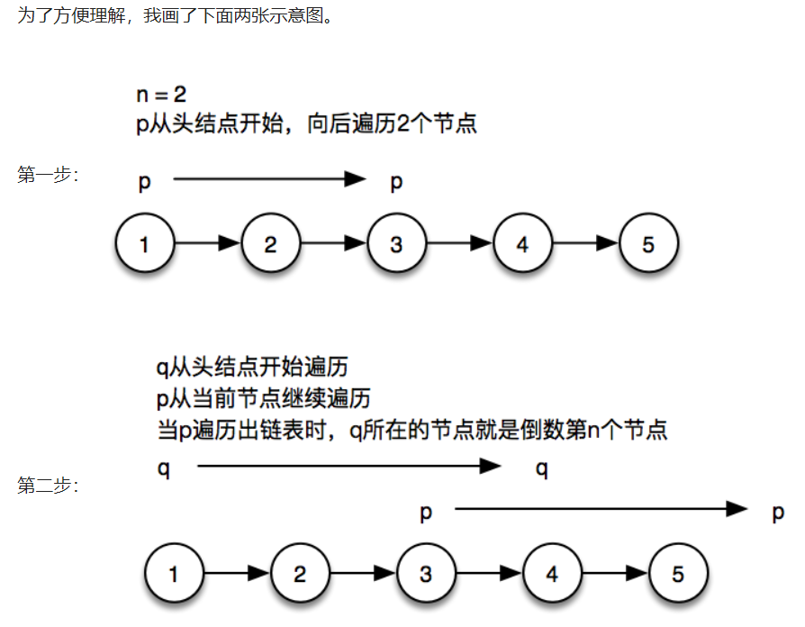

# 1.双重校验、懒汉式单例

```java
// 懒汉模式单例
public class Singleton2 {
 
    // 指向自己实例的私有静态引用
    private static Singleton singleton;
 
    // 私有的构造方法
    private Singleton(){}
 
    // 以自己实例为返回值的静态的公有方法，静态工厂方法
    public static Singleton getSingleton(){
        // 被动创建，在真正需要使用时才去创建
        if (singleton == null) {
            singleton = new Singleton();
        }
        return singleton;
    }
}

//双重校验锁 
public class Singleton {
 
        private Singleton() {} //私有化构造方法
     
        private static volatile Singleton singleton = null;
     
        public static Singleton getInstance(){
            
            if(singleton==null){ //第一次校验singleton是否为空
                synchronized (Singleton.class){
                    
                    if(singleton==null){ //第二次校验singleton是否为空
                        singleton = new Singleton();//实例化会有三个代码volitile关键字防止重排序
                    }
                }
            }
            return singleton;
        }
     
 ==================================================================================
        public static void main(String[] args) {
            for (int i = 0; i < 100; i++) {
                new Thread(new Runnable() {
                    public void run() {
                        System.out.println(Thread.currentThread().getName()
                        +" : "+Singleton.getInstance().hashCode());
                    }
                }).start();
            }
        }
    }
```


# 2.二分法

```java
int binarySearch(int[] nums int target){
    int left = 0;
    int right= num.length-1;
    
    while(left<=right){
        int mid= (right+left)/2;
        if(nums[mids] == target)
            return mid;
        else if(nums[mid]<target)
            left=mid+1;
        else if(nums[mid]>target)
            rigit=mid-1;
    }
    return -1
}
```

二分搜索的时间复杂度O（logN）

红黑树的时间复杂度O（logN）

平衡树树的时间复杂度O（logN）

二叉堆，优先队列，哈希表 O（1）


# 3.反转链表。

```java
 public ListNode reverseList(ListNode head) {
        ListNode prev = null;
        ListNode curr = head;
        while (curr != null) {
            ListNode next = curr.next;
            curr.next = prev;//改变指针的指向
            prev = curr; //把curr的值赋给prev
            curr = next;
        }
        return prev;
    }
```


# 4.回文子串

```java
//暴力破解

public class Main {
public static void main(String[] args){

Scanner sc= new Scanner(System.in);
String str = sc.next();
int sum=0;
for (int i = 0; i < str.length(); i++){  
    for (int j = i+1; j <=str.length(); j++){
        
        String str1=str.substring(i, j);
        if(str1.equals( new StringBuffer(str1).reverse().toString()))
        sum++;
        
    }}
    System.out.println(sum);
}
}
```


# 5.手写快排

```java
package com.code;

public class quicksort {
    public static void main(String[] args) {
        int[] arr = {5, 1, 7, 3, 1, 6, 9, 4};

        quickSort(arr, 0, arr.length - 1);

        for (int i : arr) {
            System.out.print(i + "\t");
        }
    }

    /**
     * @param a     待排序列
     * @param left  待排序列起始位置
     * @param right 待排序列结束位置
     */
    public static void quickSort(int[] a, int left, int right) {
        if (left > right)
            return;
        int pivot = a[left];//定义基准值为数组第一个数
        int i = left;
        int j = right;

        while (i < j) {
            while (pivot <= a[j] && i < j)//从右往左找比基准值小的数
                j--;
            while (pivot >= a[i] && i < j)//从左往右找比基准值大的数
                i++;
            if (i < j)                     //如果i<j，交换它们
            {
                int temp = a[i];
                a[i] = a[j];
                a[j] = temp;
            }
        }
        a[left] = a[i];
        a[i] = pivot;//把基准值放到合适的位置
        quickSort(a, left, i - 1);//对左边的子数组进行快速排序
        quickSort(a, i + 1, right);//对右边的子数组进行快速排序
    }
}
```


# 6.青蛙跳台阶

```java
//1.递归
public static long Faci(long n)
        {
            if (n==0)
            {
                return 0;
            }
            if (n==1)
            {
                return 1;
            }
            if (n==2)
            {
                return 2;
            }
            else
            {
                return Faci(n - 1) + Faci(n - 2);
            }                   
        }
//2.迭代
public static long JumpFloor(long n)
        {
            long former1 = 1;
            long former2 = 2;
            long target = 0;
            if (n==0)
            {
                return 0;
            }
            if (n==1)
            {
                return 1;
            }
            if (n==2)
            {
                return 2;
            }
            else
            {
                for (int i = 3; i <= n; i++)
                {
                    target = former1 + former2;
                    former1 = former2;
                    former2 = target;
                }
                return target;
            }
        }
```


# 7.丑数

```java
题目：我们把只包含因子 2、3 和 5 的数称作丑数（Ugly Number）。求从小到大的顺序的第 1500个丑数。
举例说明：
例如 6、8 都是丑数，但 14 不是，它包含因子 7。习惯上我们把 1 当做第一个丑数。
方法1：
如果被判断的数是1、2、3、5其中的一个，则这个数肯定是丑数。
如果被判断的数能被2整除，则将这个数除以2，再进行循环判断；
如果被判断的数能被3整除，则将这个数除以3，再进行循环判断；
如果被判断的数能被5整除，则将这个数除以5，再进行循环判断；
如果被判断的数不能被2、3、5这三个数其中的一个整除，则这个数肯定不是丑数。

    class Solution {
    public boolean isUgly(int num) {
        if (num <= 0) {
            return false;
        }
        while (true) {
            if (num == 1 || num == 2 || num == 3 || num == 5) {
                return true;
            }
            if (num%2 == 0) {
                num /= 2;
            }else if (num%3 == 0) {
                num /= 3;
            }else if (num%5 == 0) {
                num /= 5;
            }else {
                return false;
            }
        }
    }
}
    
```


# 8.反转字符串

```java
//方法1
public static String charAtReverse (String s){
   int length = s.length();
   String reverse = " ";
   for (int i = 0; i < length; i++) {
    reverse = s.charAt(i)+reverse;//字符串中获取单个字符的字符的放法
   }
   return reverse;
  }

//方法2
public static String reverseCharArrays(String s){
   char []array = s.toCharArray();//把字符串分割成单个字符的数组
   String reverse = "";
   for(int i = array.length -1 ; i>=0 ; i--){//遍历数组,从后向前拼接
    reverse +=array[i];
   }
   return reverse;
  }

```


# 9.返回二叉树的最深路径。

```java
方法1
class Solution {
  public int maxDepth(TreeNode root) {
   return root == null ? 0 : Math.max(maxDepth(root.left), maxDepth(root.right)) + 1;
    }
}

方法2
public static class TreeNode
    {
        int data;
        TreeNode left;
        TreeNode right;
        TreeNode(int val){ data=val;}
    }

    private static int maxDepth(TreeNode root) {
        if (root == null) {
            return 0;
        }
        //BFS的层次遍历思想，记录二叉树的层数，
        //遍历完，层数即为最大深度
        LinkedList<TreeNode> queue = new LinkedList<>();
        queue.add(root);//把根节点添加到列表
        int maxDepth = 0;
        while (!queue.isEmpty()) {
            maxDepth++;
            int levelSize = queue.size();//该层节点元素的个数
            for (int i = 0; i < levelSize; i++) {
                TreeNode node = queue.poll();//出队操作
                if (node.left != null) {
                    queue.add(node.left);//入队操作
                }
                if (node.right != null) {
                    queue.add(node.right);
                }
            }
        }
        return maxDepth;
    }

```


# 10.删除链表的倒数第 n 个节点，

要求：时间  O(n)，空间 O(1)；



```java
 //优化后的算法：
  定义两个指针p和q。p从头节点开始，遍历n个节点，然后q从头节点开始，与p一起继续向下遍历，直到p遍历出链表。此时q所在的节点就是倒数第n个节点了。此算法的时间复杂度为O(n)。
      
public static class ListNode {
        int val;
        ListNode next;

        ListNode(int x) {
            val = x;
        }
    }
    
    public ListNode removeNthFromEnd(ListNode head, int n) {
        if (head == null || n <= 0) {
            return null;
        }

        ListNode p = head;
        ListNode q = head;

        int i = 0;
        while (i < n) {
            p = p.next;

            if (p == null) {
                head = head.next;
                return head;
            }

            i++;
        }

        while (p.next != null) {
            p = p.next;
            q = q.next;
        }

        q.next = q.next.next;
        return head;
    }
```


# 11.hashmap 手写代码插入一个元素

```java
  @Override
    public V put(K key, V value) {
        // 确定index
        int index = hash(key) % initCapacity;
        if(table[index] != null){
            Entry<K, V> e = table[index];
            Entry<K, V> e2 = null;
            while(e != null){
                if(hash(e.key) == hash(key) && e.key.equals(key)){
                    // 如果键相同，则更新值
                    e.value = value;
                }
                // 遍历链表判断是否已经存在相同的key
                e2 = e;
                e = e.next;
            }
            // 如果不存在相同的key，则直接插到尾结点的后面
            e2.next = new Entry<>(key, value, null, index);
        }else{
            // 如果table[index]处为空，则直接插入
            Entry<K, V> e = new Entry<>(key, value, null, index);
            table[index] = e;
        }
        return value;
    }

```


# 12.给一个数组，求某个数下标的左边数字之和等于右边数字之和（更优解?）

```java
  public static int stuFind(int[] array){
		for(int i=1;i<array.length;i++){
			int totalLeft=0;
			for(int le=0;le<i;le++){
				totalLeft+=array[le];
			}
			int totalRight=0;
			for(int ri=i+1;ri<array.length;ri++){
				totalRight+=array[ri];
			}
			if(totalLeft==totalRight){
				return i;
			}
		}
		return -1;
	}
```


# 13.求出 int 数组中第二大的值，不能使用直接排序后返回第二大值的方式

```java

public static int findSecMax(int[] arr) {
        int max = arr[0];
        //得到整型最小值
        int sec_max = Integer.MIN_VALUE;
        for(int i=0;i<arr.length;i++) {
            if(arr[i] > max) {
                sec_max = max;
                max = arr[i];
            }else {
                if(arr[i] > sec_max) {
                    sec_max = arr[i];
                }
            }
        }
        return sec_max;
    }
    public static void main(String[] args) {
        int[] array = {7,3,19,40,4,7,1};
        System.out.println("第二大的数为:"+findSecMax(array));
    }

```


# 14.二叉树的各种遍历

```java
//前序遍历
//他的访问顺序是：根节点→左子树→右子树

//节点类
 public class TreeNode {
     public int val;
     public TreeNode left;
     public TreeNode right;
 
     public TreeNode(int x) {
         val = x;
     }
 
    public TreeNode() {
    }

    @Override
    public String toString() {
        return "[" + val + "]";
    }
}
===============================================

//递归写法
public static void preOrder(TreeNode tree) {  //前序遍历
    if (tree == null)
        return;
    System.out.printf(tree.val + "");
    preOrder(tree.left);
    preOrder(tree.right);
}

//非递归写法
public static void preOrder(TreeNode tree) {
     if (tree == null)
         return;
     Stack<TreeNode> q1 = new Stack<>();
     q1.push(tree);//压栈
     while (!q1.empty()) {
         TreeNode t1 = q1.pop();//出栈
         System.out.println(t1.val);
         if (t1.right != null) {
            q1.push(t1.right);
        }
        if (t1.left != null) {
            q1.push(t1.left);
        }
    }
}

```


# 15.实现堆的向上向下调整

```

```


# 16.写一个从domain对象到controller层的完整接口

```java
//employee
dao.eneity
public class Employee {
    private String sn;

    private String password;

    private String name;
}

dao.dao   
 public interface EmployeeDao {
    void insert(Employee employee);
    void update(Employee employee);
    void delete(String sn);
    Employee select(String sn);
    List<Employee> selectAll();
    List<Employee> selectByDepartmentAndPost(@Param("dsn") String dsn , @Param("post") String post);
}

biz.biz    
public interface EmployeeBiz {
    void add(Employee employee);
    void edit(Employee employee);
    void remove(String sn);
    Employee get(String sn);
    List<Employee> getAll();
}

biz.biziml
 @Service("employeeBiz")
public class EmployeeBizImpl implements EmployeeBiz {

    @Qualifier("employeeDao")
    @Autowired
    private EmployeeDao employeeDao;

    public void add(Employee employee) {
        employee.setPassword("000000"); //业务规则，重要
        employeeDao.insert(employee);
    }
}

web.controller   
@Controller("employeeController")
@RequestMapping("/employee")
public class EmployeeController {
    @Autowired
    private DepartmentBiz departmentBiz;
    @Autowired
    private EmployeeBiz employeeBiz;

    @RequestMapping("/list")
    public String list(Map<String,Object> map){
        map.put("list",employeeBiz.getAll());
        return "employee_list";
    }
    @RequestMapping("/to_add")
    public String toAdd(Map<String,Object> map){
        map.put("employee",new Employee());
        map.put("dlist",departmentBiz.getAll());
        map.put("plist", Contant.getPosts());
        return "employee_add";
    }
}
```


# 17判断链表有环

```java
public class Solution {
    public boolean hasCycle(ListNode head) {
        ListNode fast = head;
        ListNode slow = head;
        while(fast != null && fast.next != null){
            fast = fast.next.next;
            slow = slow.next;
            if(fast == slow){
                return true;
            }
        }
        return false;
    
    }
}
```


