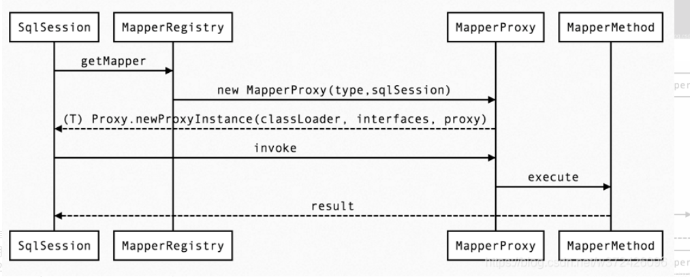
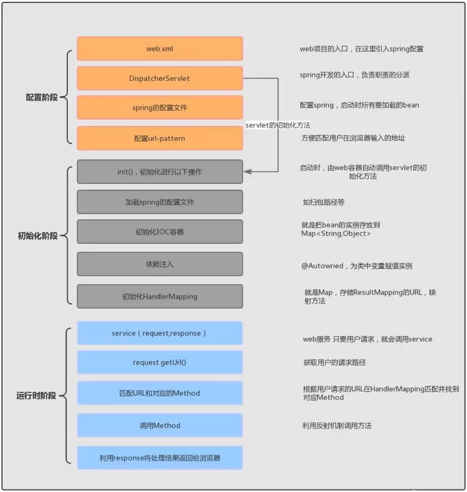
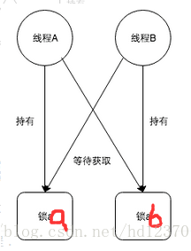

###### .JPG)

###### 集合

***HashMap*    *HashSet     Hashtable*** 

两者最主要的区别在于Hashtable是线程安全，而HashMap则非线程安全。

HashMap实现了Map接口  HashSet实现了Set接口

HashMap储存键值对   HashSet仅仅存储对象（且无重复对象）

使用put()方法将元素放入map中 ，使用add()方法将元素放入set中

HashMap中使用键对象来计算hashcode值，HashSet使用成员对象来计算hashcode值，对于两个对象来说hashcode可能相同，所以equals()方法用来判断对象的相等性，如果两个对象不同的话，那么返回false

HashMap比较快，因为是使用唯一的键来获取对象 ，HashSet较HashMap来说比较慢

HashMap允许将null作为一个entry的key或者value，而Hashtable不允许。
HashMap把Hashtable的contains方法去掉了，改成containsvalue和containsKey。因为contains方法容易让人引起误解。

**TreeSet和TreeMap的关系**（可排序，底层红黑树）

与HashSet完全类似，TreeSet里面绝大部分方法都市直接调用TreeMap方法来实现的。

TreeMap的底层采用红黑树的实现，完成数据有序的插入，排序。

红黑树的特点：
性质 1：每个节点要么是红色，要么是黑色。
性质 2：根节点永远是黑色的。
性质 3：所有的叶节点都是空节点（即 null），并且是黑色的。
性质 4：每个红色节点的两个子节点都是黑色。（从每个叶子到根的路径上不会有两个连续的红色节点）
性质 5：从任一节点到其子树中每个叶子节点的路径都包含相同数量的黑色节点。

相同点：

TreeMap和TreeSet都是有序的集合，也就是说他们存储的值都是排好序的。

TreeMap和TreeSet都是非同步集合，因此他们不能在多线程之间共享，不过可以使用方法Collections.synchroinzedMap()来实现同步

运行速度都要比Hash集合慢，他们内部对元素的操作时间复杂度为O(logN)，而HashMap/HashSet则为O(1)。

不同点：

最主要的区别就是TreeSet和TreeMap非别实现Set和Map接口

TreeSet只存储一个对象，而TreeMap存储两个对象Key和Value（仅仅key对象有序）

TreeSet中不能有重复对象，而TreeMap中可以存在


###### java锁

https://www.jianshu.com/p/7e3cf7469c83


###### 并发包

https://www.jianshu.com/p/dc56fa89d0fc


###### 线程池

```java
// https://blog.csdn.net/yan88888888888888888/article/details/83927609
//Executor创建会报内存溢出（底层有一个无界的阻塞队列）
private static ExecutorService executor = new ThreadPoolExecutor(10, 10,
        60L, TimeUnit.SECONDS,new ArrayBlockingQueue(10));
//运行机制
首先线程池它有一个核心线程数，当线程运行的时候，如果没有设置成预启动加载，线程数是0；
当提交一个新任务的时候，它会建立一个核心线程去执行任务，此时如果一直来任务，之前的也没有执行完，它会一直创建核心线程；
当达到核心线程数时，如果还都在忙，那么就会放到blockingQueue阻塞队列；
如果阻塞队列也放满了，而且核心线程还在忙，那就会去建立非核心线程，如果一直创建，数量达到非核心最大的线程数，就会触发一个拒绝策略


//四种创建线程池的方式
    
// 创建单个线程
Executors.newSingleThreadExecutor(); 
// 创建固定数量的线程
Executors.newFixedThreadPool(3); 
// 可动态调整,随着请求的增多线程也随之创建
Executors.newCachedThreadPool(); 
// 用来调度即将执行的任务的线程池
Executors.newScheduledThreadPool();

//七个参数
corePoolSize 核心线程数，一直存活，即使线程数小于核心线程数且线程数有空闲，线程池也会创建新的线程。
maximumPoolSize 最大线程数，当线程数大于核心线程数并且任务队列已经满了的时候，线程池会创建新的线程，当线程数大于最大线程数并且任务队列已经满了，会抛出异常。
keepAliveTime 线程空闲时间，当线程的空闲时间达到keepAliveTime时，线程会退出，直到线程数等于核心线程数，可以设置参数allowCoreThreadTimeout=true,则会直到线程数为0。
TimeUnit unit 超时时间单位。
BlockingQueue workQueue 阻塞队列，任务队列的容量。
ThreadFactory threadFactory 线程工厂，基本不用设置（默认使用Executors.defaultThreadFactory()）
    
RejectedExecutionHandler handler 拒绝策略，任务拒绝处理器。
  
//四种拒绝策略
AbortPolicy() 线程池满了，如果还有线程想加入，不处理这个请求，抛出异常。
CallerRunsPolicy() 谁调用返回谁执行，这种方式会影响新任务的提交速度
DiscardPolicy() 队列满了，丢掉任务，不会抛出异常。
DiscardOldestPolicy() 队列满了，尝试去和最早的竞争，不会抛出异常。
    
    
//总结
其实线程池就是种池化技术，其他的比如还有数据库连接池，内存池，http连接池等等，这样可以减少资源对象的创建次数，垃圾回收的开销，提高程序的性能，特别是在高并发下这种提高更加明显。
```

###### ThreadLocal


###### IOC

IOC（控制反转）是一种**设计思想**，就是 **将原本在程序中手动创建对象的控制权，交由Spring框架来管理。** IOC 容器是 Spring 用来实现 IOC 的载体， IOC 容器实际上就是个Map，存放的是各种对象。将对象之间的相互依赖关系交给 IoC 容器来管理，并由 IoC 容器完成对象的注入。这样可以很大程度上简化应用的开发，把应用从复杂的依赖关系中解放出来。 **IoC 容器就像是一个工厂一样，当我们需要创建一个对象的时候，只需要配置好配置文件/注解即可，完全不用考虑对象是如何被创建出来的。** 

Spring 时代我们一般通过 XML 文件来配置 Bean，后来开发人员觉得 XML 文件来配置不太好，于是 SpringBoot 注解配置就慢慢开始流行起来。

**IOC容器初始化流程**


###### AOP

AOP（面向切面编程）能够将那些与业务无关，**却为业务模块所共同调用的逻辑或责任（例如事务处理、日志管理、权限控制等）封装起来**，便于**减少系统的重复代码**，**降低模块间的耦合度**，并**有利于未来的可拓展性和可维护性**。

**Spring AOP就是基于动态代理的**，如果要代理的对象，实现了某个接口，那么Spring AOP会使用**JDK Proxy**，去创建代理对象，而对于没有实现接口的对象，这时候Spring AOP会使用**Cglib**生成一个被代理对象的子类来作为代理。

使用 AOP 之后我们可以把一些通用功能抽象出来，在需要用到的地方直接使用即可，这样大大简化了代码量。我们需要增加新功能时也方便，这样也提高了系统扩展性。日志功能、事务管理等等场景都用到了 AOP 。

https://www.jianshu.com/p/428f0898d0ce

https://blog.csdn.net/fz13768884254/article/details/83538709   @Aspect注解

###### JAVA反射

https://blog.csdn.net/qq_37875585/article/details/89340495

反射是在运行状态中，对于任意一个类，都能够知道这个类的所有属性和方法；对于任意一个对象，都能够调用它的任意一个方法和属性；这种动态获取的信息以及动态调用对象的方法的功能称为 Java 语言的反射机制。

JDBC中，利用反射动态加载了数据库驱动程序。
Web服务器中利用反射调用了Sevlet的服务方法。
Eclispe等开发工具利用反射动态刨析对象的类型与结构，动态提示对象的属性和方法。
很多框架都用到反射机制，注入属性，调用方法，如Spring。


优点：可以动态执行，在运行期间根据业务功能动态执行方法、访问属性，最大限度发挥了java的灵活性。
缺点：对性能有影响，这类操作总是慢于直接执行java代码。


###### mybatis实现原理



###### spring 流程




###### Spring Bean 生命周期

1. 实例化一个 Bean。
2. 按照 Spring 上下文对实例化的 Bean 进行配置（IOC 注入）。
3. 如果 Bean 实现了 BeanNameAware 接口，会调用它实现的 setBeanName(String name)方法，此处传递的就是 Spring 配置文件中 Bean 的 id 值。
4. 如果 Bean 实现了 BeanFactoryAware 接口，会调用它实现的 setBeanFactory(setBeanFactory(BeanFactory)传递的是 Spring 工厂自身，可以用来获取其他Bean。
5. 如果 Bean 实现了 ApplicationContextAware 接口，会调用 setApplicationContext(ApplicationContext)方法，传入 Spring 上下文（因为ApplicationContext为BeanFactory子接口，所以功能更丰富）。
6. 如果 Bean 关联了 BeanPostProcessor 接口，将会调用 postProcessBeforeInitialization(Object obj, String s)方法，BeanPostProcessor 经常被用作是 Bean
   内容的更改，并且由于这个是在 Bean 初始化结束时调用那个的方法，也可以被应用于内存
   或缓存技术。
7. 如果 Bean 在 Spring 配置文件中配置了 init-method 属性会自动调用其配置的初始化方法。
8. 如果 Bean 关联了 BeanPostProcessor 接口，将会调用 postProcessAfterInitialization(Object obj, String s)方法。
9. 当 Bean 不再需要时，会经过清理阶段，如果 Bean 实现了 DisposableBean 这个接口，会调用那个其实现的 destroy()方法。
10. 如果 Bean 的 Spring 配置中配置了 destroy-method 属性，会自动调用其配置的销毁方法。 

###### JUC工具类（了解）

https://blog.csdn.net/qq_35151346/article/details/99967823


###### 如何实现关键字输入提示，使用字典树，复杂度多少（logn），有没有其他方案，

答哈希，如果是中文呢，分词后建立字典树？


###### Java中的垃圾回收讲一下

**讲了分代**

https://blog.csdn.net/weixin_33435461/article/details/114076213

**gc算法gc root可达性分析等**

https://blog.csdn.net/iva_brother/article/details/87870576

###### 死锁是怎么产生的（资源竞争）

https://blog.csdn.net/hd12370/article/details/82814348

（1） 因为系统资源不足。
（2） 进程运行推进的顺序不合适。
（3） 资源分配不当等。


所谓死锁，是指多个进程在运行过程中因争夺资源而造成的一种僵局，当进程处于这种僵持状态时，若无外力作用，它们都将无法再向前推进。 因此我们举个例子来描述，如果此时有一个线程A，按照先锁a再获得锁b的的顺序获得锁，而在此同时又有另外一个线程B，按照先锁b再锁a的顺序获得锁。如下图所示：


持有锁的资源在等待获取锁

###### 线程和进程的区别

根本区别：进程是操作系统资源分配的基本单位，而线程是任务调度和执行的基本单位

在开销方面：每个进程都有独立的代码和数据空间（程序上下文），程序之间的切换会有较大的开销；线程可以看做轻量级的进程，同一类线程共享代码和数据空间，每个线程都有自己独立的运行栈和程序计数器（PC），线程之间切换的开销小。

所处环境：在操作系统中能同时运行多个进程（程序）；而在同一个进程（程序）中有多个线程同时执行（通过CPU调度，在每个时间片中只有一个线程执行）

内存分配方面：系统在运行的时候会为每个进程分配不同的内存空间；而对线程而言，除了CPU外，系统不会为线程分配内存（线程所使用的资源来自其所属进程的资源），线程组之间只能共享资源。

包含关系：没有线程的进程可以看做是单线程的，如果一个进程内有多个线程，则执行过程不是一条线的，而是多条线（线程）共同完成的；线程是进程的一部分，所以线程也被称为轻权进程或者轻量级进程。

###### 进程的通信方式

https://blog.csdn.net/zhaohong_bo/article/details/89552188

###### CPU的执行方式

https://blog.csdn.net/qq_15037231/article/details/90950936

###### 代码中遇到进程阻塞，进程僵死，内存泄漏等情况怎么排查。

通过ps查询状态，分析dump文件等方式排查。


###### Linux了解么

查看进程状态ps，查看cpu状态 top。查看占用端口的进程号netstat grep


###### Tomcat的基本架构和组件，以及请求的整个流程。

https://blog.csdn.net/zxl_Dragon/article/details/83584667

    从本质上讲，应用服务器的处理开始于监听的Socket端口接收到数据，结束于将处理结果写入Socket输出流
    应用服务器将请求按照既定协议进行读取，并将其封装为与具体协议无关的请求体
    
    按照请求映射规则将请求定位到具体的处理单元（使用框架的话SpringMVC等则会将请求匹配到Servlet下的一个控制器）
    
    业务处理结束，将结果封装到一个与协议无关的响应对象


###### 说了一下connector和container架构和servlet请求过程。

https://blog.csdn.net/weixin_42073629/article/details/107916747

###### 有N个节点的满二叉树的高度。

1+logN

###### 单元点最短路的方法，时间复杂度

https://blog.csdn.net/xiaolei09bupt/article/details/45307157

序数组排序，二分，复杂度
常见排序算法，说下快排过程，时间复杂度