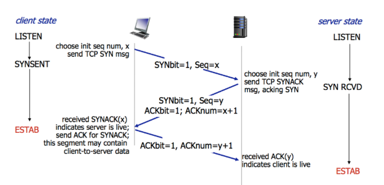
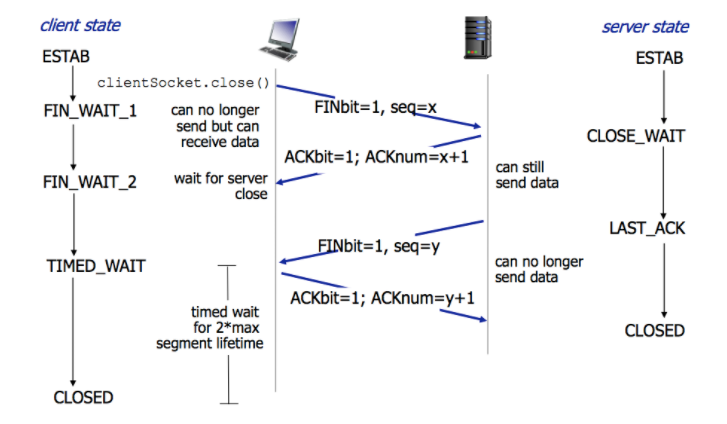
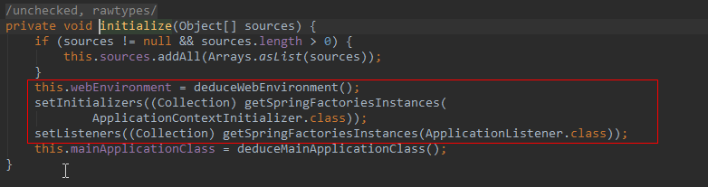
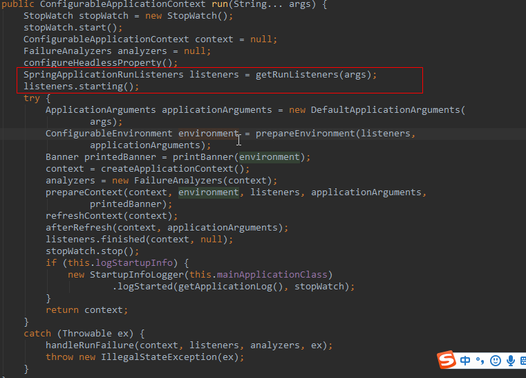
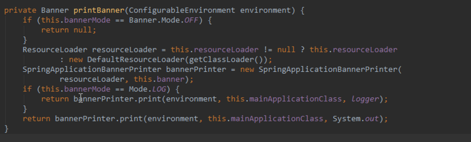
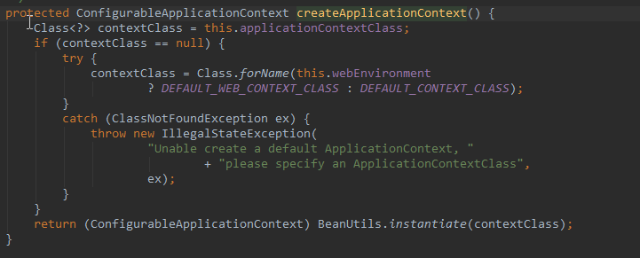
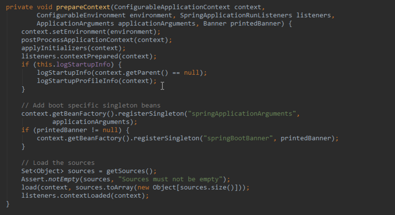
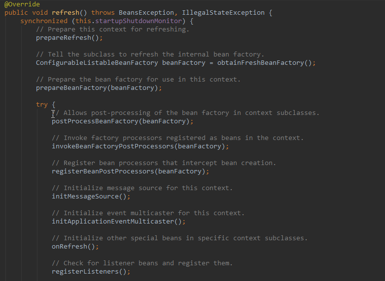

**Kwai推面经第 1 期**

## 实习 | 基础平台Java开发工程师

**第一轮**


###### \1. 项目

###### \2. Tcp的特性和状态，三次握手四次挥手



所谓三次握手(Three-way Handshake)，是指建立一个 TCP 连接时，需要客户端和服务器总共发送3个包。
三次握手的目的是连接服务器指定端口，建立 TCP 连接，并同步连接双方的序列号和确认号，交换 TCP 窗口大小信息。在 socket 编程中，客户端执行 connect() 时。将触发三次握手。

第一次握手(SYN=1, seq=x):
客户端发送一个 TCP 的 SYN 标志位置1的包，指明客户端打算连接的服务器的端口，以及初始序号 X,保存在包头的序列号(Sequence Number)字段里。发送完毕后，客户端进入 SYN_SEND 状态。

第二次握手(SYN=1, ACK=1, seq=y, ACKnum=x+1):
服务器发回确认包(ACK)应答。即 SYN 标志位和 ACK 标志位均为1。服务器端选择自己 ISN 序列号，放到 Seq 域里，同时将确认序号(Acknowledgement Number)设置为客户的 ISN 加1，即X+1。 发送完毕后，服务器端进入 SYN_RCVD 状态。

第三次握手(ACK=1，ACKnum=y+1)
客户端再次发送确认包(ACK)，SYN 标志位为0，ACK 标志位为1，并且把服务器发来 ACK 的序号字段+1，放在确定字段中发送给对方，并且在数据段放写ISN的+1发送完毕后，客户端进入 ESTABLISHED 状态，当服务器端接收到这个包时，也进入 ESTABLISHED 状态，TCP 握手结束。



四次挥手(Four-way handshake)，也叫做改进的三次握手。客户端或服务器均可主动发起挥手动作，在 socket 编程中，任何一方执行 close() 操作即可产生挥手操作。

第一次挥手(FIN=1，seq=x)
假设客户端想要关闭连接，客户端发送一个 FIN 标志位置为1的包，表示自己已经没有数据可以发送了，但是仍然可以接受数据。发送完毕后，客户端进入 FIN_WAIT_1 状态。

第二次挥手(ACK=1，ACKnum=x+1)
服务器端确认客户端的 FIN 包，发送一个确认包，表明自己接受到了客户端关闭连接的请求，但还没有准备好关闭连接。发送完毕后，服务器端进入 CLOSE_WAIT 状态，客户端接收到这个确认包之后，进入 FIN_WAIT_2 状态，等待服务器端关闭连接。

第三次挥手(FIN=1，seq=y)
服务器端准备好关闭连接时，向客户端发送结束连接请求，FIN 置为1。
发送完毕后，服务器端进入 LAST_ACK 状态，等待来自客户端的最后一个ACK。

第四次挥手(ACK=1，ACKnum=y+1)
客户端接收到来自服务器端的关闭请求，发送一个确认包，并进入 TIME_WAIT状态，等待可能出现的要求重传的 ACK 包。服务器端接收到这个确认包之后，关闭连接，进入 CLOSED 状态。客户端等待了某个固定时间（两个最大段生命周期，2MSL，2 Maximum Segment Lifetime）之后，没有收到服务器端的 ACK ，认为服务器端已经正常关闭连接，于是自己也关闭连接，进入 CLOSED 状态。


###### \3. Redis的结构，单线程为什么快

内存被cpu直接控制,cpu的时钟很快,我们知道带宽是通道数和时钟频率频率的乘积,硬盘不被cpu管理哪怕是现在的nvme硬盘也一样,被pch管理,并且pch有单独的时钟其频率最高只有几十mhz远低于cpu,所以从线路上来说内存就该快于硬盘

1、完全基于内存，绝大部分请求是纯粹的内存操作，非常快速。数据存在内存中，类似于HashMap，HashMap的优势就是查找和操作的时间复杂度都是O(1)；

2、数据结构简单，对数据操作也简单，Redis中的数据结构是专门进行设计的；

3、采用单线程，避免了不必要的上下文切换和竞争条件，也不存在多进程或者多线程导致的切换而消耗 CPU，不用去考虑各种锁的问题，不存在加锁释放锁操作，没有因为可能出现死锁而导致的性能消耗；

4、使用多路I/O复用模型，非阻塞IO；

5、使用底层模型不同，它们之间底层实现方式以及与客户端之间通信的应用协议不一样，Redis直接自己构建了VM 机制 ，因为一般的系统调用系统函数的话，会浪费一定的时间去移动和请求；

以上几点都比较好理解，下边我们针对多路 I/O 复用模型进行简单的探讨：

（1）多路 I/O 复用模型

多路I/O复用模型是利用 select、poll、epoll 可以同时监察多个流的 I/O 事件的能力，在空闲的时候，会把当前线程阻塞掉，当有一个或多个流有 I/O 事件时，就从阻塞态中唤醒，于是程序就会轮询一遍所有的流（epoll 是只轮询那些真正发出了事件的流），并且只依次顺序的处理就绪的流，这种做法就避免了大量的无用操作。

这里“多路”指的是多个网络连接，“复用”指的是复用同一个线程。采用多路 I/O 复用技术可以让单个线程高效的处理多个连接请求（尽量减少网络 IO 的时间消耗），且 Redis 在内存中操作数据的速度非常快，也就是说内存内的操作不会成为影响Redis性能的瓶颈，主要由以上几点造就了 Redis 具有很高的吞吐量。

###### \4. Mysql引擎知道哪些，说下myisam和innodb的区别，mysql事务怎么做的

https://mp.weixin.qq.com/s/Ng9akFrQNtaHhzi_Obl_og（事务）

https://blog.csdn.net/qq_35642036/article/details/82820178（区别）

redo log是用来恢复数据的 用于保障已提交事务的持久化特性。

undo log是用来回滚数据的用于保障 未提交事务的原子性

###### \5. Springboot怎么启动的，初始化的流程

### 1.3springboot启动简单流程

​		当我们运行SpringApplication的main方法时,调用静态方法run()首先是实例化,SpringApplication初始化的时候主要做主要做三件事：

- 根据classpath下是否存在(ConfigurableWebApplicationContext)判断是否要启动一个web applicationContext。
- SpringFactoriesInstances加载classpath下所有可用的ApplicationContextInitializer
- SpringFactoriesInstances加载classpath下所有可用的ApplicationListener



1.3.2 SpringApplicatio实例化完成并且完成配置后调用run()方法,首先遍历初始化过程中加载的SpringApplicationRunListeners，然后调用starting(),开始监听springApplication的启动。



1.3.3 加载SpringBoot配置环境(ConfigurableEnvironment)，如果是通过web容器发布，会加载StandardEnvironment。将配置环境(Environment)加入到监听器对象中(SpringApplicationRunListeners)。

1.3.4 banner属性的设置



1.3.5 ConfigurableApplicationContext(应用配置上下文)创建，根据webEnvironment是否是web环境创建默认的contextClass
,AnnotationConfigEmbeddedWebApplicationContext(通过扫描所有注解类来加载bean)和ConfigurableWebApplicationContext),最后通过BeanUtils实例化上下文对象，并返回。



1.3.6 prepareContext()方法将listeners、environment、applicationArguments、banner等重要组件与上下文对象关联。



1.3.7 refreshContext(context),bean的实例化完成IoC容器可用的最后一道工序。



1.3.8 最后springboot做一些收尾工作。自此springboot的简单流程到此结束。

\6. 假如让你用aop来做事务应该注意哪些点


\7. Java的锁了解哪些（ juc下的和偏向锁轻量级锁重量级锁）


\8. 两个单链表是否交叉及是否有环


**第二轮**


\1. 看你用的java，说下java的优点

\2. 面向对象的特性有哪些，介绍下，举个例子

\3. 说下java 异常，都有哪些，检查时异常和非检查异常区别

\4. 都知道哪些设计模式

\5. 单例，饿汉模式

\6. 给定参数的单例模式


## 实习 | 效率工程Java开发工程师第二轮

\1. 项目做了啥、难点。

\2. 输入一个url的过程。

\3. HTTPS怎么做的。

\4. 什么是SQL注入、mybatis怎么解决的。

\5. MySQL的事务、隔离级别介绍。

\6. String、StringBuilder、StringBuffer区别。

\7. 有自己写过SpringBoot的启动吗，给你你怎么写。

\8. SpringBoot的自动装配怎么做的。

\9. 讲一下动态代理怎么用的。

\10. 设计模式了解吗，说一下代理模式。

\11. 并发原理了解吗，说一下ConcurrentHashMap如何解决安全问题，以及扩容。

\12. 系统调用了解吗，举例。

\13. CPU缓存了解吗，各个之间速度差别具体是多少。

\14. 内存和磁盘速度具体差多少，为什么有这样的差距，物理构造了解吗。


**Kwai推面经第 2期**

## 实习 | 后端开发工程师

\1. string和stringbuffer和stringbuilder的区别

\2. concurrenthashmap了解多少，1.7和1.8区别

\3. 分段锁说一说

\4. CAS知道吗，介绍一下

\4. hashmap底层数据结构，jdk1.8之前和jdk1.8

\5. hashmap为什么链表超过8转化为红黑树？

\6. 介绍一下线程池，如果自己创建一个线程池，线程池包括哪些参数

\7. 多线程start和run方法的区别

\8. 抽象类和接口的区别，为什么要有抽象类？

\9. arraylist和linkedlist区别，是不是线程安全

\10. jvm了解多少，重要！！【垃圾回收机制】【类加载机制】

\11. mysql创建索引的注意事项

\12. redis怎么样、缓存类中间件用过哪些？kafka和rocketMQ了解多少

\13. 自动装箱 int和integer比较

\14. try catch执行顺序 中间插入return，执行顺序

\15. 多态的理解

\16. 手写单例模式

\17. arraylist和linkedlist区别

\18. 手写SQL 查找成绩总和top3的学生

\19. 创建线程的几种方法，都介绍一下

\20. 三层的B+树可以存多少信息，页表自己定义，节点大小自己估算

上亿级别，按页表16KB算，long占4个字节，16KB/4B = 4K

4K × 4K × 4K = 6.4×10^10

\21. B树和B+树介绍一下，说说区别

\22. 死锁四大条件

\23. 如何避免死锁

\24. 银行家算法（预防死锁的方法）

\25. linux会哪些命令，介绍10个

\26. socket编程了解多少

\27. 聚簇索引和非聚簇索引

\28. linux文件系统

\29. 你知道哪些文件系统，说说结构

\30. http是有状态还是无状态？是有连接还是无连接？


## 实习 | Java开发工程师

**第一轮**


\1. int与Integer的区别

\2. 接口与抽象类的区别，为什么会有接口

\3. hashmap的底层数据结构和扩容机制

\4. hashtable是怎么实现线程安全的，两个线程可以同时分别调用get和put方法吗

\5. concurrenthashmap是怎么实现线程安全的，怎么加锁，分段锁多了会怎么样，少了会怎么样，怎么保证适合的分段锁个数

\6. java里面怎么实现同步

\7. synchronized关键字和lock的区别

\8. synchronized在jvm里面是怎么实现的

\9. lock除了常用的Reetrantlock之外还了解什么实现类

\10. 了解锁升级吗

\11. 找出第k大个数

\12. 实现一个可以取到最大值的栈


**第二轮**


\1. 给定一个只有字母数字的字符串，找出连续数字的最大值

2.了解二叉树吗，写一个后序遍历，如果不用递归怎么实现

\3. 垃圾回收算法

\4. 新生代为什么要分三个区，为什么比例是8比1比1

\5. 说几个新生代垃圾回收器

\6. tcp为什么要三次握手，四次挥手

\7. 挥手为什么是4次，三次不可以吗

\8. MTU和分片了解吗


**第三轮**


\1. 实现一个求整数n的开平方数的函数

```java
import java.math.BigDecimal;
 
public class Sqrt {
	private static final double PRECISION = 6;
	
	public static double sqrt(double num) throws RuntimeException{
		if(num < 0){
			throw new RuntimeException("num should bigger than 0!");
		}
		if(num == 0 || num == 1){
			return num;
		}
		
		return sqrt0(0, num, num);
	}
	
	private static double sqrt0(double low, double high, double num){
		double mid = (low + high) / 2;
		
		BigDecimal bd = new BigDecimal(mid);
		if(bd.precision() >= PRECISION){
			return mid;
		}
		
		if((mid * mid) == num){
			return mid;
		}else if((mid * mid) < num){
			return sqrt0(mid, high, num);
		}else {
			return sqrt0(low, mid, num);
		}
	}
	
	public static void main(String[] args) {
		System.out.println(sqrt(2));
	}
}
```


\2. 为什么来快手

\3. 对商业化怎么看

```
(先过)
实习 | Java开发工程师第一轮

\1. 实现数组的map方法.扩展运算符，ES6，遍历方法


\2. promise和async await，promise.all


\3. html5.css3

\4. 盒模型

\5. let const

\6. vuex，同步异步的差别

\7. vue生命周期

\8. webpack

\9. 一个嵌套的东西展开
```


