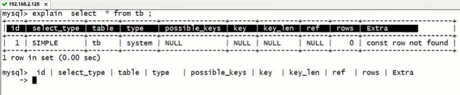

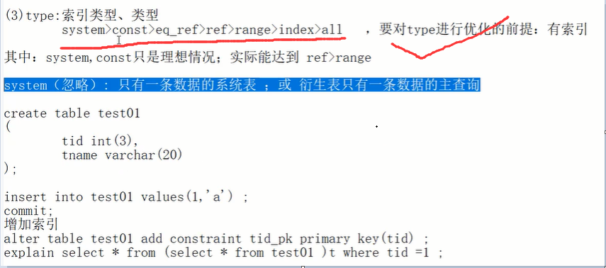


######  **1.volatile底层、synchronized底层**

synchronized底层基础:

Java对象头

Monitor:可以理解为同步机制与同步对象，为每一个java对象生成一把看不见的锁

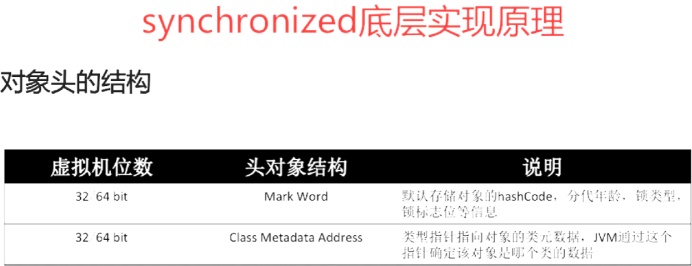

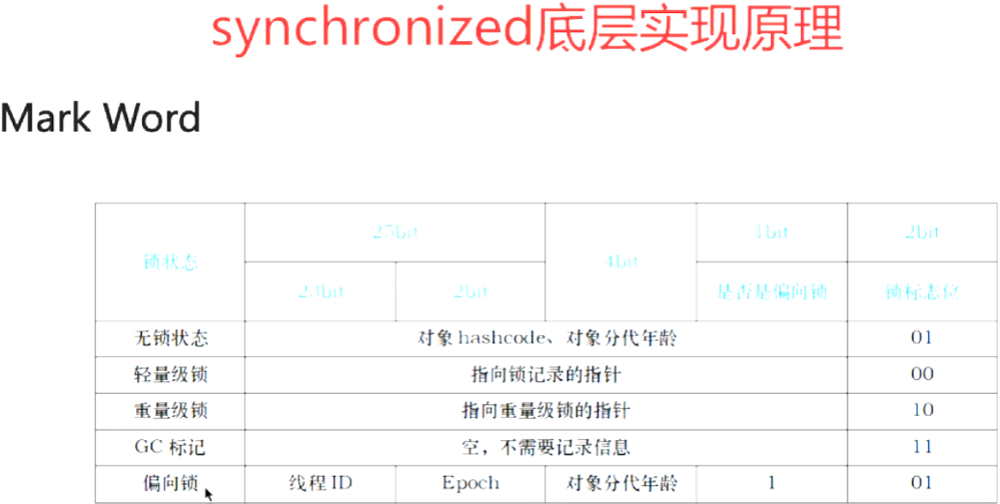

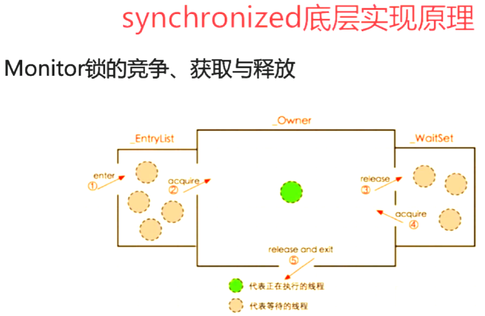

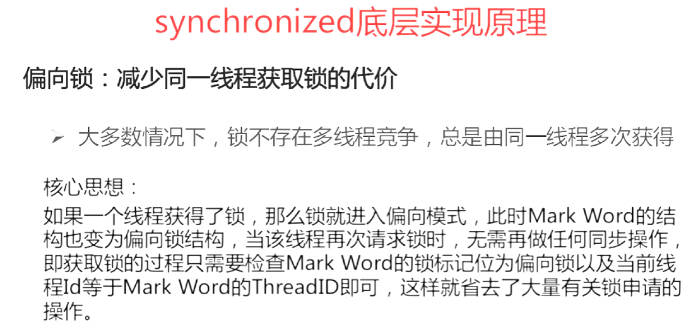


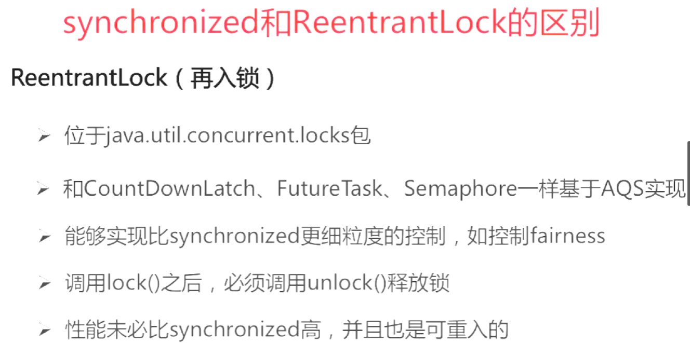

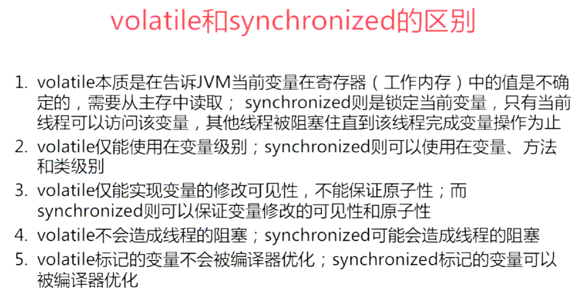


###### volatile底层（**内存屏障有哪些？？**）

有volatile变量修饰的共享变量进行写操作的时候加 lock前缀的指令在多核处理器下会引发了两件事情。
1.将当前处理器缓存行的数据会写回到系统内存。
2.这个写回内存的操作会引起在其他CPU里缓存了该内存地址的数据无效。

​       处理器为了提高处理速度，不直接和内存进行通讯，而是先将系统内存的数据读到内部缓存（L1,L2或其他）后再进行操作，但操作完之后不知道何时会写到内存，**如果对声明了Volatile变量进行写操作，JVM就会向处理器发送一条Lock前缀的指令，**将这个变量所在缓存行的数据写回到系统内存。但是就算写回到内存，如果其他处理器缓存的值还是旧的，再执行计算操作就会有问题，所以在多处理器下，为了保证各个处理器的缓存是一致的，就会实现**缓存一致性协议**，每个处理器通过嗅探在总线上传播的数据来检查自己缓存的值是不是过期了，当处理器发现自己缓存行对应的内存地址被修改，就会将当前处理器的缓存行设置成无效状态，当处理器要对这个数据进行修改操作的时候，会强制重新从系统内存里把数据读到处理器缓存里。


###### **2.线程池的拒绝策略**

（1）ThreadPoolExecutor.AbortPolicy 丢弃任务，并抛出 RejectedExecutionException 异常。

（2）ThreadPoolExecutor.CallerRunsPolicy：该任务被线程池拒绝，由调用 execute方法的线程执行该任务。

（3）ThreadPoolExecutor.DiscardOldestPolicy ： 抛弃队列最前面的任务，然后重新尝试执行任务。

（4）ThreadPoolExecutor.DiscardPolicy，丢弃任务，不过也不抛出异常。


###### **3.Synchronized 和 lock区别！！！！**

1.首先synchronized是java内置关键字，在jvm层面，Lock是个java类；

2.synchronized无法判断是否获取锁的状态，Lock可以判断是否获取到锁；

3.synchronized会自动释放锁(a 线程执行完同步代码会释放锁 ；b 线程执行过程中发生异常会释放锁)，Lock需在finally中手工释放锁（unlock()方法释放锁），否则容易造成线程死锁；

4.用synchronized关键字的两个线程1和线程2，如果当前线程1获得锁，线程2线程等待。如果线程1阻塞，线程2则会一直等待下去，而Lock锁就不一定会等待下去，如果尝试获取不到锁，线程可以不用一直等待就结束了；

5.synchronized的锁可重入、不可中断、非公平，而Lock锁可重入、可判断、可公平（两者皆可）

6.Lock锁适合大量同步的代码的同步问题，synchronized锁适合代码少量的同步问题。


###### **4.常用注解**

@Controller :WEB 层   @Service  :业务层   @Repository :持久层

属性注入的注解:(使用注解注入的方式,可以不用提供 set 方法.)

@Value  :用    于注入普通类型. @Autowired :自动装配:

\* 默认按类型进行装配.

*按名称注入:

 @Qualifier:强制使用名称注入.

@Resource 相当于:    @Autowired 和@Qualifier 一起使

Bean 的作用范围的注解:

@Scope:* singleton:单例 * prototype:多例


###### **5.abstract和接口的区别**

1.抽象类可以有构造方法,接口中不能有构造方法。

2.抽象类中可以包含非抽象的普通方法,接口中的所有方法必须都是抽象的,不能有非抽象的方法。

3.抽象类中可以有普通成员变量,接口中没有普通成员变量。

4.抽象类中的抽象方法的访问类型可以是public.protected和默认类型

5.抽象类中可以包含静态方法,接口不能包含静态方法


###### **6.网址传参数的问题，如果是a=1和A=1服务器会解析成一样的么，怎么过滤一些不合法的字符，怎么设置过滤器**

linux区分大小写

1. 创建一个表单用于发表言论。
2. 创建一个txt文件，其中存入非法字符。
3. 创建一个Filter，拦截请求。在init方法中将txt文件中的非法字符读取到内存中。
4. 获取请求中的参数，对请求的参数进行非法字符的校验。
5. 如果言论中没有含有非法字符，就放行。
6. 如果言论中含有非法字符，就拦截，并且提示用户非法言论。

先创建illgalServlet
再创建illgalFilter

###### **7.final关键字修饰类，方法等的限制**

final修饰类无法继承
final修饰方法无法被覆盖
final修改变量一旦赋值之后，无法再赋值
对于final修饰的成员变量，要么直接赋值，要么通过构造方法赋值，而且只能赋值一次
final可用于声明属性、方法和类，分别表示属性不可变，方法不可重写，类不可继承。


###### **8.如何判定链表中有环，如果时100万个数据呢。**

```java
//定义链表节点
//ListNode类表示链表节点，包含两个属性：val表示当前节点的值，next指向下一个节点。

class ListNode {
    int val;
    ListNode next;
    ListNode(int x) {
        val = x;
        next = null;
    }
}
//快慢指针
public class Solution {
    public boolean hasCycle(ListNode head) {
        if(head == null) return false;
        ListNode p = head, q = head;
        while(p.next != null && p.next.next != null && q.next != null) {
            p = p.next.next;
            q = q.next;
            if(p == q) {
                return true;
            }
        }
        return false;
    }
}

//hash表
public class Solution {
    public boolean hasCycle(ListNode head) {
        Set<ListNode> set = new HashSet<>();
        while(head != null) {
            if(set.contains(head)) return true;
            else {
                set.add(head);
                head = head.next;
            }
        }
        return false;
    }
}
```


###### **9.如何在100亿个标题中搜索到想要的关键字标题。**

redis


###### **10.怎样开发一个不可变类**

不要提供任何可以修改对象属性的方法

不要为属性提供set方法

保证类不会被扩展

用final修饰类

使所有的属性都是final的

初始化之后不能修改属性的值

使所有的属性都是private的

防止别的对象访问不可变类的属性

确保对任何可变组件的互斥访问

如果有指向可变对象的属性，一定要确保，这个可变对象不能被其他类访问和修改。最好不要在不可变类中添加 指向可变类的属性

优点

线程安全

不可变，线程间可共享，不存在多线程问题

易于设计，使用简单等等

没有多线程问题，不能被继承，不能被扩展，设计和使用的时候只需要针对当前需求就已经足够了。

缺点

每个不同的值都需要一个单独的对象


###### **12.jvm的垃圾判定算法、GC算法（标清除、标记复制、标记整理）**

JVM垃圾判定算法

常见的JVM垃圾判定算法包括：引用计数算法、可达性分析算法。

引用计数算法：给对象中添加一个引用计数器，每当有一个地方引用它时，计数器值就加1；当引用失效时，计数器值就减1；任何时刻计数器为0的对象就是不可能再被使用的。（缺点相互引用的两个对象无法释放）

可达性分析算法：从GC Roots（每种具体实现对GC Roots有不同的定义）作为起点，向下搜索它们引用的对象，可以生成一棵引用树，树的节点视为可达对象，反之视为不可达。

强引用：要强引用还存在，垃圾收集器永远不会回收掉被引用的对象

软引用：软引用是用来描述一些还有用但并非必需的对象，对于软引用关联着的对象，在系统将要发生内存溢出异常之前，将会把这些对象列进回收范围进行第二次回收。如果这次回收还没有足够的内存，才会抛出内存溢出异常

弱引用：弱引用也是用来描述非必需对象的，但是它的强度比软引用更弱一些，被弱引用关联的对象，只能生存到下一次垃圾收集发生之前。当垃圾收集器工作时，无论当前内存是否足够，都会回收掉只被弱引用关联的对象。

虚引用：虚引用也成为幽灵引用或者幻影引用，它是最弱的一中引用关系。一个对象是否有虚引用的存在，完全不会对其生存时间构成影响，也无法通过虚引用来取得一个对象实例。为一个对象设置虚引用关联的唯一目的就是能在这个对象被收集器回收时收到一个系统通知。


###### **13.Integer a = 10； Integer b = 10； a == b吗大概这样，考那个缓存池的**

Integer a=10,100,1000；
Integer b=10,100,1000；
a==b
当a和b为10,100时，为true，
当a和b为1000时，为false。因为
Integer存在常量池,一次性把从-128到127之间的所有数都初始化了
==比较的是内存地址，
当没超出赋值范围时，内存地址都为常量池中的地址，
超出了int的最大缓存量后各自new了一个对象，两个地址肯定不一样了。


###### **14.如何看线程的运行情况**

$ top -H

$ ps -T -p <pid>在ps命令中，“-T”选项可以开启线程查看。下面的命令列出了由进程号为<pid>的进程创建的所有线程。


###### **15.如何缓解哈希碰撞**

 **开放定址法：**又分为

   *线性探查法*： 简单地说，就是以当前冲突位置为起点，步长为1循环查找，直到找到一个空的位置，如果循环完了都占不到位置，就说明容器已经满了。举个栗子就像你在饭点去街上吃饭，挨家去看是否有位置一样。

   *平方探测法:*   相对于线性探查法，这就相当于的步长为di = i2来循环查找，直到找到空的位置。以上面那个例子来看，现在你不是挨家去看有没有位置了，而是拿手机算去第i2家店，然后去问这家店有没有位置。

   *伪随机探测法*:    这个就是取随机数来作为步长。还是用上面的例子，这次就是完全按心情去选一家店问有没有位置了。

缺点：

- 这种方法建立起来的哈希表，当冲突多的时候数据容易堆集在一起，这时候对查找不友好；
- 删除结点的时候不能简单将结点的空间置空，否则将截断在它填入散列表之后的同义词结点查找路径。因此如果要删除结点，只能在被删结点上添加删除标记，而不能真正删除结点；
- 如果哈希表的空间已经满了，还需要建立一个溢出表，来存入多出来的元素。


**再哈希法 ：**用于同义词发生地址冲突时，计算出另一个哈希函数地址，直到不发生冲突位置。这种方法不容易产生堆集，但是会增加计算时间。

所以再哈希法的缺点是：增加了计算时间

**建立一个公共溢出区：**假设哈希函数的值域为[0, m-1]，设向量HashTable[0,…,m-1]为基本表，每个分量存放一个记录，另外还设置了向量OverTable[0,…,v]为溢出表。基本表中存储的是关键字的记录，一旦发生冲突，不管他们哈希函数得到的哈希地址是什么，都填入溢出表。

**链地址法（拉链法）：**将冲突位置的元素构造成链表。在添加数据的时候，如果哈希地址与哈希表上的元素冲突，就放在这个位置的链表上。

**16.TCP、HTTP协议**

小结TCP与UDP的区别：
1.基于连接与无连接；
2.对系统资源的要求（TCP较多，UDP少）；
3.UDP程序结构较简单；
4.流模式与数据报模式 ；
5.TCP保证数据正确性，UDP可能丢包，TCP保证数据顺序，UDP不保证。


TCP/IP按照层次从上至下分为四层：应用层，传输层，网络层，数据链路层。

 应用层 ：
- 应用层决定了向用户提供应用服务时通信的活动。TCP/IP协议族内预存了各类通用的应用服务。比如，FTP（File Transfer Protocol，文件传输协议）和DNS（Domain Name System，域名系统）服务就是其中两类。HTTP协议也处于该层。

传输层 ：
- 传输层对上层应用层，提供处于网络连接中的两台计算机之间的数据传输。在传输层有两个性质不同的协议：TCP（Transmission ControlProtocol，传输控制协议）和UDP（User Data Protocol，用户数据报协议）。

网络层 ：
- 网络层用来处理在网络上流动的数据包。数据包是网络传输的最小数据单位。该层规定了通过怎样的路径（所谓的传输路线）到达对方计算机，并把数据包传送给对方。与对方计算机之间通过多台计算机或网络设备进行传输时，网络层所起的作用就是在众多的选项内选择一条传输路线。

 链路层（又名数据链路层，网络接口层） ：
- 用来处理连接网络的硬件部分。包括控制操作系统、硬件的设备驱动、NIC（Network Interface Card，网络适配器，即网卡），及光纤等物理可见部分（还包括连接器等一切传输媒介）。硬件上的范畴均在链路层的作用范围之内。


###### **17.spring MVC如何处理前端发送来的请求**

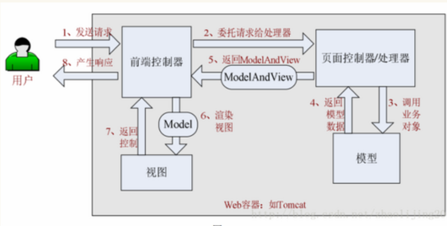


###### **18.线上服务器的一个日志重复出现了两次，如何排查问题**

多线程

log4j:logger


###### **19.maven的作用，maven的生命周期**

作用：

maven主要是用来解决导入java类依赖的jar,编译java项目主要问题，Jar包冲突的问题

maven还为全世界的Java开发者提供了一个免费的中央仓库

 热部署，热编译，你可以直接通过maven 打包war或者jar项目


生命周期：

Maven有三套相互独立的生命周期，分别是clean、default和site。每个生命周期包含一些阶段（phase），阶段是有顺序的，后面的阶段依赖于前面的阶段。

**1、clean生命周期**：清理项目，包含三个phase。

1）pre-clean：执行清理前需要完成的工作

2）clean：清理上一次构建生成的文件

3）post-clean：执行清理后需要完成的工作

**2、default生命周期**：构建项目，重要的phase如下。

1）validate：验证工程是否正确，所有需要的资源是否可用。
2）compile：编译项目的源代码。  
3）test：使用合适的单元测试框架来测试已编译的源代码。这些测试不需要已打包和布署。
4）Package：把已编译的代码打包成可发布的格式，比如jar。
5）integration-test：如有需要，将包处理和发布到一个能够进行集成测试的环境。
6）verify：运行所有检查，验证包是否有效且达到质量标准。
7）install：把包安装到maven本地仓库，可以被其他工程作为依赖来使用。
8）Deploy：在集成或者发布环境下执行，将最终版本的包拷贝到远程的repository，使得其他的开发者或者工程可以共享。

**3、site生命周期**：建立和发布项目站点，phase如下

1）pre-site：生成项目站点之前需要完成的工作

2）site：生成项目站点文档

3）post-site：生成项目站点之后需要完成的工作

4）site-deploy：将项目站点发布到服务器


###### **20.JVM内存模型，哪些区域是线程安全，哪些区域线程不安全**

1. 所有的变量都存储在主内存(Main Memory)
2. 每个线程也有用自己的工作内存(Work Memory)
3. 工作内存中的变量是主内存变量的拷贝,线程不能直接读写主内存的变量,而只能操作自己工作内存中的变量
4. 线程间不共享工作内存,如果线程间需要通信必须借助主内存来完成

共享变量所在的内存区域也就是共享内存,也称之为堆内存,该区域中的变量都可能被共享,即被多线程访问.说的再通俗点就是在java当中,堆内存是在线程间共享的,而局部变量,形参和异常程序参数不在堆内存,因此就不存在多线程共享的情况.

与JMM规定相对应,我们定义了以下四个原子性操作来实现变量从主内存拷贝到工作内存的过程:

read:读取主内存的变量,并将其传送到工作内存

load:把read操作从主内存得到的变量值放入到工作内存的拷贝中

store:把工作内存中的一个变量值传送到主内存当中,以便用于后面的write操作

write:把store操作从工作内存中得到的变量的值放入主内存的变量中.

---

基本类型是存在栈中
非通过new创建的字符串对象是存在jvm的字符池中
其余的都存放在堆中

---

###### **21.垃圾收集器介绍**

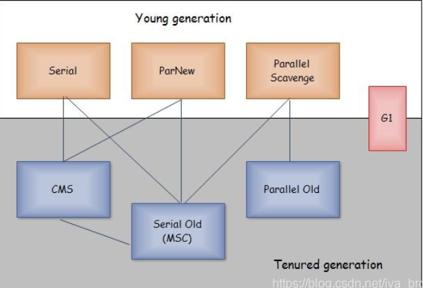

　一、Serial 收集器

　　　　单线程收集器，在进行GC时，必须暂停所有的工作线程（Stop The World）,直到GC收集结束。

　　　　缺点：“Stop The World”给用户带来了不好的体验

　　　　优点：简单而高效，Serial没有其他线程交互的开销，专心做GC可以获得最高的单线程收集效率。

　　　　适用于Client模式下的虚拟机是个很好的选择。

　　二、ParNew 收集器

 　　　ParNew收集器就是Serial收集器的多线程版本，适用于Service模式下的新生代收集器。

　　　　 ParNew在单核CPU环境中绝对不会有比Serial收集器更好的效果。但是多核CPU，GC效果还是不错的。　　

　　三、Parallel Scavenge 收集器

　　　　Parallel Scavenge 收集器也是一个新生代收集器，使用复制算法，同时也是一个并行的多线程收集器。

　　　　Parallel Scavenge 收集器的目标则是达到一个可控制的吞吐量。

　　　　注:吞吐量 =用户运行代码时间 / (运行代码时间 + 垃圾收集时间)

　　　　吞吐量高则可以最高效率的利用CPU时间，尽快的完成程序的运算任务，主要适用于后台运算二不需要太多的交互任务。

　　四、Serial Old 收集器

　　　　Serial Old 收集器是Serial收集器的老年代版本，单线程收集器，使用“标记-整理”算法。

　　五、Parallel Old 收集器

　　　　Parallel Old 收集器是Parallel Scavenge收集器的老年代版本，使用多线程和“标记-整理”算法。

　　六、CMS 收集器

　　　　CMS(Concurrent Mark Sweep)收集器是一种以获取最短停顿时间为目标的收集器。目前很大一部分Java应用程序都集中是在互联网或B/S系统的服务器上，这类应用尤其重视服务器的响应速度，希望系统停顿时间最短，给用户最好的体验。整个过程分为四步：

- 初始标记（CMS initial mark）:标记一下GC Root能直接关联到的对象，速度很快；
- 并发标记（CMS concurrent mark）：进行GC Root Tracing的过程
- 重新标记（CMS remark）：修正并发标记期间，因用户程序继续运行导致标记产生变动的那一部分对象的标记记录；
- 并发清除（CMS concurrent sweep）　　

　　其中初始标记、重新标记还是需要“Stop The World”.CMS收集器的内存回收过程与用户线程并发执行。

　　优点是并发收集、低停顿

　　缺点:1)CMS收集器对CPU资源非常敏感；在并发阶段虽然不会导致用户线程停顿，但是会因为占用了一份线程而导致应用程序变慢，总吞吐量降低。

　　　　 2)CMS并发清除阶段用户线程还在运行，伴随线程运行产生的新的垃圾出现在标记过程以后，CMS无法在本次收集中处理掉它们，只能留到下次GC。这一部分垃圾就是“浮动垃圾”。

　　　　 3)CMS是一款“标记-清除”算法实现的收集器，收集过程会产生大量的空间碎片。空间碎片过多，将会给较大对象无法分配内存，从而触发一次 Full GC.

　　七、G1 收集器

　　　　G1(Garbage First)收集器相比于CMS改进有：

　　　　（1）G1基于“标记-整理”算法实现收集器，即它不会产生大量的空间碎片，这对于长时间的应用系统非常重要。

　　　　（2）可以非常准确的控制停顿，既能让使用者明确指定一个长度为M毫秒的时间片段内，消耗在垃圾收集上的时间不超过N毫秒。G1将Java堆（包括新生代、老年代）划分为多个大小固定独立区域，并且跟踪这些区域里面的垃圾堆积程度，在后台维护一个优先列表，每次根据允许的收集时间，优先回收垃圾最多的区域。


###### **22.TreeMap是基于什么实现的（红黑树）**


###### **23.zest底层数据结构，hash底层数据结构**

底层分别使用**ziplist（压缩链表）**和**skiplist（跳表）**实现。

hash: ziplist（压缩列表）和hashtable


###### **24.介绍字典如何扩容，渐进式rehash过程中两个哈希表都要扩容，如何解决**


###### **25.死锁条件 预防死锁   避免死锁**

死锁的四个必要条件

互斥条件：一个资源每次只能被一个进程使用，即在一段时间内某 资源仅为一个进程所占有。此时若有其他进程请求该资源，则请求进程只能等待。

请求与保持条件：进程已经保持了至少一个资源，但又提出了新的资源请求，而该资源 已被其他进程占有，此时请求进程被阻塞，但对自己已获得的资源保持不放。

不可剥夺条件:进程所获得的资源在未使用完毕之前，不能被其他进程强行夺走，即只能 由获得该资源的进程自己来释放（只能是主动释放)。

循环等待条件: 若干进程间形成首尾相接循环等待资源的关系

*这四个条件是死锁的必要条件，只要系统发生死锁，这些条件必然成立，而只要上述条件之一不满足，就不会发生死锁。*

**死锁避免的基本思想**：

系统对进程发出的每一个系统能够满足的资源申请进行动态检查，并根据检查结果决定是否分配资源，如果分配后系统可能发生死锁，则不予分配，否则予以分配，这是一种保证系统不进入死锁状态的动态策略。 
如果操作系统能保证所有进程在有限时间内得到需要的全部资源，则系统处于安全状态否则系统是不安全的。

###### 死锁预防

我们可以通过破坏死锁产生的4个必要条件来 预防死锁，由于资源互斥是资源使用的固有特性是无法改变的。

1. 破坏“不可剥夺”条件：一个进程不能获得所需要的全部资源时便处于等待状态，等待期间他占有的资源将被隐式的释放重新加入到 系统的资源列表中，可以被其他的进程使用，而等待的进程只有重新获得自己原有的资源以及新申请的资源才可以重新启动，执行。
2. 破坏”请求与保持条件“：第一种方法静态分配即每个进程在开始执行时就申请他所需要的全部资源。第二种是动态分配即每个进程在申请所需要的资源时他本身不占用系统资源。
3. 破坏“循环等待”条件：采用资源有序分配其基本思想是将系统中的所有资源顺序编号，将紧缺的，稀少的采用较大的编号，在申请资源时必须按照编号的顺序进行，一个进程只有获得较小编号的进程才能申请较大编号的进程。


###### **26.ThreadLocal原理**

那么ThreadLocal内部是怎么保证对象是线程私有的呢？毫无疑问，答案需要从源码中查找。回顾前面的代码，可以发现其中调用了ThreadLocal的两个方法**set** 和 **get**，我们就从这两个方法入手。

先看 **set()** 的源码：

```java
public void set(T value) {
    Thread t = Thread.currentThread();
    // 获取线程的ThreadLocalMap，返回map
    ThreadLocalMap map = getMap(t);
    if (map != null)
        map.set(this, value);
    else
    	//map为空，创建
        createMap(t, value);
}
ThreadLocalMap getMap(Thread t) {
    return t.threadLocals;
}
void createMap(Thread t, T firstValue) {
	t.threadLocals = new ThreadLocalMap(this, firstValue);
}
```

set的代码逻辑比较简单，主要是把值设置到当前线程的一个ThreadLocalMap对象中，而ThreadLocalMap可以理解成一个Map，它是定义在Thread类中内部的成员，初始化是为null，

```
ThreadLocal.ThreadLocalMap threadLocals = null;
```

不过，与常见的Map实现类，如HashMap之类的不同的是，ThreadLocalMap中的Entry是继承于WeakReference类的，保持了对 “键” 的弱引用和对 “值” 的强引用，这是类的源码：

```
static class ThreadLocalMap {

    static class Entry extends WeakReference<ThreadLocal<?>> {
        /** The value associated with this ThreadLocal. */
        Object value;

        Entry(ThreadLocal<?> k, Object v) {
            super(k);
            value = v;
        }
    }
    
    //省略剩下的源码
    ....................
}
```

从源码中中可以看出，Entry构造函数中的参数 **k** 就是ThreadLocal实例，调用super(k) 表明对 **k** 是弱引用，使用弱引用的原因在于，当没有强引用指向 ThreadLocal 实例时，它可被回收，从而避免内存泄露，那么为何需要防止内存泄露呢？原因下面会说到。

接着说set方法的逻辑，当调用set方法时，其实是将数据写入threadLocals这个Map对象中，这个Map的key为ThreadLocal当前对象，value就是我们存入的值。而threadLocals本身能保存多个ThreadLocal对象，相当于一个ThreadLocal集合。

接着看 **get()** 的源码：

```
public T get() {
    Thread t = Thread.currentThread();
    ThreadLocalMap map = getMap(t);
    if (map != null) {
        ThreadLocalMap.Entry e = map.getEntry(this);
        if (e != null) {
            @SuppressWarnings("unchecked")
            T result = (T)e.value;
            return result;
        }
    }
    //设置初识值到ThreadLocal中并返回
    return setInitialValue();
}
private T setInitialValue() {
        T value = initialValue();
        Thread t = Thread.currentThread();
        ThreadLocalMap map = getMap(t);
        if (map != null)
            map.set(this, value);
        else
            createMap(t, value);
        return value;
    }
```

get方法的逻辑也是比较简单的，就是直接获取当前线程的ThreadLocalMap对象，如果该对象不为空就返回它的value值，否则就把初始值设置到ThreadLocal中并返回。

看到这，我们大概就能明白为什么ThreadLocal能实现线程私有的原理了，其实就是每个线程都维护着一个ThreadLocal的容器，这个容器就是ThreadLocalMap，可以保存多个ThreadLocal对象。而调用ThreadLocal的set或get方法其实就是对当前线程的ThreadLocal变量操作，与其他线程是分开的，所以才能保证线程私有，也就不存在线程安全的问题了。

然而，该方案虽然能保证线程私有，但却会占用大量的内存，因为每个线程都维护着一个Map，当访问某个ThreadLocal变量后，线程会在自己的Map内维护该ThreadLocal变量与具体实现的映射，如果这些映射一直存在，就表明ThreadLocal 存在引用的情况，那么系统GC就无法回收这些变量，可能会造成内存泄露。

针对这种情况，上面所说的ThreadLocalMap中Entry的弱引用就起作用了。


###### **27.事务隔离级别（脏读。重复读，幻读）**


###### **28.找出总成绩前十的学生**


定义stu表，num（学号），score（分数）    那么SQL语句为

select num , sum(score) total from stu group by num order by total desc limit 10;

分析：num为学号（表示一个学生）， group by num（以学号，也就是每个学生为一组）

order by total desc（总分降序） ，前面的sum(score) 必须重新命名（此处命名为total）

limit 10 （取前10名）


###### **29. 说一下hashmap的扩容机制？hashmap进行数组的位移操作的时候（hash&table.length）为1的时候要加上oldTable.length?**

一般情况下，**当元素数量超过阈值时**便会触发扩容。每次扩容的容量都是之前容量的2倍。HashMap的容量是有上限的，必须小于**1<<30**，即1073741824。如果容量超出了这个数，则不再增长，且阈值会被设置为**Integer.MAX_VALUE**（2^31 -1，即永远不会超出阈值了）。


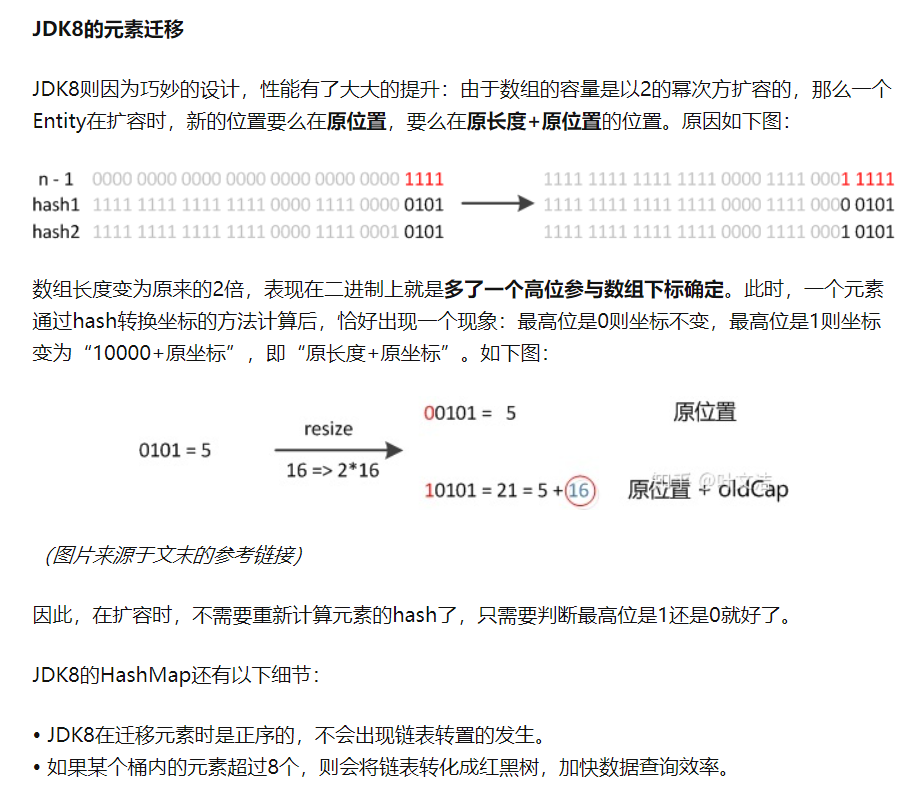


###### **30. hashmap，put的流程？**

哈希桶、链表、红黑树


###### **31.hashmap什么时候线程不安全的情况？**

多线程出现hash碰撞做头插


###### **32.说一说synch关键字和jdk lock锁的一个区别？什么时候用synch关键字和jdk锁?**

举个例子：当有多个线程读写文件时，读操作和写操作会发生冲突现象，写操作和写操作会发生冲突现象，但是读操作和读操作不会发生冲突现象。

但是采用synchronized关键字来实现同步的话，就会导致一个问题：

​        如果多个线程都只是进行读操作，所以当一个线程在进行读操作时，其他线程只能等待无法进行读操作。

​        因此就需要一种机制来使得多个线程都只是进行读操作时，线程之间不会发生冲突，通过Lock就可以办到。另外，通过Lock可以知道线程有没有成功获取到锁。这个是synchronized无法办到的。

　　总结一下，也就是说Lock提供了比synchronized更多的功能。但是要注意以下几点：

　　1）Lock不是Java语言内置的，synchronized是Java语言的关键字，因此是内置特性。

​          Lock是一个类，通过这个类可以实现同步访问；

​       2）Lock和synchronized有一点非常大的不同，采用synchronized不需要用户去手动释放锁，当synchronized方法或者synchronized代码块执行完之后，系统会自动让线程释放对锁的占用；而Lock则必须要用户去手动释放锁，如果没有主动释放锁，就有可能导致出现死锁现象。


###### **33. JVM运行时数据区域？**

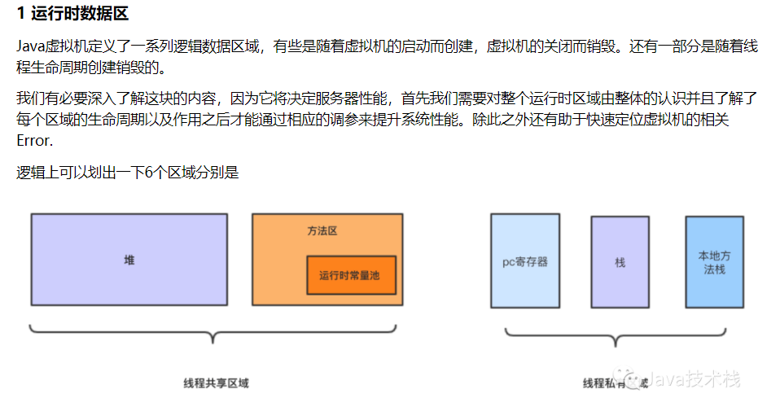

**1.1 PC寄存器**

**1.2 java虚拟机栈**

**1.3 虚拟机堆**

**1.4 方法区和运行时常量池**

**1.5 本地方法栈**

---

**2 栈帧:**

**2.1 局部变量表 (Local variable)**

**2.2 操作数栈 (Operating Stack)**

**2.3 动态链接 (Dynamic Linking)。**


###### **34.OOM啥时候发生？**

**内存泄露**：申请使用完的内存没有释放，导致虚拟机不能再次使用该内存，此时这段内存就泄露了，因为申请者不用了，而又不能被虚拟机分配给别人用。

**内存溢出**：申请的内存超出了JVM能提供的内存大小，此时称之为溢出。


###### **35.双亲委派模型是啥？啥时候用？为什么用？**

双亲委派模型:如果一个类加载器收到了加载某个类的请求,则该类加载器并不会去加载该类,而是把这个请求委派给父类加载器,每一个层次的类加载器都是如此,因此所有的类加载请求最终都会传送到顶端的启动类加载器;只有当父类加载器在其搜索范围内无法找到所需的类,并将该结果反馈给子类加载器,子类加载器会尝试去自己加载.

加密:java代码可以轻易的被反编译,如果你需要对你的代码进行加密以防止反编译,可以先将编译后的代码用加密算法加密,类加密后就不能再使用java自带的类加载器了,这时候就需要自定义类加载器.


###### **36. 类加载的过程？**

类加载过程主要包含加载、验证、准备、解析、初始化、使用、卸载

1、 JVM会先去方法区中找有没有相应类的.class存在。如果有，就直接使用；如果没有，则把相关类的.class加载到方法区

2、 在.class加载到方法区时，会分为两部分加载：先加载非静态内容，再加载静态内容

3、 加载非静态内容：把.class中的所有非静态内容加载到方法区下的非静态区域内

4、 加载静态内容：

  4.1、把.class中的所有静态内容加载到方法区下的静态区域内

  4.2、静态内容加载完成之后，对所有的静态变量进行默认初始化

  4.3、所有的静态变量默认初始化完成之后，再进行显式初始化

  4.4、当静态区域下的所有静态变量显式初始化完后，执行静态代码块

5，当静态区域下的静态代码块，执行完之后，整个类的加载就完成了。

6，如果存在继承关系，则父类先加载，再加载子类。


###### **37.索引的数据结构？**

B+树


###### **38.什么是代理模式？**

**代理模式的定义：**代理模式给某一个对象提供一个代理对象，并由代理对象控制对原对象的引用。通俗的来讲代理模式就是我们生活中常见的中介。


###### **39.代理在java如何实现？说一说在JDK如何实现的？**

首先来看一下如何使用JDK动态代理。JDK提供了Java.lang.reflect.Proxy类来实现动态代理的，可通过它的newProxyInstance来获得代理实现类。

同时对于代理的接口的实际处理，是一个java.lang.reflect.InvocationHandler，它提供了一个invoke方法供实现者提供相应的代理逻辑的实现。


###### **40.说一说redis的数据结构？**

​        大多数情况下，Redis使用简单字符串SDS（简单动态字符串）作为字符串的表示，相对于C语言字符串，SDS具有常数复杂度获取字符串长度，杜绝了缓存区的溢出，减少了修改字符串长度时所需的内存重分配次数，以及二进制安全能存储各种类型的文件，并且还兼容部分C函数。

　　通过为链表设置不同类型的特定函数，Redis链表可以保存各种不同类型的值，除了用作列表键，还在发布与订阅、慢查询、监视器等方面发挥作用（后面会介绍）。

　　Redis的字典底层使用哈希表实现，每个字典通常有两个哈希表，一个平时使用，另一个用于rehash时使用，使用链地址法解决哈希冲突。

　　跳跃表通常是有序集合的底层实现之一，表中的节点按照分值大小进行排序。

　　整数集合是集合键的底层实现之一，底层由数组构成，升级特性能尽可能的节省内存。

　　**压缩列表**是Redis为节省内存而开发的顺序型数据结构，通常作为列表键和哈希键的底层实现之一。

**跳跃表: 跟二分查找很相似**

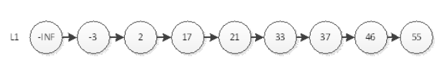

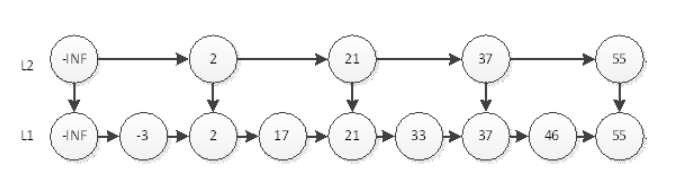

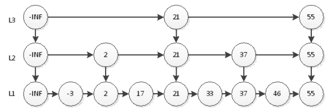


###### **41.spring如何实现代理？**

常规方式，需要一个ProxyFactory去根据需求创建具体的Proxy对象

Jdk动态代理
通过反射机制，创建一个代理类对象实例并返回。用户进行方法调用时使用创建代理对象时，需要传递该业务类的类加载器（用来获取业务实现类的元数据，在包装方法是调用真正的业务方法）、接口、handler实现类，被代理的对象必须实现了某一个接口。

CGLIB动态代理
一个java字节码的生成工具，它动态生成一个被代理类的子类，子类重写被代理的类的所有不是final的方法。在子类中采用方法拦截的技术拦截所有父类方法的调用，顺势织入横切逻辑，通过增强器Enhancer和拦截器MethodInterceptor去实现。


###### **42.循环依赖如何实现？**

Spring 就是靠获取未完成的Bean对象来填充属性，解决循环依赖的

如果多个bean存在循环依赖，在Spring容器启动后，只有当获取的第一个bean是通过属性注入依赖的singleton时，才会成功，别的情况都会失败


###### **43.mybatis的底层实现**

JDK动态代理

自定义一个InvocationHandler

映射的代理实现这个InvocationHandler的接口（重写里面的invoke方法，将目标指向当前类对象）对目标target进行拦截


###### **44.栈溢出异常，通过什么方式来解决？**

1、使用虚拟空间

  vector存储数据时，会分配一个存储空间，如果继续存储，该分配的空间已满，就会分配一块更大的内存，把原来的数据复制过来，继续存储。

 2、动态分配：

就是不要静态分配，用new动态创建，是从堆中分配的，堆的空间足够大，不过记得写析构函数，delete你申请的堆空间。类结束的时候会自动调用析构函数释放空间。


###### **45.依次删除List中的所有元素应该怎么删除？**

```java
//for 循环
for(int i=0;i<list.size();i++){
    if(list.get(i).equals("del"))
        list.remove(i);
}

//增强型for循环
for(String x:list){
    if(x.equals("del"))
        list.remove(x);
}

//迭代器
Iterator<String> it = list.iterator();
while(it.hasNext()){
    String x = it.next();
    if(x.equals("del")){
        it.remove();
    }
}
```


###### **46.HashMap在并发情况下发生resize会出现什么问题？**

死链

主要出现在并发执行resize()方法中的转移方法中，假设两个线程同时扩容，都生成自己的局部变量newTable[]，并开始转移当前table[]元素。此时虽然newTable是局部变量线程独立的，但是table以及其中的Entry是线程共享的。

成环的具体代码位置
在扩容的 transfer 方法里面，有三行关键的代码，如下：

```java
 void transfer(Entry[] newTable, boolean rehash) {
        int newCapacity = newTable.length;
        for (Entry<K,V> e : table) {
            //e为空时循环结束
            while(null != e) {
                Entry<K,V> next = e.next;
                if (rehash) {
                    e.hash = null == e.key ? 0 : hash(e.key);
                }
                int i = indexFor(e.hash, newCapacity);
                // 成环的代码主要是在这三行代码
                // 首先插入是从头开始插入的
                e.next = newTable[i];
                newTable[i] = e;
                e = next;
            }
        }
    }
```


###### **47.谈谈你对多线程的理解**

线程间通信的几种实现方式

方式一：使用 volatile 关键字

方式二：使用Object类的wait() 和 notify() 方法

wait/notify 等待

Volatile 内存共享

CountDownLatch 并发工具

CyclicBarrier 并发工具

**进程通信**
管道(pipe)
管道是一种半双工的通信方式，数据只能单向流动，而且只能在具有亲缘关系的进程间使用。进程的亲缘关系通常是指父子进程关系。

有名管道 (namedpipe)
有名管道也是半双工的通信方式，但是它允许无亲缘关系进程间的通信。

信号量(semaphore)
信号量是一个计数器，可以用来控制多个进程对共享资源的访问。它常作为一种锁机制，防止某进程正在访问共享资源时，其他进程也访问该资源。因此，主要作为进程间以及同一进程内不同线程之间的同步手段。

消息队列(messagequeue)
消息队列是由消息的链表，存放在内核中并由消息队列标识符标识。消息队列克服了信号传递信息少、管道只能承载无格式字节流以及缓冲区大小受限等缺点。

信号 (sinal)
信号是一种比较复杂的通信方式，用于通知接收进程某个事件已经发生。

共享内存(shared memory)
共享内存就是映射一段能被其他进程所访问的内存，这段共享内存由一个进程创建，但多个进程都可以访问。共享内存是最快的 IPC 方式，它是针对其他进程间通信方式运行效率低而专门设计的。它往往与其他通信机制，如信号量，配合使用，来实现进程间的同步和通信。

套接字(socket)
套接口也是一种进程间通信机制，与其他通信机制不同的是，它可用于不同设备及其间的进程通信。

###### 协程

**协程是一种用户态的轻量级线程，**协程的调度完全由**用户控制**。协程拥有自己的寄存器上下文和栈。协程调度切换时，将寄存器上下文和栈保存到其他地方，在切回来的时候，恢复先前保存的寄存器上下文和栈，直接操作栈则基本没有内核切换的开销，可以不加锁的访问全局变量，所以上下文的切换非常快。


###### **48.volatile,synchronized,reentrantLock的区别**

https://blog.csdn.net/weixin_43395526/article/details/91820680


**Synchronized可重入的实现原理**

每一个Synchronized可重入锁都关联一个线程持有者和一个计数器。当计数器为0时，表示该锁可以被任何线程获取，一旦有线程成功获取该锁，计数器为1

**Synchronized与ReentrantLock的区别**

两者都是可重入锁
Synchronized是依赖于JVM实现的；而ReentrantLock是依赖于JDK实现的，是API层面的，需要 Lock() 和 unLock() 方法配合try/finally语句块来完成。
ReentrantLock比Synchronized多了三项功能：等待可中断，可实现公平锁，可实现选择性通知（锁可绑定多个条件）。

**Volatile**使变量在多个线程间可见。一般线程通过工作内存写入（读取）主内存中的变量，而Volatile将强制在主内存中写入（读取）变量。

 **Synchronized和Volatile的区别**

volatile是线程同步的轻量级实现，所以volatile的性能比Synchronized好。
Volatile只能修饰变量，而Synchronized可以修饰方法以及代码块。
多线程访问Volatile不会发生线程组塞，而Synchronized会出现阻塞。
Volatile可以保证数据的可见性，但不能保证原子性；而Synchronized既可以保证原子性，也可以间接保证可见性（因为它会将私有内存和公共内存中的数据做同步）。
Volatile解决的是变量在多个线程之间的可见性，而Synchronized解决的是多个线程之间访问资源的同步性（只有获取锁的线程执行，其他线程等待）。


###### **49.JDK1.8是如何对synchronzied进行优化的**

在JDK1.6之后为了减少获得锁和释放锁所带来的性能消耗，提高性能，引入了“轻量级锁”和“偏向锁”，最终使得Synchronized的效率与ReentrantLock相差无几，甚至在某些场景下还优胜与ReentrantLock。 


###### **50.reentrantLock是通过内部的AQS子类实现的？能说下对AQS的了解吗？**

AbstractQueuedSynchronizer，抽象队列同步器

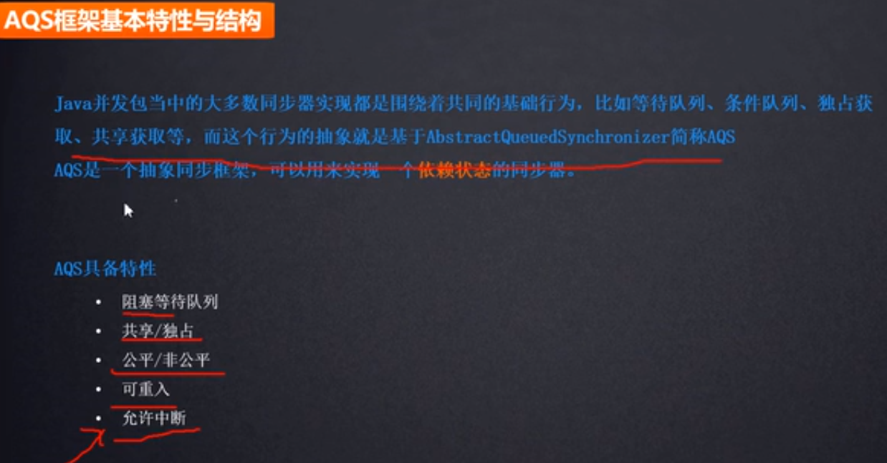

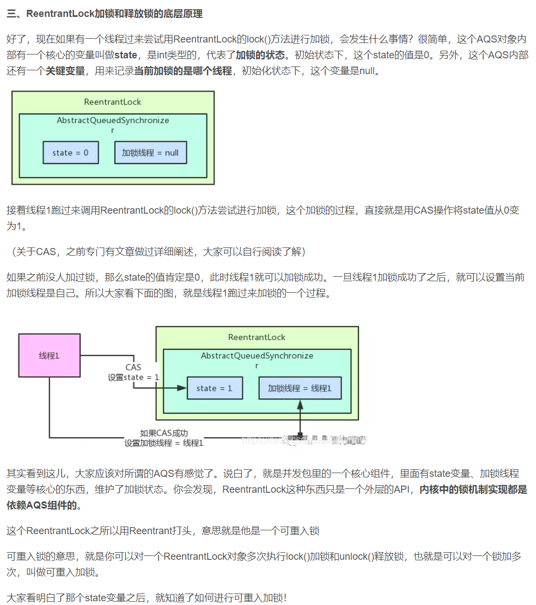


###### **51泛型是什么，泛型有什么缺点,面试官提示我反射获取范型类对象会获取什么。**

使用反射技术获取泛型类的真实类型？


###### **52.怎么处理用户状态的维护**

答Spring Security中用Threadlocal存储session，并且客户端存储cookie，cookie中存储和session对应的sessionId，每次请求都带上sessionId，从而让服务器得知用户状态。


###### **53.为什么要用乐观锁（ABA 问题是乐观锁一个常见的问题）？**

乐观锁一般会使用版本号机制或CAS算法实现。		

​		这其实是一种思想，当线程去拿数据的时候，认为别的线程不会修改数据，就不上锁，但是在更新数据的时候会去判断以下其他线程是否修改了数据。通过版本来判断，如果数据被修改了就拒绝更新，之所以叫乐观锁是因为并没有加锁。

​			乐观锁常见的机制是使用version,每个事务都会先查一下版本号,更新的时候时候同时再比对库里的版本号与刚才查的版本号是否一直,如果不一致,说明有其他事务更新了这个记录, 说明自己当前操作的数据不是最新的, 所以会尝试. **如果我们的一些业务场景不允许读取记录的旧版本，而是每次都必须去读取记录的最新版本**，这种业务场景下,select 加 独占锁和使用version实现乐观锁 都是可选的. 

**举一个简单的例子：**

假设数据库中帐户信息表中有一个 version 字段，当前值为 1 ；而当前帐户余额字段（ balance ）为 $100 。当需要对账户信息表进行更新的时候，需要首先读取version字段。

1. 操作员 A 此时将其读出（ version=1 ），并从其帐户余额中扣除 $50（ $100-$50 ）。
2. 在操作员 A 操作的过程中，操作员B 也读入此用户信息（ version=1 ），并从其帐户余额中扣除 $20 （ $100-$20 ）。
3. 操作员 A 完成了修改工作，提交更新之前会先看数据库的版本和自己读取到的版本是否一致，一致的话，就会将数据版本号加1（ version=2 ），连同帐户扣除后余额（ balance=$50 ），提交至数据库更新，此时由于提交数据版本大于数据库记录当前版本，数据被更新，数据库记录 version 更新为 2 。
4. 操作员 B 完成了操作，提交更新之前会先看数据库的版本和自己读取到的版本是否一致，但此时比对数据库记录版本时发现，操作员 B 提交的数据版本号为 2 ，而自己读取到的版本号为1 ，不满足 “ 当前最后更新的version与操作员第一次读取的版本号相等 “ 的乐观锁策略，因此，操作员 B 的提交被驳回。

这样，就避免了操作员 B 用基于 version=1 的旧数据修改的结果覆盖操作员A 的操作结果的可能。


###### **54.类的静态变量和静态方法能否被子类继承？，子类中能否调用父类的静态变量和静态方法？**


结论：java中静态属性和静态方法可以被继承，但是没有被重写(overwrite)而			是被隐藏.
原因：1). 静态方法和属性是属于类的，调用的时候直接通过类名.方法名完成，不需要继承机制及可以调用。如果子类里面定义了静态方法和属性，那么这时候父类的静态方法或属性称之为"隐藏"。如果你想要调用父类的静态方法和属性，直接通过父类名.方法或变量名完成，至于是否继承一说，子类是有继承静态方法和属性，但是跟实例方法和属性不太一样，存在"隐藏"的这种情况。
2). 多态之所以能够实现依赖于继承、接口和重写、重载（继承和重写最为关键）。有了继承和重写就可以实现父类的引用指向不同子类的对象。重写的功能是："重写"后子类的优先级要高于父类的优先级，但是“隐藏”是没有这个优先级之分的。
3). 静态属性、静态方法和非静态的属性都可以被继承和隐藏而不能被重写，因此不能实现多态，不能实现父类的引用可以指向不同子类的对象。非静态方法可以被继承和重写，因此可以实现多态。


###### **55.String a = New string ("a");在jvm中如何存储？**

首先在string的常量池中去寻找常量，如果找到则不创建对象，这样只有一个string对象，否则创建对象，这样就需要用到NEW对象，在内存中去创建一个string对象，并将其结果返回给s这样就又是一个对象，总共两个对象


###### **57.Jvm调整堆大小（不是特别重要）？**

堆主要分年轻态和老生态两种

初期JVM的大小按照年轻态:老生态=1:3进行配置，当然也和缓存中空闲失效期设置有关，缓存对其中对象如果空闲多长时间没有被使用，将实现清除。

如果缓存失效期设置过短，老生态利用率不高，比如1.3G的老生态只使用了300M，当然，也可以延缓CMS的启动比例，比如在接近1.3G的70%开始CMS垃圾收集，但是这样碰上尖峰访问可能来不及收集就撑死了(OME:OutOfMemoryError )。

如果缓存失效期设置过长，老生态会被撑满，频繁启动CMS也是徒劳无益，增加系统暂停响应时间，增加了系统延迟。

这样，缓存失效期或者说缓存大小就需要根据JVM老生态在长时间生产环境运行下进行不断微调，Probe起到了关键作用，主要是其图形化直观显示，比起JDK的JConsole等等工具要方便。


###### **58.Collection.sort()底层用的什么排序方法**

Java中如果需要对一个collections排序，需要继承于Comparable或者comparator接口

collections转化为array，并借助于arrays的sort功能完成排序，并回写到collection

Arrays.sort() 采用了2种排序算法 -- 基本类型数据使用快速排序法，对象数组使用归并排序。


###### **59.Linux如何查看端口冲突？**

netstat  -nultp

netstat  -anp  |grep  端口号


###### **60.Spring MVC如何接收参数？**

普通方式

请求参数名跟Controller的方法参数一致,创建Controller

@RequestParam

当需要传递Json格式的数据是，@RequestBody

ajax

url


###### **61.cookie与session的区别,session共享有几种方式**

1、数据存放位置不同：

cookie数据存放在客户的浏览器上，session数据放在服务器上。

2、安全程度不同：

cookie不是很安全，别人可以分析存放在本地的COOKIE并进行COOKIE欺骗,考虑到安全应当使用session。

3、性能使用程度不同：

session会在一定时间内保存在服务器上。当访问增多，会比较占用你服务器的性能,考虑到减轻服务器性能方面，应当使用cookie。

4、数据存储大小不同：

单个cookie保存的数据不能超过4K，很多浏览器都限制一个站点最多保存20个cookie，而session则存储与服务端，浏览器对其没有限制。

5、会话机制不同

session会话机制：session会话机制是一种服务器端机制，它使用类似于哈希表（可能还有哈希表）的结构来保存信息。

cookies会话机制：cookie是服务器存储在本地计算机上的小块文本，并随每个请求发送到同一服务器。 Web服务器使用HTTP标头将cookie发送到客户端。在客户端终端，浏览器解析cookie并将其保存为本地文件，该文件自动将来自同一服务器的任何请求绑定到这些cookie。


基于Cookie的Session共享

基于缓存的Session共享（经常）


###### **62.4种线程池及使用场景，讲下参数，讲下拒绝策略。**

JDK8有新增方法newWorkStealingPool，在此不作讨论。

```java
//四种创建线程池的方式
    
// 创建单个线程
Executors.newSingleThreadExecutor(); 
// 创建固定数量的线程
Executors.newFixedThreadPool(3); 
// 可动态调整,随着请求的增多线程也随之创建
Executors.newCachedThreadPool(); 
// 用来调度即将执行的任务的线程池
Executors.newScheduledThreadPool();

//七个参数
corePoolSize 核心线程数，一直存活，即使线程数小于核心线程数且线程数有空闲，线程池也会创建新的线程。
maximumPoolSize 最大线程数，当线程数大于核心线程数并且任务队列已经满了的时候，线程池会创建新的线程，当线程数大于最大线程数并且任务队列已经满了，会抛出异常。
keepAliveTime 线程空闲时间，当线程的空闲时间达到keepAliveTime时，线程会退出，直到线程数等于核心线程数，可以设置参数allowCoreThreadTimeout=true,则会直到线程数为0。
TimeUnit unit 超时时间单位。
BlockingQueue workQueue 阻塞队列，任务队列的容量。
ThreadFactory threadFactory 线程工厂，基本不用设置（默认使用Executors.defaultThreadFactory()）
    
RejectedExecutionHandler handler 拒绝策略，任务拒绝处理器。
  
//四种拒绝策略
AbortPolicy() 线程池满了，如果还有线程想加入，不处理这个请求，抛出异常。
CallerRunsPolicy() 哪来的回哪去
DiscardPolicy() 队列满了，丢掉任务，不会抛出异常。
DiscardOldestPolicy() 队列满了，尝试去和最早的竞争，不会抛出异常。
    
    
//总结
其实线程池就是种池化技术，其他的比如还有数据库连接池，内存池，http连接池等等，这样可以减少资源对象的创建次数，垃圾回收的开销，提高程序的性能，特别是在高并发下这种提高更加明显。
```


###### 63.如何实现定时任务？

while循环设置线程的休眠时间，timer类设置delay，ScheduledExecutorService三种方式


###### **64.b+树的好处**

B+树支持range-query非常方便，而B树不支持

B+树的优点：

1. 非叶子节点不会带上ROWID，这样，一个块中可以容纳更多的索引项，一是可以降低树的高度。二是一个内部节点可以定位更多的叶子节点。

2. 叶子节点之间通过指针来连接，范围扫描将十分简单，而对于B树来说，则需要在叶子节点和内部节点不停的往返移动。

B+树所有的Data域在叶子节点，一般来说都会进行一个优化，就是将所有的叶子节点用指针串起来。这样遍历叶子节点就能获得全部数据，这样就能进行区间访问啦。

B树必须用中序遍历的方法按序扫库（因为非叶子节点上存在数据，所以需要不停的在各个节点上来回遍历）


###### 65.jdk动态代理和cglib的使用区别

JDK和CGLib动态代理区别


1、JDK动态代理具体实现原理：

通过实现InvocationHandler接口创建自己的调用处理器；

通过为Proxy类指定ClassLoader对象和一组interface来创建动态代理；

通过反射机制获取动态代理类的构造函数，其唯一参数类型就是调用处理器接口类型；

通过构造函数创建动态代理类实例，构造时调用处理器对象作为参数参入；

JDK动态代理是面向接口的代理模式，如果被代理目标没有接口那么Spring也无能为力，Spring通过Java的反射机制生产被代理接口的新的匿名实现类，重写了其中AOP的增强方法。


2、CGLib动态代理：

利用ASM开源包，对代理对象类的class文件加载进来，通过修改其字节码生成子类来处理。

3、两者对比：

JDK动态代理是面向接口的。

CGLib动态代理是通过字节码底层继承要代理类来实现，因此如果被代理类被final关键字所修饰，会失败。

4、使用注意：

如果要被代理的对象是个实现类，那么Spring会使用JDK动态代理来完成操作（Spirng默认采用JDK动态代理实现机制）；

如果要被代理的对象不是个实现类那么，Spring会强制使用CGLib来实现动态代理。


###### 66.HashMap和HashTable 的区别

```
1、父类不同：
     HashMap是继承自AbstractMap类，而HashTable是继承自Dictionary（已被废弃，详情看源代码）。不过它们都实现了同时实现了map、Cloneable（可复制）、Serializable（可序列化）这三个接口。
    Hashtable比HashMap多提供了elments() 和contains() 两个方法。
    elments() 方法继承自Hashtable的父类Dictionnary。elements() 方法用于返回此Hashtable中的value的枚举。
   contains()方法判断该Hashtable是否包含传入的value。它的作用与containsValue()一致。事实上，contansValue() 就只是调用了一下contains() 方法。

2、null值问题
	Hashtable既不支持Null key也不支持Null value。Hashtable的put()方法的注释中有说明 。
	HashMap中，null可以作为键，这样的键只有一个；可以有一个或多个键所对应的值为null。当get()方法返回null值时，可能是 HashMap中没有该键，也可能使该键所对应的值为null。因此，在HashMap中不能由get()方法来判断HashMap中是否存在某个键， 而应该用containsKey()方法来判断。

3、线程安全性
	Hashtable是线程安全的，它的每个方法中都加入了Synchronize方法。在多线程并发的环境下，可以直接使用Hashtable，不需要自己为它的方法实现同步
	HashMap不是线程安全的，在多线程并发的环境下，可能会产生死锁等问题。具体的原因在下一篇文章中会详细进行分析。使用HashMap时就必须要自己增加同步处理，
	虽然HashMap不是线程安全的，但是它的效率会比Hashtable要好很多。这样设计是合理的。在我们的日常使用当中，大部分时间是单线程操作的。HashMap把这部分操作解放出来了。当需要多线程操作的时候可以使用线程安全的ConcurrentHashMap。ConcurrentHashMap虽然也是线程安全的，但是它的效率比Hashtable要高好多倍。因为ConcurrentHashMap使用了分段锁，并不对整个数据进行锁定。
	tip：HashMap是JDk1.2之后有的，而在JDK1.5中，伟大的Doug Lea给我们带来了concurrent包，从此Map也有安全的了。也就就是有了ConcurrentHashMap（关于这个的理解下次有机会再写，或自行百度）

4、遍历方式不同
	Hashtable、HashMap都使用了Iterator。而由于历史原因，Hashtable还使用了Enumeration的方式 。
	HashMap的Iterator是fail-fast迭代器。当有其它线程改变了HashMap的结构（增加，删除，修改元素），将会抛出ConcurrentModificationException。不过，通过Iterator的remove()方法移除元素则不会抛出ConcurrentModificationException异常。但这并不是一个一定发生的行为，要看JVM。
	JDK8之前的版本中，Hashtable是没有fast-fail机制的。在JDK8及以后的版本中 ，Hashtable也是使用fast-fail的。（此处可以去看一下1.5和1.8JDK源码的对比）

5、初始容量不同
	Hashtable的初始长度是11，之后每次扩充容量变为之前的2n+1（n为上一次的长度）而HashMap的初始长度为16，之后每次扩充变为原来的两倍
	创建时，如果给定了容量初始值，那么Hashtable会直接使用你给定的大小，而HashMap会将其扩充为2的幂次方大小。

6、计算哈希值的方法不同
	为了得到元素的位置，首先需要根据元素的 KEY计算出一个hash值，然后再用这个hash值来计算得到最终的位置
	Hashtable直接使用对象的hashCode。hashCode是JDK根据对象的地址或者字符串或者数字算出来的int类型的数值。然后再使用除留余数发来获得最终的位置。 然而除法运算是非常耗费时间的。效率很低
	HashMap为了提高计算效率，将哈希表的大小固定为了2的幂，这样在取模预算时，不需要做除法，只需要做位运算。位运算比除法的效率要高很多。
```


###### 67.数据结构和数据类型有什么区别?

一、性质不同

1、数据结构：是计算机存储、组织数据的方式；指相互之间存在一种或多种特定关系的数据元素的集合

2、数据元：是用一组属性描述其定义、标识、表示和允许值的数据单元。

二、作用不同

1、数据结构：通常情况下，精心选择的数据结构可以带来更高的运行或者存储效率。

2、数据元：若干具有相关性的数据元按一定的次序组成一个整体结构。

三、特点不同

1、数据结构：数据结构往往同高效的检索算法和索引技术有关。

2、数据元：数据元基本模型中，对象类对应于数据模型中的实体、特性和表示对应于数据模型中的属性。


###### 68.你了解的应用层协议有哪些，它们用的传输层协议是什么?

应用层协议：

1、远程登录协议（Telnet)

2、文件传输协议（FTP）

3、超文本传输协议（HTTP）

4、域名服shu务协议（DNS）

5、简单邮件传输协议（SMTP）

6、邮局协议（POP3）

其中，从网络上下载文件时使用的是FTP协议，上网游览网页时使用的是HTTP协议；在网络上访问一台主机时，通常不直接输入IP地址，而是输入域名，用的是DNS服务协议，它会将域名解析为IP地址；通过FoxMail发送电子邮件时，使用SMTP协议，接收电子邮件时就使用POP3协议。

传输层协议：

1、传输控制协议TCP

2、用户数据报协议UDP

TCP协议：面向连接的可靠传输协议。利用TCP进行通信时，首先要通过三步握手，以建立通信双方的连接。TCP提供了数据的确认和数据重传的机制，保证发送的数据一定能到达通信的对方。

UDP协议：是无连接的，不可靠的传输协议。采用UDP进行通信时不用建立连接，可以直接向一个IP地址发送数据，但是不能保证对方是否能收到。

网络层协议：

1、网际协议IP、Internet互联网控制报文协议ICMP、Internet组织管理协议IGMP、地址解析协议ARP。


###### 69.mybatis底层

动态代理

自定义JDK动态代理之投鞭断流实现自动映射器Mapper

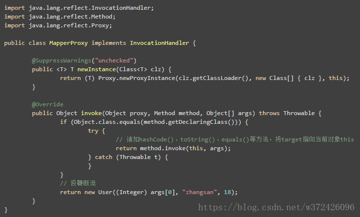

###### 70.jdk为什么不能实现类的动态代理？

单继承

###### 80.常用的设计模式

https://www.cnblogs.com/xiaofengwang/p/11255678.html

###### 81.B+树如何实现范围查询？

指针是双向的，排序是排好的

###### 82.synchronized与Lock的区别

1.首先synchronized是java内置关键字，在jvm层面，Lock是个java类；

2.synchronized无法判断是否获取锁的状态，Lock可以判断是否获取到锁（tryLock，lockInterruptibly）；

3.synchronized会自动释放锁(a 线程执行完同步代码会释放锁 ；b 线程执行过程中发生异常会释放锁)，Lock需在finally中手工释放锁（unlock()方法释放锁），否则容易造成线程死锁；

4.用synchronized关键字的两个线程1和线程2，如果当前线程1获得锁，线程2线程等待。如果线程1阻塞，线程2则会一直等待下去，而Lock锁就不一定会等待下去，如果尝试获取不到锁，线程可以不用一直等待就结束了；

5.synchronized的锁可重入、不可中断、非公平，而Lock锁可重入、可判断（中断）、可公平（两者皆可）

6.Lock锁适合大量同步的代码的同步问题，synchronized锁适合代码少量的同步问题。

###### 83.乐观锁、悲观锁

https://www.jianshu.com/p/d2ac26ca6525

###### 84.线程的几种状态

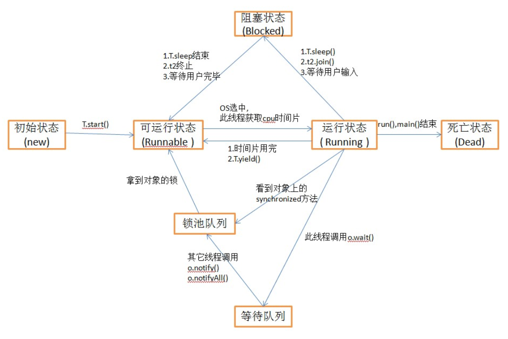


###### 85.JVM

https://www.cnblogs.com/xuningchuanblogs/p/7688332.html

​		首先，当一个程序启动之前，它的class会被**类装载器**装入**方法区**(不好听，其实这个区我喜欢叫做Permanent区)，**执行引擎**读取方法区的字节码自适应解析，边解析就边运行（其中一种方式），然后**pc寄存器**指向了main函数所在位置，虚拟机开始为main函数在**java栈**中预留一个栈帧（每个方法都对应一个栈帧），然后开始跑main函数，main函数里的代码被执行引擎映射成本地操作系统里相应的实现，然后调用**本地方法接口**，本地方法运行的时候，操纵系统会为本地方法分配**本地方法栈**，用来储存一些临时变量，然后运行本地方法，调用操作系统API等等。     


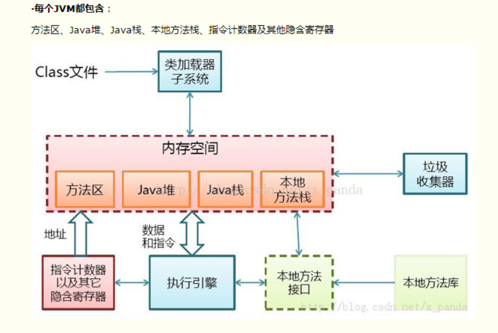


###### 86.JMM

https://zhuanlan.zhihu.com/p/29881777

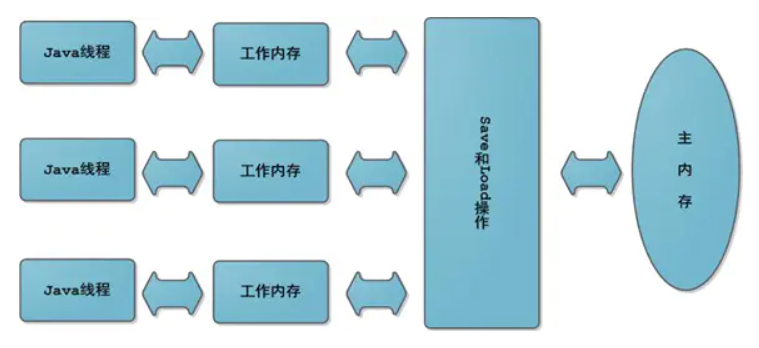

​       


​		JMM规定了内存主要划分为主内存和工作内存两种。此处的主内存和工作内存跟JVM内存划分（堆、栈、方法区）是在不同的层次上进行的，如果非要对应起来，主内存对应的是Java堆中的对象实例部分，工作内存对应的是栈中的部分区域，从更底层的来说，主内存对应的是硬件的物理内存，工作内存对应的是寄存器和高速缓存。

---

**一些问题：（多线程环境下尤其）**

- **缓存一致性问题**：在多处理器系统中，每个处理器都有自己的高速缓存，而它们又共享同一主内存（MainMemory）。基于高速缓存的存储交互很好地解决了处理器与内存的速度矛盾，但是也引入了新的问题：缓存一致性（CacheCoherence）。当多个处理器的运算任务都涉及同一块主内存区域时，将可能导致各自的缓存数据不一致的情况，如果真的发生这种情况，那同步回到主内存时以谁的缓存数据为准呢？为了解决一致性的问题，需要各个处理器访问缓存时都遵循一些协议，在读写时要根据协议来进行操作，这类协议有MSI、MESI（IllinoisProtocol）、MOSI、Synapse、Firefly及DragonProtocol，等等：

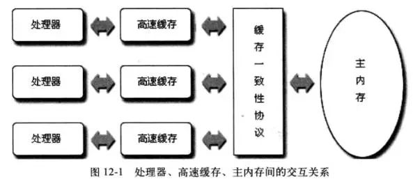

- **指令重排序问题**：为了使得处理器内部的运算单元能尽量被充分利用，处理器可能会对输入代码进行乱序执行（Out-Of-Order Execution）优化，处理器会在计算之后将乱序执行的结果重组，保证该结果与顺序执行的结果是一致的，**但并不保证程序中各个语句计算的先后顺序与输入代码中的顺序一致。因此，如果存在一个计算任务依赖另一个计算任务的中间结果，那么其顺序性并不能靠代码的先后顺序来保证**。与处理器的乱序执行优化类似，Java虚拟机的即时编译器中也有类似的指令重排序（Instruction Reorder）优化

**happens before：**

从JDK 5开始，Java使用新的JSR-133内存模型，JSR-133使用happens-before的概念来阐述操作之间的内存可见性：在JMM中，如果一个操作执行的结果需要对另一个操作可见（两个操作既可以是在一个线程之内，也可以是在不同线程之间），那么这两个操作之间必须要存在happens-before关系：

- 程序顺序规则：一个线程中的每个操作，happens-before于该线程中的任意后续操作。
- 监视器锁规则：对一个锁的解锁，happens-before于随后对这个锁的加锁。
- volatile变量规则：对一个volatile域的写，happens-before于任意后续对这个volatile域的读。
- 传递性：如果A happens-before B，且B happens-before C，那么A happens-before C。

一个happens-before规则对应于一个或多个编译器和处理器重排序规则


**内存屏障禁止特定类型的处理器重排序：**

重排序可能会导致多线程 程序出现**内存可见性**问题。对于处理器重排序，JMM的处理器重排序规则会要求Java编译器在生成指令序列时，插入特定类型的内存屏障（Memory Barriers，Intel称之为Memory Fence）指令，通过内存屏障指令来禁止特定类型的处理器重排序。通过禁止特定类型的编译器重排序和处理器重排序，为程序员提供一致的内存可见性保证。

## 什么是内存可见性

> 如果线程A对共享变量X进行了修改，但是线程A没有及时把更新后的值刷入到主内存中，而此时线程B从主内存读取共享变量X的值，所以X的值是原始值，那么我们就说对于线程B来讲，共享变量X的更改对线程B是不可见的。


为了保证内存可见性，Java编译器在生成指令序列的适当位置会插入内存屏障指令来禁止特定类型的处理器重排序。


StoreLoad Barriers是一个“全能型”的屏障，它同时具有其他3个屏障的效果。现代的多处理器大多支持该屏障（其他类型的屏障不一定被所有处理器支持）。执行该屏障开销会很昂贵，因为当前处理器通常要把写缓冲区中的数据全部刷新到内存中（Buffer Fully Flush）。


###### 87.Classloader

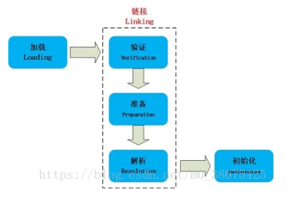

JVM的类加载机制主要有如下3种。

全盘负责：所谓全盘负责，就是当一个类加载器负责加载某个Class时，该Class所依赖和引用其他Class也将由该类加载器负责载入，除非显示使用另外一个类加载器来载入。

双亲委派：所谓的双亲委派，则是先让父类加载器试图加载该Class，只有在父类加载器无法加载该类时才尝试从自己的类路径中加载该类。通俗的讲，就是某个特定的类加载器在接到加载类的请求时，首先将加载任务委托给父加载器，依次递归，如果父加载器可以完成类加载任务，就成功返回；只有父加载器无法完成此加载任务时，才自己去加载。

缓存机制。缓存机制将会保证所有加载过的Class都会被缓存，当程序中需要使用某个Class时，类加载器先从缓存区中搜寻该Class，只有当缓存区中不存在该Class对象时，系统才会读取该类对应的二进制数据，并将其转换成Class对象，存入缓冲区中。这就是为很么修改了Class后，必须重新启动JVM，程序所做的修改才会生效的原因。


**当一个classLoder启动的时候，classLoader的生存地点在jvm中的堆**，然后它会去主机硬盘上将A.class装载到jvm的方法区，方法区中的这个字节文件会被虚拟机拿来new A字节码()，然后在堆内存生成了一个A字节码的对象，然后A字节码这个内存文件有两个引用一个指向A的class对象，一个指向加载自己的classLoader

https://blog.csdn.net/m0_38075425/article/details/81627349

###### 88.**二叉树的实际应用**

二叉查找树用于对消费额与积分规则的计算。

排序

数据库索引

数据管理

哈夫曼编码:数据压缩

海量数据并发查询，二叉树复杂度是O(K+LgN)。二叉排序树就既有链表的好处，也有数组的好处， 在处理大批量的动态的数据是比较有用。


###### 89.**robbitMq作用（处理异步请求）**

这其实和线程竞争锁很像，rocketMQ的解决办法也和锁竞争的道理很像，看具体实现：

1、broker这边，请求过来，如果有新消息返回，在consumer这边，异步请求的回调函数pullCallback中，判断pullResult不为null，那么把消息存到processQueue中之后，马上发起下一个请求。

2、如果broker没有获取到新消息，并不会马上返回pullRequest（consumer那边的发送pullRequest的请求本来就是异步的，不用担心等待的问题），而是会在suspendPullRequest方法中，把当前的请求信息（主要是offset，group，topic，requestId这几个值）放到PullRequestHoldService.pullRequestTable中。而在ReputMessageService的doReput方法会每隔一毫秒扫描commitLog，如果有新消息，会建立索引，并同时判断之前有没有pulRequest在等待这个消息，如果有--->messageArrivingListener.arriving--->pullRequestHoldService.notifyMessageArriving--->mpr = this.pullRequestTable.get(key)--->requestList = mpr.cloneListAndClear() 把刚才存进去的所有pullRequest取出来，返回请求，这样就避免了不停的轮询。

**这里面会出现的异常情况：**

先看消费者这边，如果长时间没有订阅的消息到达broker---这是绝大多数的情况，那么消费者这边的responseTable中存的responseFuture就一直得不到响应。实际上会有个定时任务扫描responseTable，代码逻辑：nettyRemotingClient.start--->NettyRemotingClient.this.scanResponseTable()，定期（默认间隔30秒）取出过期(30秒 + 1秒)的responseFuture，执行callback的operationComplete方法，而pullRequest的operationComplete会判断responseFuture的responseCommand属性为不为null，没有得到响应的话是为null的，那么会进入else中pullCallback.onException，点进去看，是把pullRequest取出再放入队列中一次（其实这里也是重复消费的一个因素）。

还有的情况就是某次pullRequest的请求已经发出，但是broker并没有收到而是在网络中丢掉了，或者说broker的响应消息没有成功到达consumer，这两种情况和上面说的一样，会导致过段时间再扫描，再拉取，只不过就是broker有消息到达，不能及时响应consumer，而是只能响应接下来的扫描提交的第二次消息，这样会影响时效（可以把上面说的扫描的间隔由30秒降低为3秒），不过好在这个订阅的事件不会中断。

还有个问题，broker这里suspendPullRequest暂时扣下来的pullRequest如果一直没有消息到来去唤醒，那么consumer那边到期了就会再发一次请求，这样broker这边的pullRequest就会越积越多。对于这个问题broker这边也有定时任务检测，过期了就模拟消息到来唤醒，这次如果不成功获取消息，不再suspend，而是返回noMessage。具体代码逻辑：PullRequestHoldService是一个ServiceThread的子类，brokerController那里会start，run方法里面是上次提到的重写的countDownLatch循环wait5秒或者1秒(具体看配置文件中longPollingEnable的值)，其实也就是个定时的周期任务，checkHoldRequest--->notifyMessageArriving--->executeRequestWhenWakeup也就是发现过期了(suspendTimestamp + timeoutMillis：CONSUMER_TIMEOUT_MILLIS_WHEN_SUSPEND的值，默认30秒)，模拟消息到来唤醒的过程，注意，唤醒之后的PullMessageProcessor.this.processRequest方法中的参数brokerAllowSuspend传入的是false，所以即使再获取不到，也会直接给出nomesage的响应而不是suspend了

###### 90.hashmap put的流程

1、`hash(key)`，取key的hashcode进行高位运算，返回hash值
2、如果hash数组为空，直接`resize()`
3、对hash进行取模运算计算，得到key-value在数组中的存储位置i
（1）如果`table[i] == null`，直接插入`Node<key,value>`
（2）如果`table[i] != null`，判断是否为红黑树`p instanceof TreeNode`。
（3）如果是红黑树，则判断TreeNode是否已存在，如果存在则直接返回oldnode并更新；不存在则直接插入红黑树，`++size`，超出threshold容量就扩容
（4）如果是链表，则判断Node是否已存在，如果存在则直接返回oldnode并更新；不存在则直接插入链表尾部，判断链表长度，如果大于8则转为红黑树存储，`++size`，超出threshold容量就扩容

###### 91.单核CPU使用多线程能否提高效率?

一，如果是CPU密集型作业------不能

      假设一段耗时总共为10s的代码(不涉及io操作),使用单线程执行,只需要10s的时间,当使用多线程执行时,就会涉及到线程的上下文切换,这时耗时肯定会超过10s的,所以这种情况下不能提高效率。

二，如果是IO密集型的作业----能

     同理,一段代码(线程使用CPU执行2s的运算,然后执行3秒的io操作,接下来重复这个操作一次)总耗时10s,其中io操作就会占用6s的时间。
    
     使用单线程执行时,串行执行总耗时为10s。
    
     现在使用2个线程执行,当线程一执行2s的CPU运算时,线程二也会获得CPU的时间片进行运算。也就是两个线程会并行执行,当然,因为是单核CPU,所以每个线程2s的运算时间是肯定的,执行完CPU的运算的时间(2*2)是需要4s的,假设线程上下文切换的时间为0.5s,然后每个线程等待io操作的时间是一样的(3s),那么执行完这段代码的所需时间(4s+0.5s+3s)也就是7.5秒。这种情况下多线程肯定是能提高效率的。
    
    当然,IO操作执行的时间越长,使用多线程就越有效。
###### 92.float,double为何会损失精度

精度损失产生的原因在于Java的数据存储采用的都是2进制形式，二进制不能准确的表示1/10等分数，只能无限趋近。

0.96

0.97

小数无法用二进制准确表示

java.math.BigDecimal，通过使用BigDecimal

涉及到运算直接用string构造double

###### 93.在雇员表中查找第二高的工资的员工记录SQL语句怎么写

mysql不支持top用法

select salary as secondSalary from Employ order by salary desc limit 1 offset 1

select * from article LIMIT 1 OFFSET 1

###### 94.hashcode equals方法的重写

​       如果只重写了equals方法而没有重写hashCode方法的话，则会违反约定的第二条：相等的对象必须具有相等的散列码（hashCode） 同时对于HashSet和HashMap这些基于散列值（hash）实现的类。HashMap的底层处理机制是以数组的方法保存放入的数据的(Node<K,V>[] table)，其中的关键是数组下标的处理 数组的下标是根据传入的元素hashCode方法的返回值再和特定的值异或决定的。如果该数组位置上已经有放入的值了，且传入的键值相等则不处理，若不相等则覆盖原来的值，如果数组位置没有条目，则插入，并加入到相应的链表中。检查键是否存在也是根据hashCode值来确定的。所以如果不重写hashCode的话可能导致HashSet、HashMap不能正常的运作

###### 95.bit、 byte 、int (-2^31到2^31 – 1)

1B=1字节=8bit（比特）。

int就是4个字节，36bit；在64位的计算机里，int就是8个字节。

###### 96.数据库limit关键字用法

```
mysql不支持top用法
mysql里分页一般用limit来实现

1. select* from article LIMIT 1,3

2.select * from article LIMIT 3 OFFSET 1

//上面两种写法都表示取2,3,4三条条数据

SELECT * FROM table LIMIT 95,-1; // 检索记录行 96-last. 

MySql查询前10条数据sql语句为：select * from table_name limit 0,10


```

###### 97.重写equals（）方法的原则

对称性：

如果`x.equals（y）`返回是“true”，那么`y.equals（x）`也应该返回是
“true”。

自反性：

`x.equals（x）`必须返回是“true”。

传递性：

如果`x.equalsly）`返回是“true”，而且`y.equals（z）`返回是“true”，那么`z.equals（x）`也应该返回是“true”。

一致性：

如果`x.equals（y）`返回是“true”，只要x和y内容一直不变，不管重复`x.equals（y）`多少次，返回结果都是“true”。

其他：

任何情况下，`x.equals（null）`，永远返回是“false”：
`x.equals（与x不同类型的对象）`水远返回是“false”。