###### 1.红黑树

8自动转红黑树符合 泊松分布hash的离散型最好

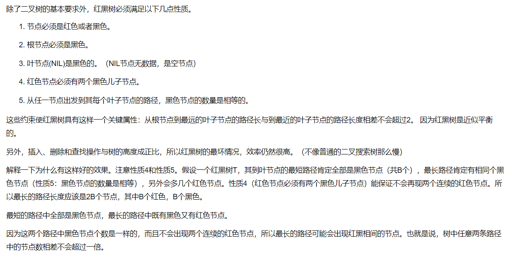

但是红黑树的性质是每条路径的黑色节点数目相同这个时候你再想想那其他路径的黑色节点数目一定比你现在少一个节点，所以调整起来是非常繁琐的. 插入红节点不需要调整其他路径，如果它的父亲为黑，那么直接插入，如果他的父亲为红那么在该路径上面开始分情况调整. 所以插入节点默认颜色一定要为红.如果为黑调节成本太大了.

###### 2.HashMap的put操作

put流程

1.通过hash函数计算key的hash值，调用putVal方法

2.如果hash表为空，调用resize()方法初始化创建一个hash表

3.根据hash值索引  hash表对应桶位置，判断该位置是否有hash碰撞

　　3.1 没有碰撞，直接插入映射入hash表

　　3.2 有碰撞，遍历桶中节点

　　　　3.2.1 第一个节点匹配，记录该节点

　　　　3.2.2 第一个节点没有匹配，桶中结构为红黑树结构，按照红黑树结构添加数据，记录返回值

　　　　3.2.3 第一个节点没有匹配，桶中结构是链表结构。遍历链表，找到key映射节点，记录，退出循环。
　　　　　没有则在链表尾部添加节点。插入后判断链表长度是否大于转换为红黑树要求，符合则转为红黑树结构

　　　　3.2.4 用于记录的值判断是否为null，不为则是需要插入的映射key在hash表中原来有，替换值，返回旧 值putValue方法结束

###### 3.ConurrentHashMap和HashTable有什么区别

hashtable每次同步执行的时候都要锁住整个结构

<jdk1.7> ：使用 Segment数组 + HashEntry数组 + 链表
<jdk1.8> ：使用 Node数组+链表+ 红黑树

加入分段锁结构

###### 4.分布式锁的实现，SETNX和GETSET的作用

setNX：SET if Not eXists，命令在指定的 key 不存在时，为 key 设置指定的值。设置成功，返回 1；设置失败，返回 0 。

get：获取指定key的值

getSet：设置指定 key 的值，并返回 key 的旧值。

很多人可能用了setNX和expire命令，这种操作不是原子操作，如果在调用expire设置过期时间之前机器挂了，这种情况会导致锁没法释放，即死锁。锁使用完之后，记得在finally里将锁释放。


###### 5.MySQL，先问了聚集索引和非聚集索引（最左匹配底层是什么引起的）

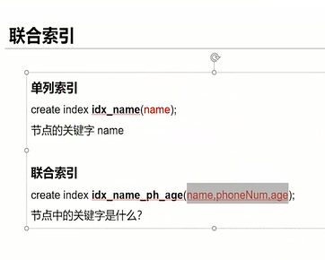

MySQL 索引类型有：唯一索引，主键（聚集）索引，非聚集索引，全文索引。

聚集（clustered）索引，也叫聚簇索引。

定义：数据行的物理顺序与列值（一般是主键的那一列）的逻辑顺序相同，一个表中只能拥有一个聚集索引。

聚集（unclustered）索引。

定义：该索引中索引的逻辑顺序与磁盘上行的物理存储顺序不同，一个表中可以拥有多个非聚集索引。

最左匹配底层是什么引起的

可以看到a的值是有顺序的，1，1，2，2，3，3，而b的值是没有顺序的1，2，1，4，1，2。所以b = 2这种查询条件没有办法利用索引，因为联合索引首先是按a排序的，b是无序的。

同时我们还可以发现在a值相等的情况下，b值又是按顺序排列的，但是这种顺序是相对的。所以最左匹配原则遇上范围查询就会停止，剩下的字段都无法使用索引。例如a = 1 and b = 2 a,b字段都可以使用索引，因为在a值确定的情况下b是相对有序的，而a>1and b=2，a字段可以匹配上索引，但b值不可以，因为a的值是一个范围，在这个范围中b是无序的。


###### 6.==和equals的区别

```java
public static void main(String[] args) {
 Integer integerA = new Integer(5);
 Integer integerB = new Integer(5);
 int intA = 10;
 int intB = 10;
 String strA = new String("test");
 String strB = new String("test");
 System.out.println(integerA == integerB);
 System.out.println(integerA.equals(integerB));
 System.out.println(integerA.equals(intA));
 System.out.println(intA == intB);
 System.out.println(strA == strB);
}
```

###### 7.Linux命令

https://blog.51cto.com/viphyy/2093535

###### 8.数据库分表

https://www.cnblogs.com/twoheads/p/9641265.html

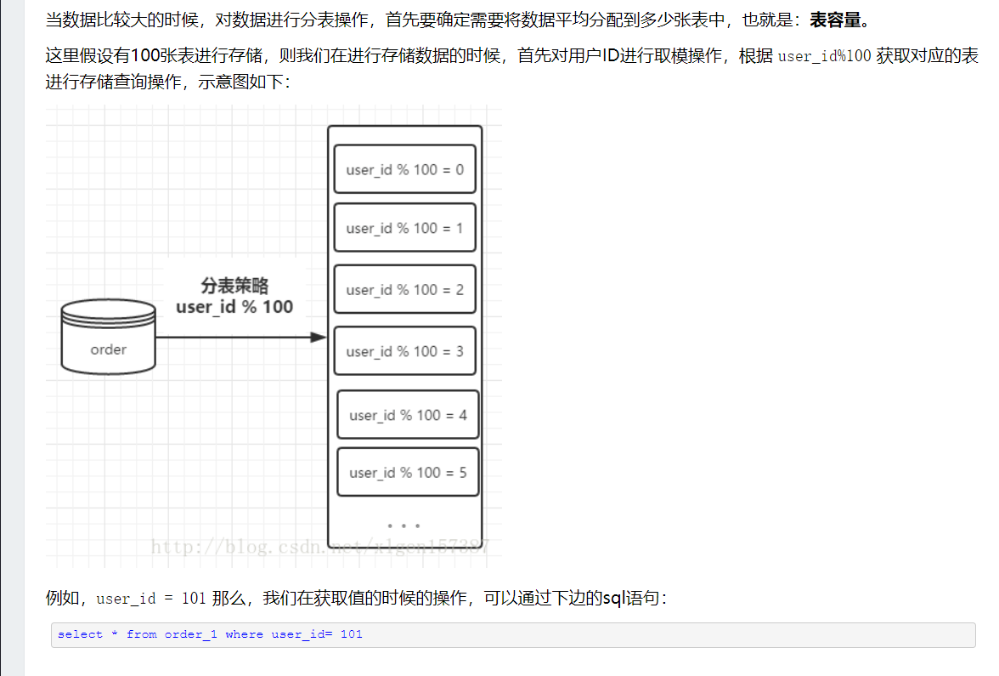

###### 9.Java的抽象类和接口的区别。

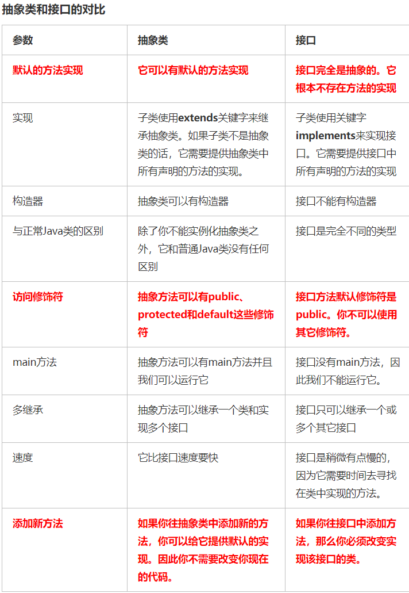

###### 10.设计模式，说IO流用了什么设计模式。

io中的适配器模式

由于InputStream是字节流不能享受到字符流读取字符那么便捷的功能，因此借助 InputStreamReader将其转为Reader子类，因此可以拥有便捷操作文本文件方法。 OutputStream同理。

io中的装饰(包装)模式

将InputStream字节流包装为BufferedReader过程就装饰的过程。一开始
InputStream只有read一个字节的方法，包装为Reader之后拥有read一个字符的功
能，在包装成BufferedReader之后就拥有read一行字符串功能。OutputStream同理

###### 11.sleep会不会释放锁，哪个会释放锁

wait会释放锁，sleep不会。

###### 12.sleep的时候如果interrupt会怎么样，catch住异常后要做什么处理。

https://blog.csdn.net/qq_19301269/article/details/78595640

​        对于sleep中的线程，如果你调用了Thread。sleep(一年);现在你后悔了，想让它早些醒过来，调用interrupt()方法就是唯一手段，只有改变它的中断状态，让它从sleep中将控制权转到处理异常的catch语句中，然后再由catch中的处理转换到正常的逻辑。同样地 于join中的线程你也可以这样处理。

　　对于一般介绍多线程模式的书上，他们会这样来介绍:当一个线程被中断后，在进入wait，sleep，join方法时会抛出异常。

　　是的，这一点也没有错，但是这有什么意义呢?

如果你知道那个线程的状态已经处于中断状态，为什么还要让它进入这三个方法呢?当然有时是必须这么做的，但大多数时候没有这么做的理由，所以我上面主要介绍了在已经调用这三个方法的线程上调用interrupt()方法让它中这本个方法的"暂停"状态中恢复过来。

这个恢复过来就可以包含两个目的:

　　一、[可以使线程继续执行]，那就是在catch语句中招待醒来后的逻辑，或由catch语句转回正常的逻辑。总之它是从wait，sleep，join的暂停状态活过来了。

　　二、[可以直接停止线程的运行]，当然在catch中什么也不处理，或return，那么就完成了当前线程的使命，可以使在上面"暂停"的状态中立即真正的"停止"。


###### 13.开放问题

问12306怎么处理大量请求。 

增加应用服务器，这些服务器做负载均衡，数据库与应用服务区分离，数据库读写分离，同时结合缓存，反向代理与正向代理。。。当然有很多的细节问题需要处理，比如session同步，集群中服务节点失效，数据量超出数据库单表极限需要分库分表等问题。。。涉及的算法有一致性哈希等等等

问12306怎么处理大量的读请求。 

问12306为什么有的时候会有看的时候有票，但是买的时候没票的情况，问我有可能会是什么原因。 

问12306可能存在第三方软件帮忙抢票，怎么防止。

限制ip /手机号

###### 14.ArrayList和Vector的扩容机制

```java
Vector 
if(minCapacity > oldCapacity) //扩容的条件，数组需要的长度要大于实际长度 
 在有参构造时可以给capacityIncrement赋值，扩容时会将capacityIncrement和原来容量进行对比，取较大值再加上原来容量（扩容机制相比ArrayList更灵活，开发者可以根据实际业务决定扩容，减少扩容的次数来提升性能）
```

###### 15.创建线程池、线程池的运行机制和拒绝策略

```java
//运行机制
首先线程池它有一个核心线程数，当线程运行的时候，如果没有设置成预启动加载，线程数是0；
当提交一个新任务的时候，它会建立一个核心线程去执行任务，此时如果一直来任务，之前的也没有执行完，它会一直创建核心线程；
当达到核心线程数时，如果还都在忙，那么就会放到blockingQueue阻塞队列；
如果阻塞队列也放满了，而且核心线程还在忙，那就会去建立非核心线程，如果一直创建，数量达到非核心最大的线程数，就会触发一个拒绝策略


//四种创建线程池的方式
    
// 创建单个线程
Executors.newSingleThreadExecutor(); 
// 创建固定数量的线程
Executors.newFixedThreadPool(3); 
// 可动态调整,随着请求的增多线程也随之创建
Executors.newCachedThreadPool(); 
// 用来调度即将执行的任务的线程池
Executors.newScheduledThreadPool();

//七个参数
corePoolSize 核心线程数，一直存活，即使线程数小于核心线程数且线程数有空闲，线程池也会创建新的线程。
maximumPoolSize 最大线程数，当线程数大于核心线程数并且任务队列已经满了的时候，线程池会创建新的线程，当线程数大于最大线程数并且任务队列已经满了，会抛出异常。
keepAliveTime 线程空闲时间，当线程的空闲时间达到keepAliveTime时，线程会退出，直到线程数等于核心线程数，可以设置参数allowCoreThreadTimeout=true,则会直到线程数为0。
TimeUnit unit 超时时间单位。
BlockingQueue workQueue 阻塞队列，任务队列的容量。
ThreadFactory threadFactory 线程工厂，基本不用设置（默认使用Executors.defaultThreadFactory()）
    
RejectedExecutionHandler handler 拒绝策略，任务拒绝处理器。
  
//四种拒绝策略
AbortPolicy() 线程池满了，如果还有线程想加入，不处理这个请求，抛出异常。
CallerRunsPolicy() 谁调用返回谁执行，这种方式会影响新任务的提交速度
DiscardPolicy() 队列满了，丢掉任务，不会抛出异常。
DiscardOldestPolicy() 队列满了，尝试去和最早的竞争，不会抛出异常。
    
    
//总结
其实线程池就是种池化技术，其他的比如还有数据库连接池，内存池，http连接池等等，这样可以减少资源对象的创建次数，垃圾回收的开销，提高程序的性能，特别是在高并发下这种提高更加明显。
```


###### 16.Redis持久化的方式，AOF备份文件过大怎么办

重写的好处：减少AOF日志尺寸，减少内存占用，加快数据库恢复时间。

执行一个 AOF文件重写操作，重写会创建一个当前 AOF 文件的体积优化版本。
即使 BGREWRITEAOF 执行失败，也不会有任何数据丢失，因为旧的 AOF 文件在 BGREWRITEAOF 成功之前不会被修改。
从 Redis 2.4 开始，AOF 重写由 Redis 自行触发， BGREWRITEAOF 仅仅用于手动触发重写操作。但网上有网友说已经3.2.5版本了，貌似redis还是没有自动触发BGREWRITEAOF
稳妥的方法还写一个脚本每天定时去执

https://blog.csdn.net/qq_35971301/article/details/101124553

RDB
在指定的时间间隔内生成数据集的时间点快照（point-in-time snapshot）

 因此你可能会至少 5 分钟才保存一次 RDB 文件。 在这种情况下， 一旦发生故障停机， 你就可能会丢失好几分钟的数据。

AOF（体积太大）

使用 AOF 持久化会让 Redis 变得非常耐久（much more durable）：你可以设置不同的 fsync 策略，比如无 fsync ，每秒钟一次 fsync ，或者每次执行写入命令时 fsync 。 AOF 的默认策略为每秒钟 fsync 一次，在这种配置下，Redis 仍然可以保持良好的性能，并且就算发生故障停机，也最多只会丢失一秒钟的数据（ fsync 会在后台线程执行，所以主线程可以继续努力地处理命令请求）。

###### 17.String、StringBuilder、StringBuffer区别

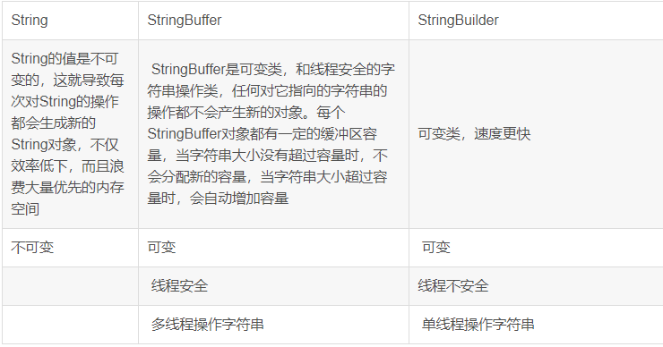

区别1：线程安全
StringBuffer：线程安全，StringBuilder：线程不安全。因为 StringBuffer 的所有公开方法都是 synchronized 修饰的，而 StringBuilder 并没有 StringBuilder 修饰。

区别2：缓冲区

可以看出，StringBuffer 每次获取 toString 都会直接使用缓存区的 toStringCache 值来构造一个字符串。

而 StringBuilder 则每次都需要复制一次字符数组，再构造一个字符串。

所以，缓存冲这也是对 StringBuffer 的一个优化吧，不过 StringBuffer 的这个toString 方法仍然是同步的。

区别3：性能
既然 StringBuffer 是线程安全的，它的所有公开方法都是同步的，StringBuilder 是没有对方法加锁同步的，所以毫无疑问，StringBuilder 的性能要远大于 StringBuffer。

所以，StringBuffer 适用于用在多线程操作同一个 StringBuffer 的场景，如果是单线程场合 StringBuilder 更适合。


###### 18.final修饰的方法和类是否可以更改

**A、修饰类(class)。 

   1、该类不能被继承。 
   2、类中的方法不会被覆盖，因此默认都是final的。 
   3、**用途：**设计类时，如果该类不需要有子类，不必要被扩展，类的实现细节不允许被改变，那么就设计成final类

**B、修饰方法(method)** 
   1、该方法可以被继承，但是不能被覆盖。 
   2、**用途：**一个类不允许子类覆盖该方法，则用final来修饰 
   3、**好处：**可以防止继承它的子类修改该方法的意义和实现；更为高效，编译器在遇到调用final方法转入内嵌机制，提高了执行效率。 
   4、**注意：**父类中的private成员方法不能被子类覆盖，因此，private方法默认是final型的(可以查看编译后的class文件)

**C、修饰变量(variable) 
**   1、用final修饰后变为常量。包括**静态变量、实例变量和局部变量**这三种。 
   2、**特点：**可以先声明，不给初值，这种叫做final空白。但是使用前必须被初始化。一旦被赋值，将不能再被改变。(被final修饰的变量，不可变的是**变量的引用**，而不是变量的内容)

**D、修饰参数(arguments) 
**   1、用final修饰参数时，可以读取该参数，但是不能对其作出修改

**二、final关键字不能用来抽象类和接口。**

###### 19.controller,service注解实现

 Spring框架的核心就是IOC,通过controller一类注解的bean的实例化过程可以大体总结spring注解的工作原理：

1）利用asm技术扫描class文件，转化成Springbean结构，把符合扫描规则的（主要是是否有相关的注解标注，例如@Component）bean注册到Spring 容器中beanFactory

2）注册处理器，包括注解处理器

4）实例化处理器（包括注解处理器），并将其注册到容器的beanPostProcessors列表中

5）创建bean的过程中，属性注入或者初始化bean时会调用对应的注解处理器进行处理。

 

###### 20.JVM中Remember Set是干什么用的，在哪儿用到，什么情况下会进行变更。

 RememberedSet用于可达性分析。

老年代对象引用新生代对象”这种关系，会在引用关系发生时，在新生代边上专门开辟一块空间就记录下来，这就是RememberedSet。所以，“新生代的 GC Roots”+"RememberedSet存储的内容"，才是新生代收集时真正的GC Roots。然后就可以以此为据，在新生代上做可达性分析，进行垃圾回收。

  OopMap记录了栈上本地变量表到堆上的引用关系。

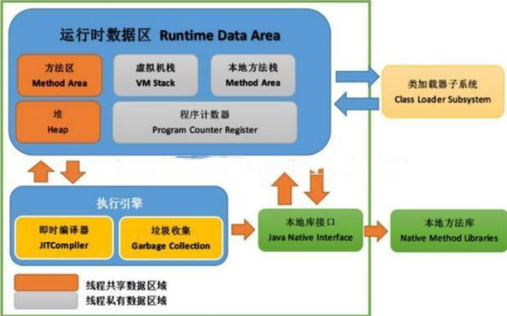

###### 21.Java的多线程问题，Thread.interrupted和thread.isinterrupted的区别还有线程状态。

https://blog.csdn.net/zxl_LangYa/article/details/82662919?utm_medium=distribute.pc_relevant.none-task-blog-BlogCommendFromMachineLearnPai2-4.baidujs&dist_request_id=088a2428-a121-4c3e-a539-b7c2698d28bf&depth_1-utm_source=distribute.pc_relevant.none-task-blog-BlogCommendFromMachineLearnPai2-4.baidujs

在java中有以下的3种方法可以终止正在运行的线程：

1. 使用退出标志，使线程正常退出，也就是当run方法完成后才停止；
2. 就是我们上面所说的使用stop方法强行终止线程，是过期作废的方法，这种方法可以排除不用；
3. 使用interrupt方法终止线程。

interrupt()只是会设置线程的中断标志位，没有任何其它作用

1）this.interrupted()：测试当前线程是否已经是中断中断状态，执行后进行状态标志清除。
2）this.isInterrupted()：测试线程Thread对象是否已经是中断状态，但不清除状态标志。


###### 22.线程池常用的阻塞队列

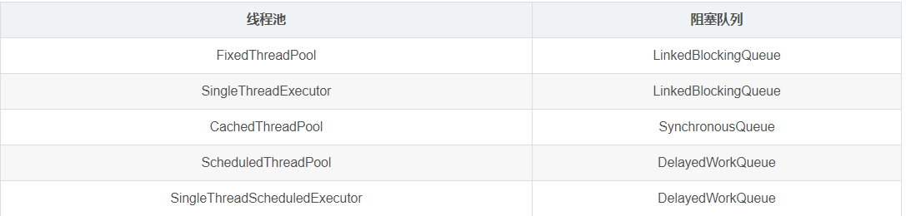

**LinkedBlockingQueue**

第一种阻塞队列是 LinkedBlockingQueue，它的容量是 Integer.MAX_VALUE，为 231 -1 ，是一个非常大的值，可以认为是无界队列。

FixedThreadPool 和 SingleThreadExecutor 线程池的线程数是固定的，所以没有办法增加特别多的线程来处理任务，这时就需要 LinkedBlockingQueue 这样一个没有容量限制的阻塞队列来存放任务。

**SynchronousQueue**

第二种阻塞队列是 SynchronousQueue，对应的线程池是 CachedThreadPool。线程池 CachedThreadPool 的最大线程数是 Integer.MAX_VALUE，可以理解为线程数是可以无限扩展的。

CachedThreadPool 和上一种线程池 FixedThreadPool 的情况恰恰相反，FixedThreadPool 的情况是阻塞队列的容量是无限的，而这里 CachedThreadPool 是线程数可以无限扩展，所以 CachedThreadPool 线程池并不需要一个任务队列来存储任务，因为一旦有任务被提交就直接转发给线程或者创建新线程来执行，而不需要另外保存它们。

我们自己创建使用 SynchronousQueue 的线程池时，如果不希望任务被拒绝，那么就需要注意设置最大线程数要尽可能大一些，以免发生任务数大于最大线程数时，没办法把任务放到队列中也没有足够线程来执行任务的情况。

**DelayedWorkQueue**

第三种阻塞队列是DelayedWorkQueue，它对应的线程池分别是 ScheduledThreadPool 和 SingleThreadScheduledExecutor，这两种线程池的最大特点就是可以延迟执行任务，比如说一定时间后执行任务或是每隔一定的时间执行一次任务。

DelayedWorkQueue 的特点是内部元素并不是按照放入的时间排序，而是会按照延迟的时间长短对任务进行排序，内部采用的是“堆”的数据结构（堆的应用之一就是 **优先级队列**）。之所以线程池 ScheduledThreadPool 和 SingleThreadScheduledExecutor 选择 DelayedWorkQueue，是因为它们本身正是基于时间执行任务的，而延迟队列正好可以把任务按时间进行排序，方便任务的执行。

###### 23.AQS公平锁和非公平锁的区别，问AQS怎么实现可重入锁。

```java
import java.util.concurrent.TimeUnit;
import java.util.concurrent.locks.AbstractQueuedSynchronizer;
import java.util.concurrent.locks.Condition;
import java.util.concurrent.locks.Lock;

/**
 * 用AQS实现的重入锁
 * @author 张仕宗
 * @date 2018.11.9
 */
public class MyAqsLock implements Lock{
	//AQS子类的对象，用它来辅助MyAqsLock工作
	private Sync sync = new Sync();
	
	private class Sync extends AbstractQueuedSynchronizer {

		@Override
		protected boolean tryAcquire(int arg) {
			//如果第一个线程进来，直接获得锁，并设置当前独占的线程为当前线程
			int state = this.getState();
			if(state == 0) { //state为0,说明当前没有线程占用该线程
				if(this.compareAndSetState(0, arg)) { //判断当前state值，第一个线程进来，立刻设置state为arg
					this.setExclusiveOwnerThread(Thread.currentThread()); //设置当前独占线程为当前线程
					return true; //告诉顶级aqs获取锁成功
				}
			} else { //如果是第二个线程进来
				Thread currentThread = Thread.currentThread();//当前进来的线程
				Thread ownerThread = this.getExclusiveOwnerThread();//已经保存进去的独占式线程
				if(currentThread == ownerThread) { //判断一下进来的线程和保存进去的线程是同一线程么？如果是，则获取锁成功，如果不是则获取锁失败
					this.setState(state+arg); //设置state状态
					return true;
				}
			}
			return false;
		}

		@Override
		protected boolean tryRelease(int arg) {
			//锁的获取和锁的释放是一一对应的,获取过多少次锁就释放多少次锁
			if(Thread.currentThread() != this.getExclusiveOwnerThread()) {
				//如果释放锁的不是当前线程，则抛出异常
				throw new RuntimeException();
			}
			int state = this.getState()-arg;
			//接下来判断state是否已经归零，只有state归零的时候才真正的释放锁
			if(state == 0) {
				//state已经归零，做扫尾工作
				this.setState(0);
				this.setExclusiveOwnerThread(null);
				return true;
			}
			this.setState(state);
			return false;
		}
		
		public Condition newCondition() {
			return new ConditionObject();
		}
	}

	/**
	 * 上锁的方法
	 */
	@Override
	public void lock() {
		sync.acquire(1);
	}
	
	/**
	 * 释放锁的方法
	 */
	@Override
	public void unlock() {
		sync.release(1);
	}
	
	@Override
	public void lockInterruptibly() throws InterruptedException {
		sync.acquireInterruptibly(1);
	}

	@Override
	public boolean tryLock() {
		//调用帮助器的tryAcquire方法，测试获取锁一次，不会自旋
		return sync.tryAcquire(1);
	}

	@Override
	public boolean tryLock(long time, TimeUnit unit) throws InterruptedException {
		//调用帮助器的tryRelease方法，测试释放锁一次，不会子旋
		return sync.tryRelease(1);
	}

	@Override
	public Condition newCondition() {
		//调用帮助类获取Condition对象
		return sync.newCondition();
	}
}

```


基于AQS的锁(比如ReentrantLock)原理大体是这样:
有一个state变量，初始值为0，假设当前线程为A,每当A获取一次锁，status++. 释放一次，status--.锁会记录当前持有的线程。
当A线程拥有锁的时候，status>0. B线程尝试获取锁的时候会对这个status有一个CAS(0,1)的操作，尝试几次失败后就挂起线程，进入一个等待队列。
如果A线程恰好释放，--status==0, A线程会去唤醒等待队列中第一个线程，即刚刚进入等待队列的B线程，B线程被唤醒之后回去检查这个status的值，尝试CAS(0,1),而如果这时恰好C线程也尝试去争抢这把锁

非公平锁实现：
C直接尝试对这个status CAS(0,1)操作，并成功改变了status的值，B线程获取锁失败，再次挂起，这就是非公平锁，B在C之前尝试获取锁，而最终是C抢到了锁。
公平锁：
C发现有线程在等待队列，直接将自己进入等待队列并挂起,B获取锁

https://blog.csdn.net/zhang5476499/article/details/83796289


###### 24.mysql什么时候触发行锁，什么时候触发表锁？

https://www.cnblogs.com/Marydon20170307/p/14105005.html

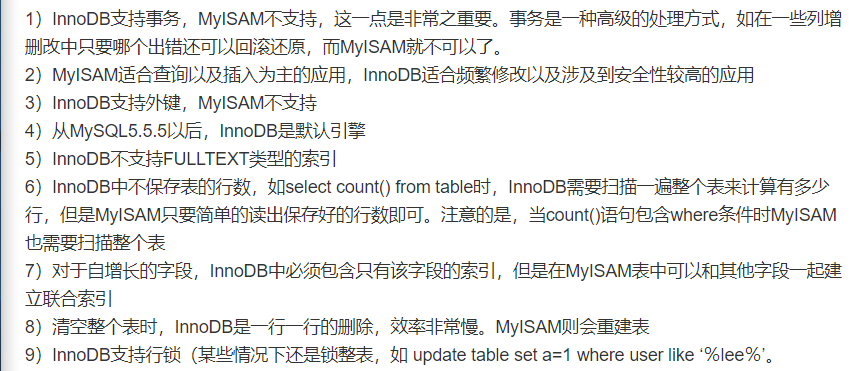

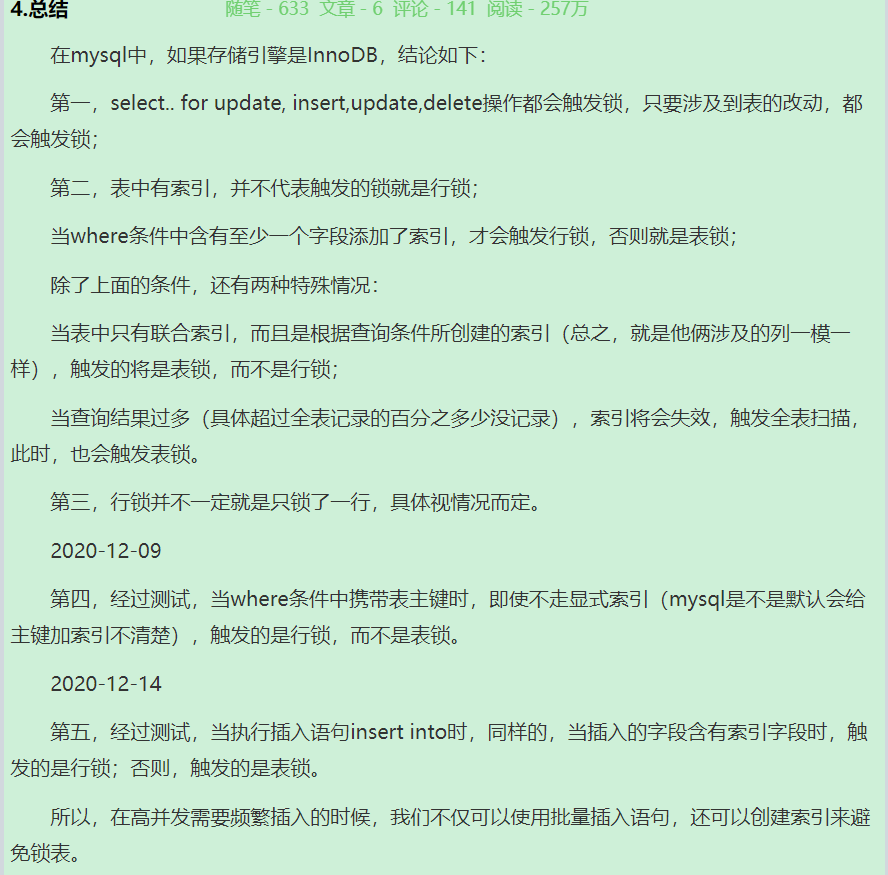

###### mysql的一致性和CAP的一致性有什么区别？

ACID一致性是有关数据库规则，如果数据表结构定义一个字段值是唯一的，那么一致性系统将解决所有操作中导致这个字段值非唯一性的情况，如果带有一个外键的一行记录被删除，那么其外键相关记录也应该被删除，这就是ACID一致性意思。

CAP理论的一致性是保证同样一个数据在所有不同服务器上的拷贝都是相同的，这是一种逻辑保证，而不是物理，因为光速限制，在不同服务器上这种复制是需要时间的，集群通过阻止客户端查看不同节点上还未同步的数据维持逻辑视图。


###### 25.java jar包冲突的原理

当我们需要A的依赖的时候，就会在pom.xml中引入A的jar包；而引入的A的jar包中可能又依赖B的jar包，这样Maven在解析pom.xml的时候，会依次将A、B 的jar包全部都引入进来。

###### 26.springboot 循环依赖怎么解决

​		我现在有一个ServiceA需要调用ServiceB的方法，那么ServiceA就依赖于ServiceB，那在ServiceB中再调用ServiceA的方法，就形成了循环依赖。Spring在初始化bean的时候就不知道先初始化哪个bean就会报错。

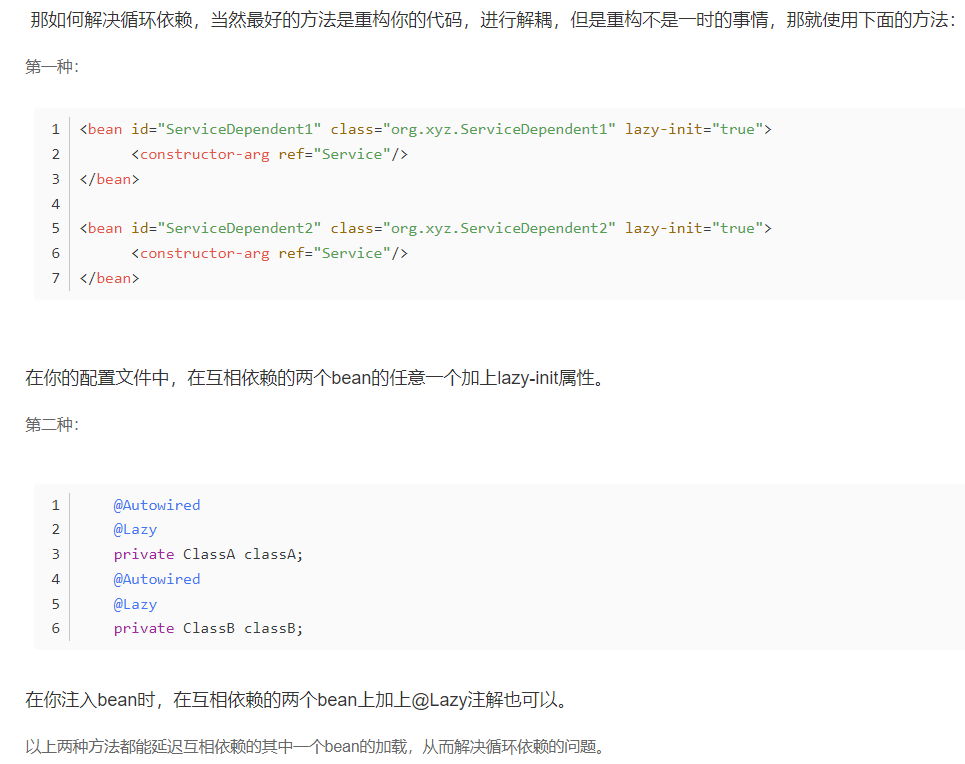


###### 27.基于SpringBoot构造器注入循环依赖及解决方式

使用Setter/Field注入

Spring文档建议的一种方式是使用setter注入。当依赖最终被使用时才进行注入。对前文的样例代码少做修改，来观察测试效果。

https://www.jb51.net/article/185514.htm

###### 28.hashcode()是key还是value

key

###### 29，线程的几种状态

线程在一定条件下，状态会发生变化。线程一共有以下几种状态：

1、新建状态(New)：新创建了一个线程对象。

2、就绪状态(Runnable)：线程对象创建后，其他线程调用了该对象的start()方法。该状态的线程位于“可运行线程池”中，变得可运行，只等待获取CPU的使用权。即在就绪状态的进程除CPU之外，其它的运行所需资源都已全部获得。

3、运行状态(Running)：就绪状态的线程获取了CPU，执行程序代码。

4、阻塞状态(Blocked)：阻塞状态是线程因为某种原因放弃CPU使用权，暂时停止运行。直到线程进入就绪状态，才有机会转到运行状态。

###### 30.BIO，NIO，AIO

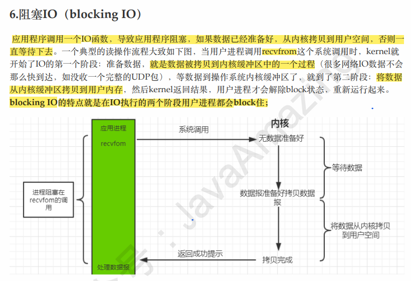

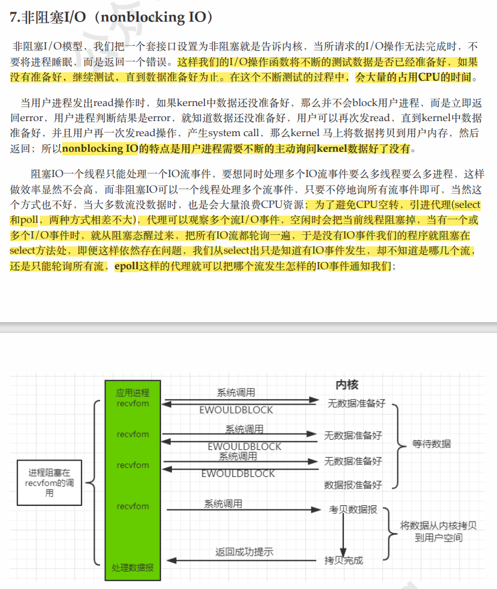

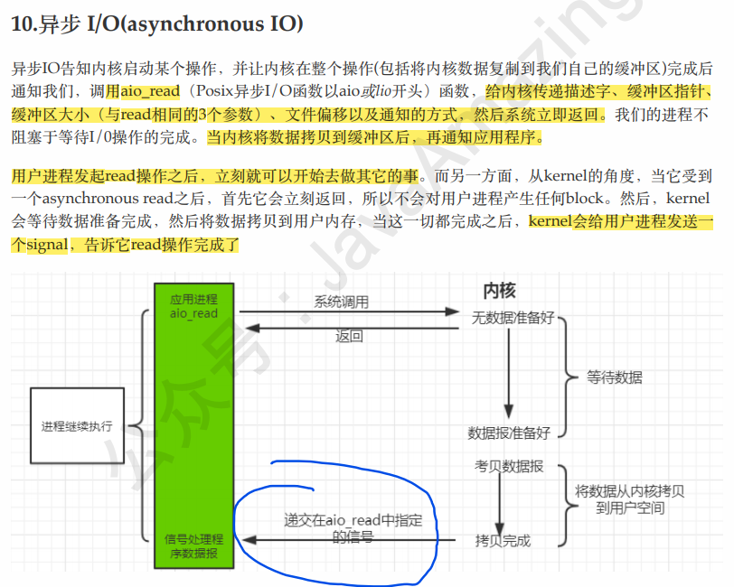


###### 31.lock和synchronized的区别

两者区别：

1.首先synchronized是java内置关键字，在jvm层面，Lock是个java类；

2.synchronized无法判断是否获取锁的状态，Lock可以判断是否获取到锁；

3.synchronized会自动释放锁(a 线程执行完同步代码会释放锁 ；b 线程执行过程中发生异常会释放锁)，Lock需在finally中手工释放锁（unlock()方法释放锁），否则容易造成线程死锁；

4.用synchronized关键字的两个线程1和线程2，如果当前线程1获得锁，线程2线程等待。如果线程1阻塞，线程2则会一直等待下去，而Lock锁就不一定会等待下去，如果尝试获取不到锁，线程可以不用一直等待就结束了；

5.synchronized的锁可重入、不可中断、非公平，而Lock锁可重入、可判断、可公平（两者皆可）

6.Lock锁适合大量同步的代码的同步问题，synchronized锁适合代码少量的同步问题。


###### 32.，jdk代理和cglib代理区别，实现

JDK 的动态代理只能对实现了接口的目标类进行代理，而不实现接口的类就不能使用 JDK 的动态代理

CGLIB 是针对类来实现代理，当没有实现接口的类需要代理时就需要通过 CGLIB 来实现代理了，他的原理是对指定的目标类生成一个子类，并覆盖其中方法实现增强，但是因为采用的是继承，所以不能对 finall 类进行继承。

###### 33.tcp三次握手，为什么，两次有什么问题

```
1. 客户端向服务器发送一个SYN置位的TCP报文，其中包含连接的初始序列号x和一个窗口大小（表示客户端上用来存储从服务器发送来的传入段的缓冲区的大小）。
2. 服务器收到客户端发送过来的SYN报文后，向客户端发送一个SYN和ACK都置位的TCP报文，其中包含它选择的初始序列号y、对客户端的序列号的确认x+1和一个窗口大
小（表示服务器上用来存储从客户端发送来的传入段的缓冲区的大小）。
3. .客户端接收到服务器端返回的SYN+ACK报文后，向服务器端返回一个确认号y+1和序号x+1的ACK报文，一个标准的TCP连接完成。

三次握手改成仅需要两次握手，死锁是可能发生
考虑计算机A和B之间的通信，假定B给A发送一个连接请求分组，A收到了这个分组，并发送了确认应答分组。按照两次握手的协定，A认为连接已经成功地建立了，可以开始发送数据分组。可是，B在A的应答分组在传输中被丢失的情况下，将不知道A是否已准备好，不知道A建议什么样的序列号，B甚至怀疑A是否收到自己的连接请求分组。在这种情况下，B认为连接还未建立成功，将忽略A发来的任何数据分组，只等待连接确认应答分组。这样就形成了死锁
```


###### 34.https请求过程

一个HTTPS请求实际上包含了两次HTTP传输，可以细分为8步。
 1.客户端向服务器发起HTTPS请求，连接到服务器的443端口

2.服务器端有一个密钥对，即公钥和私钥，是用来进行非对称加密使用的，服务器端保存着私钥，不能将其泄露，公钥可以发送给任何人。

3.服务器将自己的公钥发送给客户端。

4.客户端收到服务器端的证书之后，会对证书进行检查，验证其合法性，如果发现发现证书有问题，那么HTTPS传输就无法继续。严格的说，这里应该是验证服务器发送的数字证书的合法性，关于客户端如何验证数字证书的合法性，下文会进行说明。如果公钥合格，那么客户端会生成一个随机值，这个随机值就是用于进行对称加密的密钥，我们将该密钥称之为client key，即客户端密钥，这样在概念上和服务器端的密钥容易进行区分。然后用服务器的公钥对客户端密钥进行非对称加密，这样客户端密钥就变成密文了，至此，HTTPS中的第一次HTTP请求结束。

5.客户端会发起HTTPS中的第二个HTTP请求，将加密之后的客户端密钥发送给服务器。

6.服务器接收到客户端发来的密文之后，会用自己的私钥对其进行非对称解密，解密之后的明文就是客户端密钥，然后用客户端密钥对数据进行对称加密，这样数据就变成了密文。

7.然后服务器将加密后的密文发送给客户端。

8.客户端收到服务器发送来的密文，用客户端密钥对其进行对称解密，得到服务器发送的数据。这样HTTPS中的第二个HTTP请求结束，整个HTTPS传输完成。


###### 35.数据库索引分成几类？具体讲一下

Mysql常见的索引有主键索引、普通索引、全文索引、唯一索引

主键就是唯一索引，但是唯一索引不一定是主键，唯一索引可以为空，但是空值只能有一个，主键不能为空。
普通唯一索引：单个字段上建立唯一索引，需要此字段所在的列上不能有重复的值，属于二级索引。
复合唯一索引：多个字段上联合建立唯一索引，属于二级索引。

###### 36.mybatis如果xml和注解配置都有会先用哪个

- **这种方式一定要把类的配置写在 XML 的配置之前。**

因为先解析完 mapper 之后，可以继续解析 xml，解析 xml 时如果判断 mapper 解析过之后则不会重复解析也不会抛错，但是如果先解析 xml，会向Configuration 中注册 Mapper，当之后解析 Mapper 时如果检测到有加载过则会抛出异常并终止程序创建 SqlSessionFactory。

- **不允许对一个方法既XML 配置又注解，这会报错。**

因为在解析每个 sqlmap 的时候会给其生成唯一的 ID，并存入 MapperRegistry 中，这个注册中心本质上是一个 HashMap，且不允许插入已经存在的 key 值，做插入操作时如果检测到已存在同名ID就会报错终止解析。

###### 37.ConcurrentHashMap如何保证线程安全性?

(CAS+synchronized)

###### 38.如何判定一个对象是否应该回收。

1. 引用计数法；(无法解决对象循环引用的问题，导致对象无法被回收)
2. 可达性分析；

###### 39.java异常

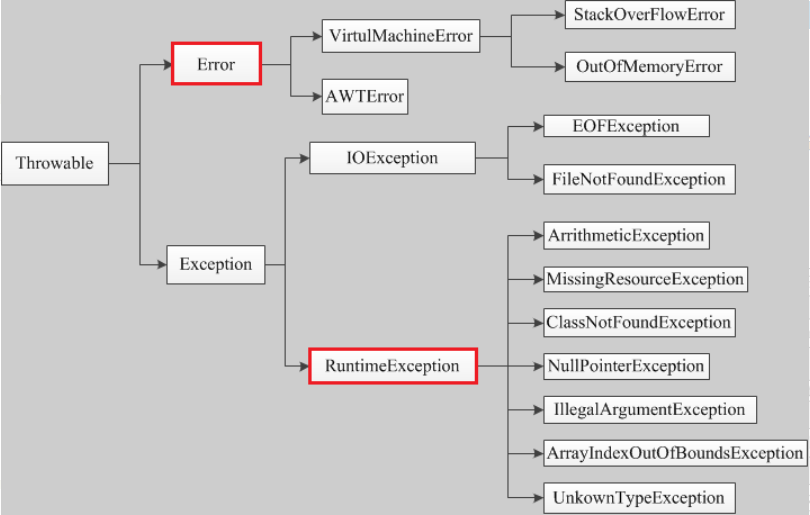

###### 40.说下spring中的AOP，以及解释下什么是切面，通知，连接点等。


​      后两个不常用

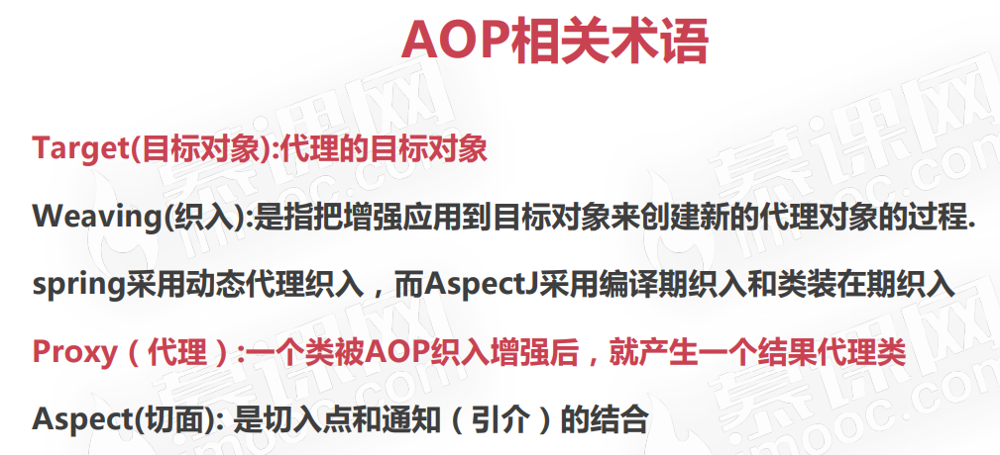

###### 41.java三大拦截器

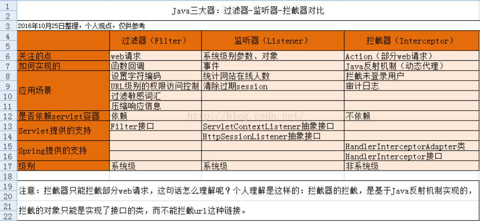

拦截器三个方法分别是:

1.1  preHandle

     预处理回调方法，实现处理器的预处理（如登录检查），第三个参数为响应的处理器（如具体的Controller实现）； 
返回值：true表示继续流程（如调用下一个拦截器或处理器）；false表示流程中断（如登录检查失败），不会继续调用其他的拦截器或处理器，此时我们需要通过response来产生响应；

1.2 postHandle

     后处理回调方法，实现处理器的后处理（但在渲染视图之前），此时我们可以通过modelAndView（模型和视图对象）对模型数据进行处理或对视图进行处理，modelAndView也可能为null。

1.3 afterCompletion

     整个请求处理完毕回调方法，即在视图渲染完毕时回调，如性能监控中我们可以在此记录结束时间并输出消耗时间，还可以进行一些资源清理，类似于try-catch-finally中的finally，但仅调用处理器执行链中preHandle返回true的拦截器的afterCompletion.

**执行流程**  

首先用户请求到达前端控制器 DispatcherServlet,前端控制器找到处理器映射器,根据请求的方法找到对应的处理器handler,生成拦截器和handler执行顺序的执行链,交给DispatcherServlet,

dispatcherServlet找到对应的处理器适配器进行处理.

   prehandler在请求处理之前执行.该方法的返回值是布尔值 Boolean 类型的，当它返回为 false 时，表示请求结束，后续的 Interceptor 和 Controller 都不会再执行；当返回值为 true 时，就会继续调用下一个 Interceptor 的 preHandle 方法，如果已经是最后一个 Interceptor 的时候，就会是调用当前请求的 Controller 中的方法。

   postHandler 方法在当前请求进行处理之后，也就是在 Controller 中的方法调用之后执行，但是它会在 DispatcherServlet 进行视图返回渲染之前被调用，所以我们可以在这个方法中对 Controller 处理之后的 ModelAndView 对象进行操作。

   afterCompletion该方法将在整个请求结束之后，也就是在 DispatcherServlet 渲染了对应的视图之后执行，这个方法的主要作用是用于进行资源清理的工作。像异常处理资源释放会放在这一步.

  多个拦截器的执行顺序是: 拦截器A的preHandler-->拦截器B的preHandler-->B的postHandler-->A的postHandler-->B的afterCompletion-->A的afterCompletion

42.@responsebody

1.

@responseBody注解的作用是将controller的方法返回的对象通过适当的转换器转换为指定的格式之后，写入到response对象的body区，通常用来返回JSON数据或者是XML

数据，需要注意的呢，在使用此注解之后不会再走试图处理器，而是直接将数据写入到输入流中，他的效果等同于通过response对象输出指定格式的数据。

2、

　　@RequestMapping("/login")
　　@ResponseBody
　　public User login(User user){
　　　　return user;
　　}
User字段：userName pwd 那么在前台接收到的数据为：'{"userName":"xxx","pwd":"xxx"}'
效果等同于如下代码：
　　@RequestMapping("/login")
　　public void login(User user, HttpServletResponse response){
　　　　response.getWriter.write(JSONObject.fromObject(user).toString());
　　}

```java
后台 Controller类中对应的方法：
@RequestMapping("/login.do")
@ResponseBody
public Object login(String name, String password, HttpSession session) {
	user = userService.checkLogin(name, password);
	session.setAttribute("user", user);
	return new JsonResult(user);
}
 
@RequestBody是作用在形参列表上，用于将前台发送过来固定格式的数据【xml格式 或者 json等】封装为对应的 JavaBean 对象，
封装时使用到的一个对象是系统默认配置的 HttpMessageConverter进行解析，然后封装到形参上。
如上面的登录后台代码可以改为：
@RequestMapping("/login.do")
@ResponseBody
public Object login(@RequestBody User loginUuser, HttpSession session) {
	user = userService.checkLogin(loginUser);
	session.setAttribute("user", user);
	return new JsonResult(user);
}

@ResponseBody 表示该方法的返回结果直接写入 HTTP response body 中，一般在异步获取数据时使用【也就是AJAX】。
```

###### 42.HttpSession 服务端的技术

```

服务器会为每一个用户 创建一个独立的HttpSession

HttpSession原理
当用户第一次访问Servlet时,服务器端会给用户创建一个独立的Session
并且生成一个SessionID,这个SessionID在响应浏览器的时候会被装进cookie中,从而被保存到浏览器中
当用户再一次访问Servlet时,请求中会携带着cookie中的SessionID去访问
服务器会根据这个SessionID去查看是否有对应的Session对象
有就拿出来使用;没有就创建一个Session(相当于用户第一次访问)

域的范围:
    Context域 > Session域 > Request域
    Session域 只要会话不结束就会存在 但是Session有默认的存活时间(30分钟)
```

