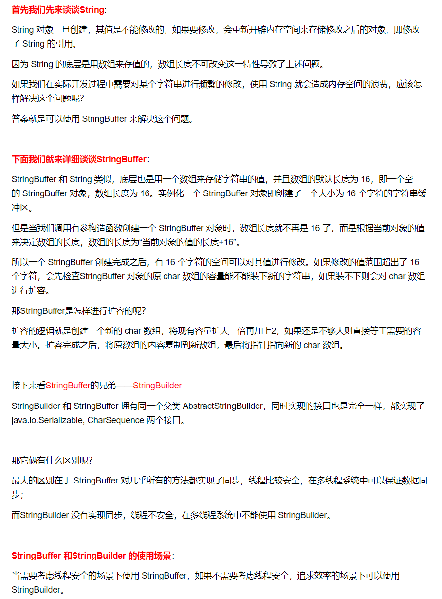
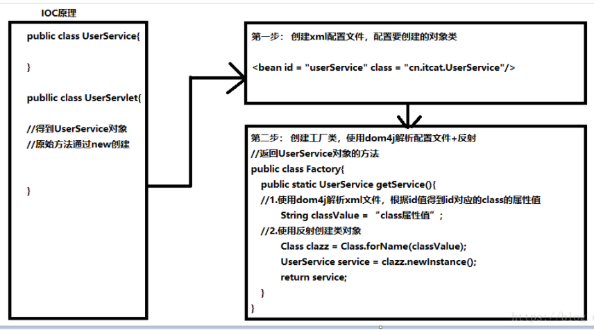
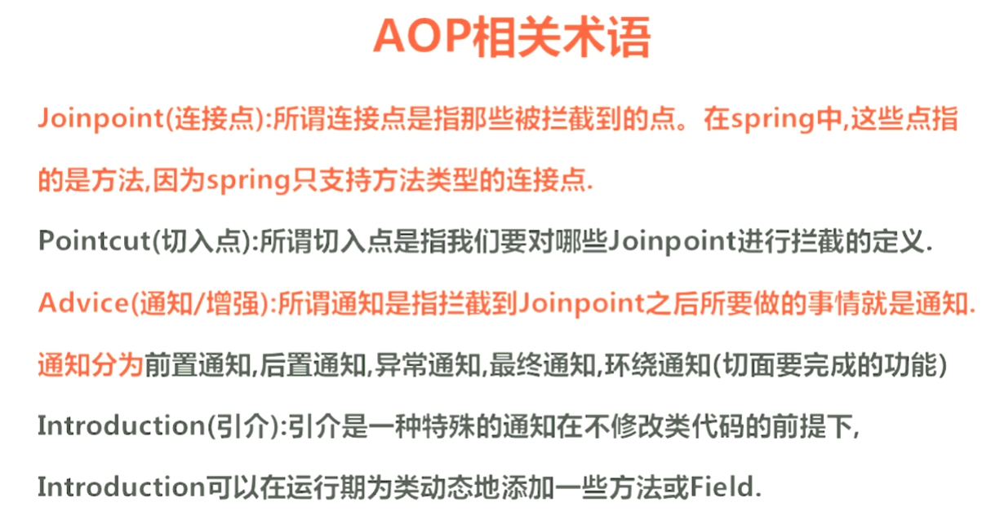
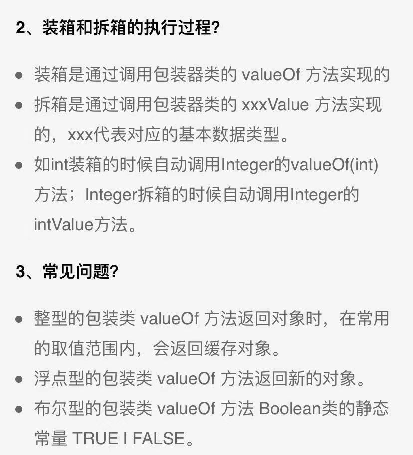
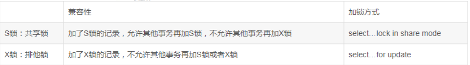
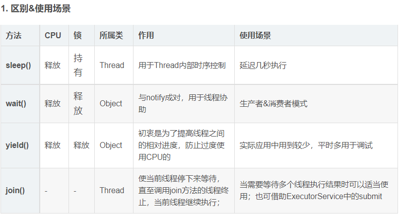

Michale

****

###### 1.==和equals的区别

1.对于基本数据类型，只有==，没有equals()（注意string类型不是基本数据类型），所以很明显值相等就为true。
2.对于字符串，==指比较两者的内存地址，equals()则重写了object类的equals()，比较的是内容，你可以查看api看看它怎么重写的。对于字符串是存放在方法区的字符串常量池里的，无论定义多少，只要字符串值相等都指同一块内存地址，所以==和equals()结果没区别。
3.对于实例对象而言，==比较的依然是内存地址(所以你可以看出无论什么情况，==一直比较的都是内存地址)，而equals()默认重写object类的equals()方法(比较地址)。但是一般我们会自己重写equals()，让它比较值是否相等。

###### 2.hashcode

1、hashCode的存在主要是用于查找的快捷性，如Hashtable，HashMap等，hashCode是用来在散列存储结构中确定对象的存储地址的；

2、如果两个对象相同，就是适用于equals(java.lang.Object) 方法，那么这两个对象的hashCode一定要相同；

3、如果对象的equals方法被重写，那么对象的hashCode也尽量重写，并且产生hashCode使用的对象，一定要和equals方法中使用的一致，否则就会违反上面提到的第2点；

4、两个对象的hashCode相同，并不一定表示两个对象就相同，也就是不一定适用于equals(java.lang.Object) 方法，只能够说明这两个对象在散列存储结构中，如Hashtable，他们“存放在同一个篮子里”。

###### 3.ArrayList和Vector（矢量队列，动态数组）

（1）：Vector是线程安全的，源码中有很多的synchronized可以看出，而ArrayList不是。导致Vector效率无法和ArrayList相比；

（2）ArrayList和Vector都采用线性连续存储空间，当存储空间不足的时候，ArrayList默认增加为原来的50%，Vector默认增加为原来的一倍；

（3）Vector可以设置capacityIncrement，而ArrayList不可以，从字面理解就是capacity容量，Increment增加，容量增长的参数。

###### 4.String、StringBuilder和StringBuffer原理和区别



###### 5.垃圾回收算法

https://zhuanlan.zhihu.com/p/54851319

###### 6.OOM问题如何定位和解决

- 有可能是内存分配确实过小，而正常业务使用了大量内存
- 某一个对象被频繁申请，却没有释放，内存不断泄漏，导致内存耗尽
- 某一个资源被频繁申请，系统资源耗尽，例如：不断创建线程，不断发起网络连接

jmap -heap pid

https://www.cnblogs.com/lujiango/p/9650927.html

###### 6.java异常机制

https://www.cnblogs.com/lulipro/p/7504267.html

###### 8.线程的同步机制有哪些，Lock和Synchronized、threadlocal


###### 9.sleep和wait区别

sleep()
sleep() 方法是线程类（Thread）的静态方法，让调用线程进入睡眠状态，让出执行机会给其他线程，等到休眠时间结束后，线程进入就绪状态和其他线程一起竞争cpu的执行时间。
因为sleep() 是static静态的方法，他不能改变对象的机锁，当一个synchronized块中调用了sleep() 方法，线程虽然进入休眠，但是对象的机锁没有被释放，其他线程依然无法访问这个对象。
wait()
wait()是Object类的方法，当一个线程执行到wait方法时，它就进入到一个和该对象相关的等待池，同时释放对象的机锁，使得其他线程能够访问，可以通过notify，notifyAll方法来唤醒等待的线程.

###### 10.servlet启动流程，生命周期

- 执行流程： Get/Post  ->   web.xml  ->  url-Pattern  ->  servlet-class  ->   doGet/doPost

  生命周期

  1、初始化阶段 调用init()方法

   2、响应客户请求阶段。调用service()方法，由service()方法根据提交的方式选择执行doGet()或者doPost()方法
  
   3、终止阶段　　调用destroy()方法

###### 11.servlet和jsp区别

JSP的本质就是Servlet，JVM只能识别java的类，不能识别JSP的代码,Web容器将JSP的代码编译成JVM能够识别的java类。
JSP页面在执行的时候都会被服务器端的JSP引擎转换为Servelet（.java），然后又由JSP引擎调用Java编译器，将Servelet（.java）编译为Class文件（.class），并由Java虚拟机（JVM）解释执行。

###### 12.servlet是不是线程安全，如何避免

Servlet的线程安全问题只有在大量的并发访问时才会显现出来，并且很难发现，因此在编写Servlet程序时要特别注意。线程安全问题主要是由实例变量造成的,因此在Servlet中应避免使用实例变量。如果应用程序设计无法避免使用实例变量，那么使用同步来保护要使用的实例变量，但为保证系统的最佳性能，应该同步可用性最小的代码路径。

###### 13.MVC框架有哪些

常用的MVC框架有JSP + servlet + javabean的模式

SpringMVC会稍微比Struts2快。SpringMVC是基于方法的设计，而Sturts2是基于类，每次发一次请求都会实例一个action，每个action都会被注入属性，而SpringMVC基于方法，粒度更细，但要小心把握像在servlet控制数据一样。

###### 14.Spring核心IOC和AOP

IOC



AOP(各个步骤之间的良好隔离性 ,源代码无关性 )

1.面向切面编程提供声明式事务管理 
2.spring支持用户自定义的切面 




###### 15.注入bean对象的几种方式

- **set方法注入**
- **构造器注入**
- **静态工厂注入**
- **实例工厂注入**
- **使用注解注入**

###### 16.UNION和UNION ALL关键字都是将两个结果集合并为一个

MySQL中的UNION

UNION在进行表链接后会筛选掉重复的记录，所以在表链接后会对所产生的结果集进行排序运算，删除重复的记录再返回结果。实际大部分应用中是不会产生重复的记录，最常见的是过程表与历史表UNION。如：

select * from gc_dfys union select * from ls_jg_dfys

这个SQL在运行时先取出两个表的结果，再用排序空间进行排序删除重复的记录，最后返回结果集，如果表数据量大的话可能会导致用磁盘进行排序。 

MySQL中的UNION ALL

而UNION ALL只是简单的将两个结果合并后就返回。这样，如果返回的两个结果集中有重复的数据，那么返回的结果集就会包含重复的数据了。

从效率上说，UNION ALL 要比UNION快很多，所以，如果可以确认合并的两个结果集中不包含重复的数据的话，那么就使用UNION ALL，如下：

select * from gc_dfys union all select * from ls_jg_dfys

###### 17.int和Integer自动拆装箱

自动装箱：把基本类型自动转换成对应的包装类

自动拆箱：把包装类自动转换成对应的基本类型



 java早年设计的一个缺陷，基本数据类型不是对象，自然不是Object的子类，需要装箱才能把数据类型变成一个类，那就可以把装箱过后的基本数据类型当做一个对象，就可以调用object子类的接口。而且基本数据类型是不可以作为形参使用的，装箱后就可以。

**享元模式**

对于两个非new生成的Integer对象，进行比较时，如果两个变量的值在区间-128到127之间，则比较结果为true，如果两个变量的值不在此区间，则比较结果为false。
解析原因：归结于java对于Integer与int的自动装箱与拆箱的设计，是一种模式：叫享元模式（flyweight）。
（1）加大对简单数字的重利用，Java定义在自动装箱时对于在-128~127之内的数值，它们被装箱为Integer对象后，会存在内存中被重用，始终只存在一个对象。
（2）而如果在-128~127之外的数，被装箱后的Integer对象并不会被重用，即相当于每次装箱时都新建一个 Integer对象。

###### 18.单例模式的应用

https://www.cnblogs.com/kuangdw/p/12840026.html

headheart

****

######   1 静态变量放在哪里？ 

内存到底分几个区？

1、栈区（stack）— 由编译器自动分配释放 ，存放函数的参数值，局部变量的值等。

2、堆区（heap） — 一般由程序员分配释放， 若程序员不释放，程序结束时可能由os回收 。注意它与数据结构中的堆是两回事，分配方式倒是类似于链表。

3、全局区（静态区）（static）—全局变量和静态变量的存储是放在一块的，初始化的全局变量和静态变量在一块区域， 未初始化的全局变量和未初始化的静态变量在相邻的另一块区域。程序结束后有系统释放。

4、文字常量区 — 常量字符串就是放在这里的。 程序结束后由系统释放。

5、程序代码区 — 存放函数体的二进制代码。

######   2 内存泄漏和内存溢出知道么？有什么区别？ 

```
内存泄露是指你的应用使用资源之后没有及时释放，导致应用内存中持有了不需要的资源，这是一种状态描述。
内存溢出是指你的应用的内存已经不能满足正常使用了，堆栈已经达到系统设置的最大值，进而导致崩溃，这事一种结果描述。
而且通常都是由于内存泄露导致堆栈内存不断增大，从而引发内存溢出。

常见内存泄漏引起原因
1；静态集合类
像hashmap，vector等，如果是全局的，静态的，集合只增不减就会造成泄漏，集合类应该增减方法都有，
2；当集合里面的对象属性被修改后，在调用remove()时不起作用
p a = new person; set.add(a); a.setName("ddd");set.remove(a);删除不掉，set.add(a);还可以成功，里面有两个a对象，修改前的a访问不到，内存泄漏，因为属性改变对象的hashcode改变，set就找不到了
3；监听器
当我们往一个控件中添加监听对象，控件会用集合之类的存储这些监听对象，当释放对象的时候忘记删除监听器
4；各种连接
忘记close（）；
5；内部类和外部模块的引用
把对象的引用传给外部模块，外部模块没有去处这个引用；
6；单例模式
单例对象一直存在，如果这个对象持有别的对象的引用，如果没有去处这个引用会造成这个对象泄漏
```

######   3 AOP用过么？你用来干什么？ 

######   4 Spring 中事务如何实现的？ serviceA调用serviceB，如果serviceB抛出异常，serviceA会不会回滚？ 

如果内部抛出了error或者unchecked exception 会回滚，抛的时checked exception不会回滚，我当时就这么答的，也不知道对不对。我当时还提了 transactional注解可以设置 rollbackfor()和 norollbackfor()设置哪些 checked exception回滚或者不回滚。

######   5 过滤器和拦截器知道么？有什么区别？各自的使用场景是什么？ 

 **过滤器常见使用场景**
统一设置编码
过滤敏感字符
登录校验
URL级别的访问权限控制
数据压缩

**拦截器常见使用场景**
a) 日志记录
b) 权限校验
c) 登录校验
d) 性能检测[检测方法的执行时间]


######   6 Mybatis中模糊查询如何实现的？ 

http://baijiahao.baidu.com/s?id=1654523881624000395&wfr=spider&for=pc

######   7 你知道MySQL中有哪些存储引擎？ 

https://baijiahao.baidu.com/s?id=1631929456150628689&wfr=spider&for=pc

######   8 InnoDB的默认隔离级别是什么？ 

RR

######   9 MySQL 中 char(1) 占几个字节？ 

CHAR(30)在UTF-8字符集下计算最大字符数和最大字节数分别是30和90(放入汉字时)，而存入字母时分别为30和30。

######   10 在MySQL中怎么定义浮点数？ 定义浮点数时指定10.2，这个10.2是什么意思？

10代表整数部分和小数部分加起来总共10位，2代表有两位小数

###### 11.springboot中的注解有去了解吗？

https://www.php.cn/faq/417047.html

****

cike

4.说说springboot和springmvc


###### 5.说一件能体现你责任心的事

​        对于无法完成的任务又会非常上心，并且会在任务开始之前就能坦诚的表示自己能力欠缺，希望得到帮助。这种帮助并不是甩给别人去做，而是依然当做自己的任务将它努力的做到自己所能做到的极限。

###### 6.团队里的角色

实干者
实干者非常现实、传统甚至有点保守，他们崇尚努力，计划性强，喜欢用系统的方法解决问题，实干者有很好的

自控力和纪律性，对团队忠诚度高，为团队整体利益着想，而较少考虑个人的利益。实干者在团队中的主要作用

是：由于其可靠、高效率、及处理具体工作的能力强，因此在团队中作用很大。实干者不会根据个人的兴趣来完

成工作，而是根据团队的需要来完成工作。所以他们有组织能力、务实、能够把想法转变为实际行动，他们工作

努力，自律。


###### 7.怎么体现你的协调能力

1、准确的理解他人：

在处理人际关系之时，其前提条件就是理解别人，学会换位思考，站在对方的角度考虑问题，能够把自己设身处地地带入到题目的环境中去，才能感受对方的心境、情绪、困难，才能找到有效解决问题的方法。当然在面试中，准确理解他人还有另外一层含义，即听清楚题目，因为天津的公务员面试的形式都是听题，所以如果不能很好倾听，不能把握题目重点，就没有办法将此类题目答好。

2、清晰的表达自我：

要站在听众的立场上，去判断自己是否表达清楚。根据不同的听众，调整自己的表达方式，直接了当、简单明确的表明自己的核心观点，不必担心传递的信息不够或者不全，有些考生总是担心表达的不够，总想表达完善一些，结果表达显得累赘。在表达了自己的核心观点之后，再增加必要的细节。细节也不是全部的细节，应该是比较重要的，有亮点的细节。

3、有效地影响他人：

沟通是两人或多人互动的过程，这就要求我们应该互相尊重，平等对待他人，要以商量或建议的方式来沟通信息，不要盛气凌人；一般我们在沟通的过程中直接关系到工作的有效进行，因此我们在沟通的过程中应力求准确、真实地反映客观实际，防止出现放大、缩小、片面等失真现象。

###### 8.如何用sql锁住一张表

LOCK TABLES tablename WRITE;
LOCK TABLES tablename READ;
INSERT INTO assignment VALUES (1,7513, '0000-00-00' ,5),(1,7513, '2003-01-20' ,8.5);
UNLOCK TABLES;

###### 9.mysql有哪些锁

1、表级锁：开销小，加锁快；不会出现死锁；锁定粒度大，发生锁冲突的概率最高，并发度最低。

2、行级锁：开销大，加锁慢；会出现死锁；锁定粒度最小，发生锁冲突的概率最低，并发度也最高。

3、页面锁：开销和加锁时间界于表锁和行锁之间；会出现死锁；锁定粒度界于表锁和行锁之间，并发度一般。

所谓死锁：是指两个或两个以上的进程在执行过程中,因争夺资源而造成的一种互相等待的现象,若无外力作用，它们都将无法推进下去.此时称系统处于死锁状态或系统产生了死锁，这些永远在互相等待的进程称为死锁进程。


**锁级别分类**

**共享锁读 & 排他锁写**

https://zhuanlan.zhihu.com/p/88880235



解决方法

1. 发起死锁检测，主动回滚一条事务，让其他事务继续执行（innodb_deadlock_detect=on）。

###### 开发过程中的编码规范

https://blog.csdn.net/weixin_34413065/article/details/92330386

###### 怎么减少项目中的错误和异常

多向前辈请教

###### sleep和wait了解吗，有没有使用过

Sleep一般用于使当前线程进入阻塞状态并且继续持有锁，一般是让线程等待。

wait一般用于多线程之间的通信，需要配合notify或者notifyall来进行使用，例如：生产者，消费者模式就需要使用wait，notify方法



wait，notify和notifyAll只能在同步控制方法或者同步控制块里面使用（synchronized），

 IllegalMonitorStateException(会报这个异常)

而sleep可以在任何地方使用

###### 数据库连接池

```java
//运行机制
首先线程池它有一个核心线程数，当线程运行的时候，如果没有设置成预启动加载，线程数是0；
当提交一个新任务的时候，它会建立一个核心线程去执行任务，此时如果一直来任务，之前的也没有执行完，它会一直创建核心线程；
当达到核心线程数时，如果还都在忙，那么就会放到blockingQueue阻塞队列；
如果阻塞队列也放满了，而且核心线程还在忙，那就会去建立非核心线程，如果一直创建，数量达到非核心最大的线程数，就会触发一个拒绝策略


//四种创建线程池的方式
    
// 创建单个线程
Executors.newSingleThreadExecutor(); 
// 创建固定数量的线程
Executors.newFixedThreadPool(3); 
// 可动态调整,随着请求的增多线程也随之创建
Executors.newCachedThreadPool(); 
// 用来调度即将执行的任务的线程池
Executors.newScheduledThreadPool();

//七个参数
corePoolSize 核心线程数，一直存活，即使线程数小于核心线程数且线程数有空闲，线程池也会创建新的线程。
maximumPoolSize 最大线程数，当线程数大于核心线程数并且任务队列已经满了的时候，线程池会创建新的线程，当线程数大于最大线程数并且任务队列已经满了，会抛出异常。
keepAliveTime 线程空闲时间，当线程的空闲时间达到keepAliveTime时，线程会退出，直到线程数等于核心线程数，可以设置参数allowCoreThreadTimeout=true,则会直到线程数为0。
TimeUnit unit 超时时间单位。
BlockingQueue workQueue 阻塞队列，任务队列的容量。
ThreadFactory threadFactory 线程工厂，基本不用设置（默认使用Executors.defaultThreadFactory()）
    
RejectedExecutionHandler handler 拒绝策略，任务拒绝处理器。
  
//四种拒绝策略
AbortPolicy() 线程池满了，如果还有线程想加入，不处理这个请求，抛出异常。
CallerRunsPolicy() 谁调用返回谁执行，这种方式会影响新任务的提交速度
DiscardPolicy() 队列满了，丢掉任务，不会抛出异常。
DiscardOldestPolicy() 队列满了，尝试去和最早的竞争，不会抛出异常。
    
    
//总结
其实线程池就是种池化技术，其他的比如还有数据库连接池，内存池，http连接池等等，这样可以减少资源对象的创建次数，垃圾回收的开销，提高程序的性能，特别是在高并发下这种提高更加明显。
```

###### **Bean 的生命周期**

如上图所示，Bean 的生命周期还是比较复杂的，下面来对上图每一个步骤做文字描述:

1. Spring启动，查找并加载需要被Spring管理的bean，进行Bean的实例化
2. Bean实例化后对将Bean的引入和值注入到Bean的属性中
3. 如果Bean实现了BeanNameAware接口的话，Spring将Bean的Id传递给setBeanName()方法
4. 如果Bean实现了BeanFactoryAware接口的话，Spring将调用setBeanFactory()方法，将BeanFactory容器实例传入
5. 如果Bean实现了ApplicationContextAware接口的话，Spring将调用Bean的setApplicationContext()方法，将bean所在应用上下文引用传入进来。
6. 如果Bean实现了BeanPostProcessor接口，Spring就将调用他们的postProcessBeforeInitialization()方法。
7. 如果Bean 实现了InitializingBean接口，Spring将调用他们的afterPropertiesSet()方法。类似的，如果bean使用init-method声明了初始化方法，该方法也会被调用
8. 如果Bean 实现了BeanPostProcessor接口，Spring就将调用他们的postProcessAfterInitialization()方法。
9. 此时，Bean已经准备就绪，可以被应用程序使用了。他们将一直驻留在应用上下文中，直到应用上下文被销毁。
10. 如果bean实现了DisposableBean接口，Spring将调用它的destory()接口方法，同样，如果bean使用了destory-method 声明销毁方法，该方法也会被调用。


