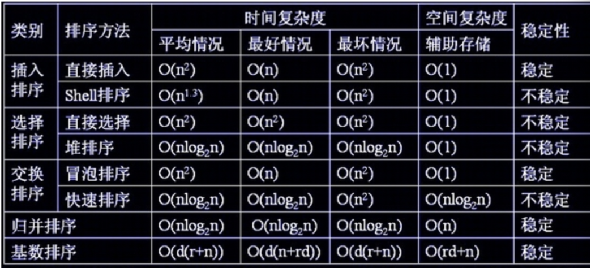
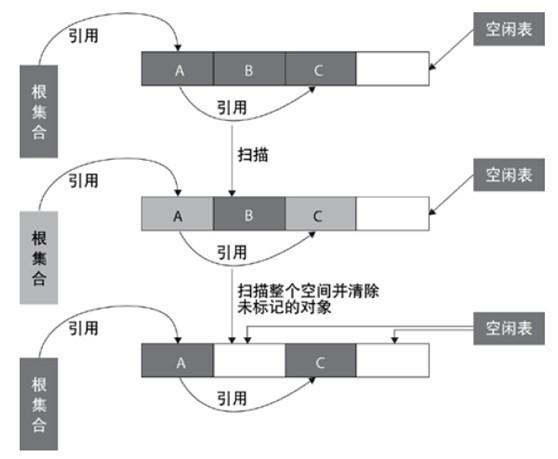
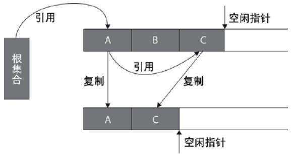
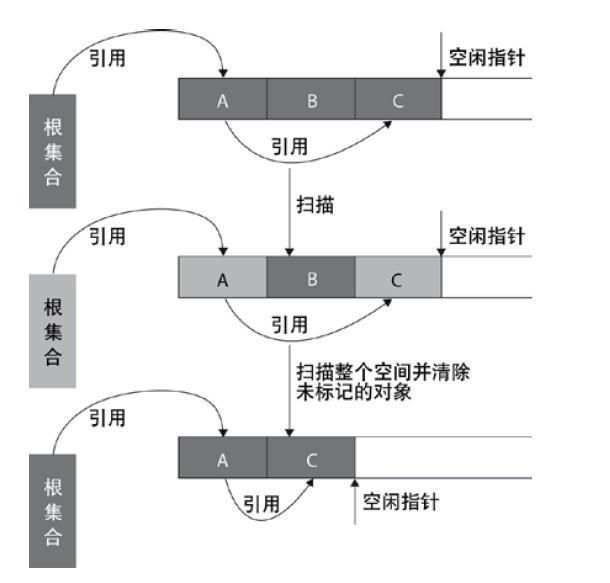
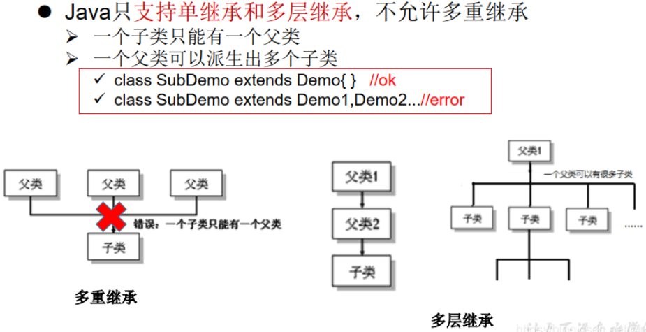
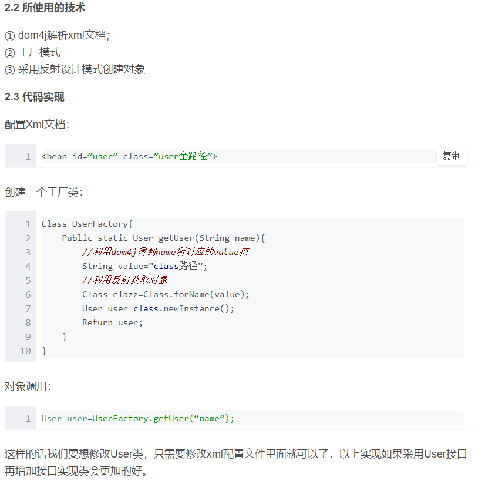
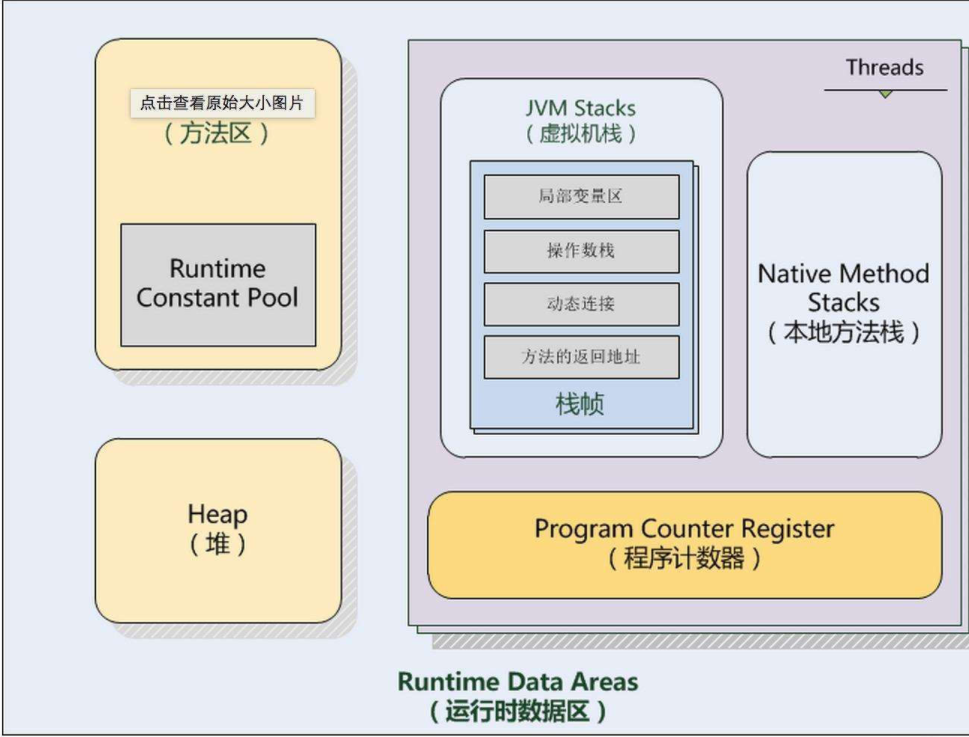

###### 各算法时间复杂度



二分搜索的时间复杂度O（logN）

红黑树的时间复杂度O（logN）

平衡树树的时间复杂度O（logN）

二叉堆，优先队列，哈希表 O（1）


###### 1.讲实习项目，遇到哪些难点，怎么解决的，有什么收获？

慢查询sql

###### 2.数据结构学过吗？

**数组(Array)**
数组是一种聚合数据类型，它是将具有相同类型的若干变量有序地组织在一起的集合。数组可以说是最基本的数据结构，在各种编程语言中都有对应。一个数组可以分解为多个数组元素，按照数据元素的类型，数组可以分为整型数组、字符型数组、浮点型数组、指针数组和结构数组等。数组还可以有一维、二维以及多维等表现形式。 
**栈( Stack)**
栈是一种特殊的线性表，它只能在一个表的一个固定端进行数据结点的插入和删除操作。栈按照后进先出的原则来存储数据，也就是说，先插入的数据将被压入栈底，最后插入的数据在栈顶，读出数据时，从栈顶开始逐个读出。栈在汇编语言程序中，经常用于重要数据的现场保护。栈中没有数据时，称为空栈。 
**队列(Queue)**
队列和栈类似，也是一种特殊的线性表。和栈不同的是，队列只允许在表的一端进行插入操作，而在另一端进行删除操作。一般来说，进行插入操作的一端称为队尾，进行删除操作的一端称为队头。队列中没有元素时，称为空队列。 
**链表( Linked List)**
链表是一种数据元素按照链式存储结构进行存储的数据结构，这种存储结构具有在物理上存在非连续的特点。链表由一系列数据结点构成，每个数据结点包括数据域和指针域两部分。其中，指针域保存了数据结构中下一个元素存放的地址。链表结构中数据元素的逻辑顺序是通过链表中的指针链接次序来实现的。 
**树( Tree)**
树是典型的非线性结构，它是包括，2个结点的有穷集合K。在树结构中，有且仅有一个根结点，该结点没有前驱结点。在树结构中的其他结点都有且仅有一个前驱结点，而且可以有两个后继结点，m≥0。 
**图(Graph)**
图是另一种非线性数据结构。在图结构中，数据结点一般称为顶点，而边是顶点的有序偶对。如果两个顶点之间存在一条边，那么就表示这两个顶点具有相邻关系。 
**堆(Heap)**
堆是一种特殊的树形数据结构，一般讨论的堆都是二叉堆。堆的特点是根结点的值是所有结点中最小的或者最大的，并且根结点的两个子树也是一个堆结构。 
散列表(Hash)
散列表源自于散列函数(Hash function)，其思想是如果在结构中存在关键字和T相等的记录，那么必定在F(T)的存储位置可以找到该记录，这样就可以不用进行比较操作而直接取得所查记录。 

###### 3.数组和链表区别，使用场景

(1)  如果应用程序对各个索引位置的元素进行大量的存取或删除操作，ArrayList对象要远优于LinkedList对象；
( 2 ) 如果应用程序主要是对列表进行循环，并且循环时候进行插入或者删除操作，LinkedList对象要远优于ArrayList对象；

###### 4.口述，两个有序数组合并成一个数组,如何确定合并后的数组长度，我答两个数组长度之和

```java
public static int[] MergeList(int a[],int b[])
        {
            int result[];  
//                定义一个新数组，长度为两个数组长度之和
                result = new int[a.length+b.length];
              //i:a数组下标    j：b数组下标  k：新数组下标
                int i=0,j=0,k=0;
//                按位循环比较两个数组，较小元素的放入新数组，下标加一（注意，较大元素对应的下标不加一），直到某一个下标等于数组长度时退出循环
                while(i<a.length && j<b.length)
                    if(a[i] <= b[j]) {
                        result[k++] = a[i++];
                        print(result);
                        System.out.println();
                    }else{
                        result[k++] = b[j++];
                    }
                /* 后面连个while循环是用来保证两个数组比较完之后剩下的一个数组里的元素能顺利传入 *
                 * 此时较短数组已经全部放入新数组，较长数组还有部分剩余，最后将剩下的部分元素放入新数组，大功告成*/
                while(i < a.length) 
                    result[k++] = a[i++];
                while(j < b.length)
                    result[k++] = b[j++];
                return result;
           }
```


###### 5.哪些区会抛OOM异常

内存溢出通俗的讲就是内存不够用了，并且 GC 通过垃圾回收也无法提供更多的内存。实际上除了程序计数器，其他区域都有可能发生 OOM, 简单总结如下：

堆内存不足是最常见的 OOM 原因之一，抛出错误信息 java.lang.OutOfMemoryError:Java heap space，原因也不尽相同，可能是内存泄漏，也有可能是堆的大小设置不合理。

对于虚拟机栈和本地方法栈，导致 OOM 一般为对方法自身不断的递归调用，且没有结束点，导致不断的压栈操作。类似这种情况，JVM 实际会抛出 StackOverFlowError , 但是如果 JVM 试图去拓展栈空间的时候，就会抛出 OOM.

对于老版的 JDK, 因为永久代大小是有限的，并且 JVM 对老年代的内存回收非常不积极，所以当我们添加新的对象，老年代发生 OOM 的情况也非常常见。

随着元数据区的引入，方法区内存已经不再那么窘迫，所以相应的 OOM 有所改观，出现 OOM，异常信息则变成了：“java.lang.OutOfMemoryError: Metaspace”。

###### 6.链表反转。

```java
public class ListNode{
    int val;
    ListNode next = null;
    
    ListNode(int val){
        this.val = val;
    }
}
public ListNode reverseList(ListNode head) {
        ListNode prev = null;
        ListNode curr = head;
        while (curr != null) {
            ListNode next = curr.next;
            curr.next = prev;//改变指针的指向
            prev = curr; //把curr的值赋给prev
            curr = next;
        }
        return prev;
    }
```


###### 7.JVM内存模型，哪些是线程共享的。


栈、本地方法栈、程序计数器这三个部分都是线程独占的。 

栈也叫方法栈，是线程私有的，线程在执行每个方法时都会同时创建一个栈帧，用来存储局部变量表、操作栈、动态链接、方法出口等信息。调用方法时执行入栈，方法返回时执行出栈。

 本地方法栈与栈类似，也是用来保存线程执行方法时的信息，不同的是，执行 Java 方法使用栈，而执行 native 方法使用本地方法栈。 

程序计数器保存着当前线程所执行的字节码位置，每个线程工作时都有一个独立的计数器。程序计数器为执行 Java 方法服务，执行 native 方法时，程序计数器为空。 


线程共享

堆是JVM管理的内存中最大的一块，堆被所有线程共享，目的是为了存放对象实例，几乎所有的对象实例都在这里分配。当堆内存没有可用的空间时，会抛出OOM异常。根据对象存活的周期不同，JVM把堆内存...

方法区也是各个线程共享的内存区域，又叫非堆区。用于存储已被虚拟机加载的类信息、常量、静态变量、即时编译器编译后的代码等数据，JDK1.7中的永久代和JDK1.8中的Metaspace都是。


###### 8.volatile 怎么实现的可见性，为什么不能保证原子操作。

volatile通过添加内存屏障禁止指令重排序

**volatile如何实现内存可见性：**

​     深入来说：通过加入内存屏障和禁止重排序优化来实现的。

- 对volatile变量执行写操作时，会在写操作后加入一条store屏障指令
- 对volatile变量执行读操作时，会在读操作前加入一条load屏障指令

​     通俗地讲：volatile变量在每次被线程访问时，都强迫从主内存中重读该变量的值，而当该变量发生变化时，又会强迫线程将最新的值刷新到主内存。这样任何时刻，不同的线程总能看到该变量的最新值。

**不能保证原子性**

​       一个变量i被volatile修饰，两个线程想对这个变量修改，都对其进行自增操作也就是i++，i++的过程可以分为三步，首先获取i的值，其次对i的值进行加1，最后将得到的新值写会到缓存中。 线程A首先得到了i的初始值100，但是还没来得及修改，就阻塞了，这时线程B开始了，它也得到了i的值，由于i的值未被修改，即使是被volatile修饰，主存的变量还没变化，那么线程B得到的值也是100，之后对其进行加1操作，得到101后，将新值写入到缓存中，再刷入主存中。根据可见性的原则，这个主存的值可以被其他线程可见。 问题来了，线程A已经读取到了i的值为100，也就是说读取的这个原子操作已经结束了，所以这个可见性来的有点晚，线程A阻塞结束后，继续将100这个值加1，得到101，再将值写到缓存，最后刷入主存，所以即便是volatile具有可见性，也不能保证对它修饰的变量具有原子性。


###### 9.synchronized 与 lock区别。


###### 10.基本数据类型，与包装类区别？Integer 直接赋值和new对象赋值比较。

byte、short、int、long、float、double、boolean、char。

一个是值引用，那就是Integer,赋的是值。而一个是对象引用，他赋的是一个地址。

new 创建对象过程：
1.类加载
代码验证
2.给对象在内存（堆）中分配空间(给属性赋值)；
3.属性赋默认值；


###### 11.对象锁。

JVM
在JVM中，根据锁的优化分为三种锁，偏向锁、轻量级锁、重量级锁，线程竞争越激烈，使用的锁等级越高，锁的转换过程不可逆，无法降级。

1.偏向锁
乐观锁。对象头有一个标志 MarkWord 负责记录哪个线程获得了锁，如果已经记录了线程A，线程A可以直接进入，但是线程B进入时，会检测线程A是否活动。
不活动：把标志MarkWord指向自己B。然后进入同步代码块。
活动：等待线程A执行到安全点，挂起线程A。执行线程B。最后膨胀为轻量级锁。
2.轻量级锁
乐观锁。升级轻量级锁后，线程A获得锁时，会在线程A的栈帧中创建“lock record”来记录(复制)对象头的MarkWord,并将对象头的MarkWord 更新为指向“lock record”的指针。如果更新失败了就会自旋有限次数，仍然失败就会膨胀为重量级锁。
3.重量级锁
悲观锁。如果线程A获取了对象的锁，其它线程会自旋有限次数，失败后线程B被阻塞挂起。线程A释放锁后唤醒所有阻塞的线程，一起竞争对象锁。阻塞线程之间不会排队等待，没有”先到先得“的原则。

###### 13.垃圾回收算法。

**1.标记清除**

标记-清除算法将垃圾回收分为两个阶段：**标记阶段和清除阶段**。

在标记阶段首先通过**根节点(GC Roots)**，标记所有从根节点开始的对象，未被标记的对象就是未被引用的垃圾对象。然后，在清除阶段，清除所有未被标记的对象。



**适用场合**：

- 存活对象较多的情况下比较高效
- 适用于年老代（即旧生代）

**缺点**：

- 容易产生内存碎片，再来一个比较大的对象时（典型情况：该对象的大小大于空闲表中的每一块儿大小但是小于其中两块儿的和），会提前触发垃圾回收
- 扫描了整个空间两次（第一次：标记存活对象；第二次：清除没有标记的对象）

**2.复制算法**

从根集合节点进行扫描，标记出所有的存活对象，并将这些存活的对象复制到一块儿新的内存（图中下边的那一块儿内存）上去，之后将原来的那一块儿内存（图中上边的那一块儿内存）全部回收掉





**现在的商业虚拟机都采用这种收集算法来回收新生代。**

**适用场合：**

- 存活对象较少的情况下比较高效
- 扫描了整个空间一次（标记存活对象并复制移动）
- 适**用于年轻代（即新生代）**：基本上98%的对象是"朝生夕死"的，存活下来的会很少

**缺点：**

- 需要一块儿空的内存空间
- 需要复制移动对象

**3.标记整理**

复制算法的高效性是建立在存活对象少、垃圾对象多的前提下的。

这种情况在新生代经常发生，但是在老年代更常见的情况是大部分对象都是存活对象。如果依然使用复制算法，由于存活的对象较多，复制的成本也将很高。





标记-压缩算法是一种老年代的回收算法，它在标记-清除算法的基础上做了一些优化。

首先也需要从根节点开始对所有可达对象做一次标记，但之后，它并不简单地清理未标记的对象，而是将所有的存活对象压缩到内存的一端。之后，清理边界外所有的空间。这种方法既避免了碎片的产生，又不需要两块相同的内存空间，因此，其性价比比较高。

###### 14.冒泡排序讲一下，这个算法有什么优化空间吗？

　　https://www.cnblogs.com/jyroy/p/11248691.html

​        为了解决这个问题，我们可以设置一个标志位，用来表示当前第 i 趟是否有交换，如果有则要进行 i+1 趟，如果没有，则说明当前数组已经完成排序。

​        归并排序是稳定的，快排是不稳定的会改变相同元素的位置

###### 15.concurrentHashMap分段锁

ConcurrentHashMap 是 java.util.concurrent 包（JDK 1.5时引入）中的一个类，它提供了线程安全的HashMap实现。

**在JDK1.7及其之前ConcurrentHashMap实现线程安全的方法相对比较简单：**

- 其内部将数据分为数个“**段（Segment）**”，其数量和并发级别有关系，具体是“大于等于并发级别的最小的2的幂次”。
- 每个segment使用单独的ReentrantLock（分段锁）。
- 如果操作涉及不同segment，则可以并发执行，如果是同一个segment则会进行锁的竞争和等待。
- 此设计的效率是高于synchronized的。

**不过JDK1.8之后，ConcurrentHashMap舍弃了ReentrantLock，而重新使用了**synchronized。原因大致有一下几点：

1. 加入多个分段锁浪费内存空间。
2. 生产环境中， map 在放入时竞争同一个锁的概率非常小，分段锁反而会造成更新等操作的长时间等待。
3. 为了提高 GC 的效率

新的ConcurrentHashMap中使用**synchronized关键字+CAS操作保证了线程安全**。


###### 16.servlet的生命周期

对每一个客户端的请求，Servlet引擎载入Servlet，调用它的init()方法，完成Servlet的初始化。

然后，Servlet对象通过为每一个请求单独调用service()方法来处理所有随后来自客户端的请求

最后，调用Servlet(注意：这里应该是Servlet而不是server)的destroy()方法把Servlet删除掉。

###### 17.bean的生命周期

1. 实例化 Instantiation

2. 属性赋值 Populate

3. 初始化 Initialization

4. 销毁 Destruction

   细分

   1. Spring启动，查找并加载需要被Spring管理的bean，进行Bean的实例化
   2. Bean实例化后对将Bean的引入和值注入到Bean的属性中
   3. 如果Bean实现了BeanNameAware接口的话，Spring将Bean的Id传递给setBeanName()方法
   4. 如果Bean实现了BeanFactoryAware接口的话，Spring将调用setBeanFactory()方法，将BeanFactory容器实例传入
   5. 如果Bean实现了ApplicationContextAware接口的话，Spring将调用Bean的setApplicationContext()方法，将bean所在应用上下文引用传入进来。
   6. 如果Bean实现了BeanPostProcessor接口，Spring就将调用他们的postProcessBeforeInitialization()方法。
   7. 如果Bean 实现了InitializingBean接口，Spring将调用他们的afterPropertiesSet()方法。类似的，如果bean使用init-method声明了初始化方法，该方法也会被调用
   8. 如果Bean 实现了BeanPostProcessor接口，Spring就将调用他们的postProcessAfterInitialization()方法。
   9. 此时，Bean已经准备就绪，可以被应用程序使用了。他们将一直驻留在应用上下文中，直到应用上下文被销毁。
   10. 如果bean实现了DisposableBean接口，Spring将调用它的destory()接口方法，同样，如果bean使用了destory-method 声明销毁方法，该方法也会被调用。

###### 18.MyBatis插入数据返回插入对象的主键

useGeneratedKeys=“true” keyProperty=“userId” //userId为返回的主键对应的java对象的属性

```java
<insert id="insert" useGeneratedKeys="true" keyProperty="userId" parameterType="com.yhr.pojo.User">  
    insert into user(userName,password,comment)  
    values(#{userName}
</insert>  
```


###### 19.面向对象的三大特性

**封装**
封装最好理解了。封装是面向对象的特征之一，是对象和类概念的主要特性。
封装，也就是把客观事物封装成抽象的类，并且类可以把自己的数据和方法只让可信的类或者对象操作，对不可信的进行信息隐藏。
**继承**
面向对象编程 (OOP) 语言的一个主要功能就是“继承”。继承是指这样一种能力：它可以使用现有类的所有功能，并在无需重新编写原来的类的情况下对这些功能进行扩展。
通过继承创建的新类称为“子类”或“派生类”。
被继承的类称为“基类”、“父类”或“超类”。

基类，父类，超类是指被继承的类，派生类，子类是指继承于基类的类．继承的过程，就是从一般到特殊的过程。
要实现继承，可以通过“继承”（Inheritance）和“组合”（Composition）来实现。
在某些 OOP 语言中，一个子类可以继承多个基类。但是一般情况下，一个子类只能有一个基类，要实现多重继承，可以通过多级继承来实现。

继承概念的实现方式有三类：实现继承、接口继承和可视继承。
Ø         实现继承是指使用基类的属性和方法而无需额外编码的能力；
Ø         接口继承是指仅使用属性和方法的名称、但是子类必须提供实现的能力；
Ø         可视继承是指子窗体（类）使用基窗体（类）的外观和实现代码的能力。
在考虑使用继承时，有一点需要注意，那就是两个类之间的关系应该是“属于”关系。例如，Employee 是一个人，Manager 也是一个人，因此这两个类都可以继承 Person 类。但是 Leg 类却不能继承 Person 类，因为腿并不是一个人。
抽象类仅定义将由子类创建的一般属性和方法，创建抽象类时，请使用关键字 Interface 而不是 Class。
OO开发范式大致为：划分对象→抽象类→将类组织成为层次化结构(继承和合成) →用类与实例进行设计和实现几个阶段。

**多态**
多态性（polymorphisn）是允许你将父对象设置成为和一个或更多的他的子对象相等的技术，赋值之后，父对象就可以根据当前赋值给它的子对象的特性以不同的方式运作。简单的说，就是一句话：允许将子类类型的指针赋值给父类类型的指针。
实现多态，有二种方式，覆盖，重载。
覆盖，是指子类重新定义父类的虚函数的做法。
重载，是指允许存在多个同名函数，而这些函数的参数表不同（或许参数个数不同，或许参数类型不同，或许两者都不同）。


###### 20.多重继承和多级继承




###### 21.快速排序

O（nlog2n）

```java
/**
 * 快速排序演示
 */
public class QuickSort {
    public static void main(String[] args) {
        int[] arr = {5, 1, 7, 3, 1, 6, 9, 4};

        quickSort(arr, 0, arr.length - 1);

        for (int i : arr) {
            System.out.print(i + "\t");
        }
    }

    /**
     * @param a        待排序列
     * @param left  待排序列起始位置
     * @param right 待排序列结束位置
     */
   public void quickSort(int[]a,int left,int right)
{
    if(left>right)
        return;
    int pivot=a[left];//定义基准值为数组第一个数
    int i=left;
    int j=right;
   
    while(i<j)
  {
     while(pivot<=a[j]&&i<j)//从右往左找比基准值小的数
           j--;
     while(pivot>=a[i]&&i<j)//从左往右找比基准值大的数
           i++;
       if(i<j)                     //如果i<j，交换它们
    {
        int temp=a[i];
        a[i]=a[j];
        a[j]=temp;
    }
  }
   a[left]=a[i];
   a[i]=pivot;//把基准值放到合适的位置
   quickSort(a,left,i-1);//对左边的子数组进行快速排序
   quickSort(a,i+1,right);//对右边的子数组进行快速排序
}
```


###### 22.ArrayList和LinkedList

###### 23.HashMap底层以及为什么用红黑树

###### 24.IOC底层

https://blog.csdn.net/z4331016/article/details/78210582?utm_medium=distribute.pc_relevant.none-task-blog-BlogCommendFromMachineLearnPai2-2.baidujs&dist_request_id=9345d555-a89b-4eb4-967c-5c7547da76e3&depth_1-utm_source=distribute.pc_relevant.none-task-blog-BlogCommendFromMachineLearnPai2-2.baidujs



###### 25.JVM内存区域



**1、程序计数器**

 程序计数器是一块很小的内存空间，它是线程私有的，可以认作为当前线程的行号指示器。

 那么计数器记录虚拟机字节码指令的地址。如果为native【底层方法】，那么计数器为空。

 这块内存区域是虚拟机规范中唯一没有OutOfMemoryError的区域。

**2、Java栈（虚拟机栈）**

栈描述的是Java方法执行的内存模型。

每个方法被执行的时候都会创建一个栈帧用于存储局部变量表，操作栈，动态链接，方法出口等信息。每一个方法被调用的过程就对应一个栈帧在虚拟机栈中从入栈到出栈的过程。

平时说的栈一般指局部变量表部分。

局部变量表所需要的内存空间在编译期完成分配，当进入一个方法时，这个方法在栈中需要分配多大的局部变量空间是完全确定的，在方法运行期间不会改变局部变量表大小。

**Java虚拟机栈可能出现两种类型的异常：**

1. 线程请求的栈深度大于虚拟机允许的栈深度，将抛出StackOverflowError。
2. 虚拟机栈空间可以动态扩展，当动态扩展是无法申请到足够的空间时，抛出OutOfMemory异常

**3、本地方法栈**

本地方法栈是与虚拟机栈发挥的作用十分相似,区别是虚拟机栈执行的是Java方法(也就是字节码)服务，而本地方法栈则为虚拟机使用到的native方法服务，可能底层调用的c或者c++,我们打开jdk安装目录可以看到也有很多用c编写的文件，可能就是native方法所调用的c代码。

**4、堆**

堆是java虚拟机管理内存最大的一块内存区域，因为堆存放的对象是线程共享的，所以多线程的时候也需要同步机制。

java虚拟机规范对这块的描述是:所有对象实例及数组都要在堆上分配内存，但随着JIT编译器的发展和逃逸分析技术的成熟，这个说法也不是那么绝对，但是大多数情况都是这样的。

即时编译器:可以把把Java的字节码，包括需要被解释的指令的程序）转换成可以直接发送给处理器的指令的程序)

逃逸分析:通过逃逸分析来决定某些实例或者变量是否要在堆中进行分配，如果开启了逃逸分析，即可将这些变量直接在栈上进行分配，而非堆上进行分配。这些变量的指针可以被全局所引用，或者其其它线程所引用。

堆是所有线程共享的，它的目的是存放对象实例。同时它也是GC所管理的主要区域，因此常被称为GC堆，又由于现在收集器常使用分代算法，Java堆中还可以细分为新生代和老年代。

根据虚拟机规范，Java堆可以存在物理上不连续的内存空间，就像磁盘空间只要逻辑是连续的即可。它的内存大小可以设为固定大小，也可以扩展。

当前主流的虚拟机如HotPot都能按扩展实现(通过设置 -Xmx和-Xms)，如果堆中没有内存内存完成实例分配，而且堆无法扩展将报OOM错误(OutOfMemoryError)

**5、方法区**

方法区同堆一样，是所有线程共享的内存区域，为了区分堆，又被称为非堆。

方法区用于存储已被虚拟机加载的类信息、常量、静态变量，如static修饰的变量加载类的时候就被加载到方法区中。

在老版jdk，方法区也被称为永久代。

不过自从JDK7之后，Hotspot虚拟机便将运行时常量池从永久代移除了。


###### 26堆和栈的区别

一、堆栈空间分配区别：

1、栈（操作系统）：由操作系统自动分配释放 ，存放函数的参数值，局部变量的值等。其操作方式类似于数据结构中的栈；

2、堆（操作系统）： 一般由程序员分配释放， 若程序员不释放，程序结束时可能由OS回收，分配方式倒是类似于链表。

二、堆栈缓存方式区别：

1、栈使用的是一级缓存， 他们通常都是被调用时处于存储空间中，调用完毕立即释放；

2、堆是存放在二级缓存中，生命周期由虚拟机的垃圾回收算法来决定（并不是一旦成为孤儿对象就能被回收）。所以调用这些对象的速度要相对来得低一些。

堆：内存中，存储的是引用数据类型，引用数据类型无法确定大小，堆实际上是一个在内存中使用到内存中零散空间的链表结构的存储空间，堆的大小由引用类型的大小直接决定，引用类型的大小的变化直接影响到堆的变化

栈：是内存中存储值类型的，大小为2M，超出则会报错，内存溢出

三、堆栈数据结构区别：

堆（数据结构）：堆可以被看成是一棵树，如：堆排序；

栈（数据结构）：一种先进后出的数据结构。

特点：先进后出


###### 27.常量池：String a和 a.intern

​		String.intern()是一个Native方法，它的作用是：如果运行时常量池中已经包含一个等于此String对象内容的字符串，则返回常量池中该字符串的引用；如果没有，则在常量池中创建与此String内容相同的字符串，并返回常量池中创建的字符串的引用。

###### 28.抽象类和接口

接口和抽象类都是继承树的上层，他们的共同点如下：

1)	都是上层的抽象层。

2)	都不能被实例化

3)	都能包含抽象的方法，这些抽象的方法用于描述类具备的功能，但是不比提供具体的实现。

他们的区别如下：

1)	在抽象类中可以写非抽象的方法，从而避免在子类中重复书写他们，这样可以提高代码的复用性，这是抽象类的优势；接口中只能有抽象的方法。

2)	一个类只能继承一个直接父类，这个父类可以是具体的类也可是抽象类；但是一个类可以实现多个接口。

​		接口的设计目的，是对类的行为进行约束（更准确的说是一种“有”约束，因为接口不能规定类不可以有什么行为），也就是提供一种机制，可以强制要求不同的类具有相同的行为。它只约束了行为的有无，但不对如何实现行为进行限制。对“接口为何是约束”的理解，我觉得配合泛型食用效果更佳。

​        而抽象类的设计目的，是代码复用。当不同的类具有某些相同的行为(记为行为集合A)，且其中一部分行为的实现方式一致时（A的非真子集，记为B），可以让这些类都派生于一个抽象类。在这个抽象类中实现了B，避免让所有的子类来实现B，这就达到了代码复用的目的。而A减B的部分，留给各个子类自己实现。正是因为A-B在这里没有实现，所以抽象类不允许实例化出来（否则当调用到A-B时，无法执行）。


###### 29.重写equal为什么要重写hashcode

hashcode相等比较equal,若equal相等，则两个对象是相等的

hashcode不相等则两个对象一定不等，提升效率

1.使用hashcode方法提前校验，可以避免每一次比对都调用equals方法，提高效率

2.保证是同一个对象，如果重写了equals方法，而没有重写hashcode方法，会出现equals相等的对象，hashcode不相等的情况，重写hashcode方法就是为了避免这种情况的出现。


###### 30.JAVA反射

https://blog.csdn.net/qq_37875585/article/details/89340495

反射是在运行状态中，对于任意一个类，都能够知道这个类的所有属性和方法；对于任意一个对象，都能够调用它的任意一个方法和属性；这种动态获取的信息以及动态调用对象的方法的功能称为 Java 语言的反射机制。

JDBC中，利用反射动态加载了数据库驱动程序。
Web服务器中利用反射调用了Sevlet的服务方法。
Eclispe等开发工具利用反射动态刨析对象的类型与结构，动态提示对象的属性和方法。
很多框架都用到反射机制，注入属性，调用方法，如Spring。


优点：可以动态执行，在运行期间根据业务功能动态执行方法、访问属性，最大限度发挥了java的灵活性。
缺点：对性能有影响，这类操作总是慢于直接执行java代码。


###### 31.java泛型的优点

1.保证类型安全
使用泛型后，如果其他地方需要调用获取列表信息的方法，在使用返回数据的时候，无论是添加还是使用数据，都可以减少出错的概率。

2.消除强制类型转换
没有泛型的返回，我们可以认为是一个Object，在使用时需要对其进行强制转换，在转换过程中，非常容易出现ClassCastException。


不使用泛型：
好处：集合不使用泛型，默认存储的是Object类型，可以存放任意数据
坏处：容易出现int转String出错的情况。不严谨

使用泛型：
好处：不需要考虑类型转换，并且可以在写代码的时候就检测是否有错误。
坏处：集合直接确定了类型，只能存放一种类型的数据


###### 32.守护线程

当主线程结束时，结束其余的子线程（守护线程）自动关闭，就免去了还要继续关闭子线程的麻烦。如：Java垃圾回收线程就是一个典型的守护线程；内存资源或者线程的管理，但是非守护线程也可以。

###### 33.cookie与session的区别

1，session 在服务器端，cookie 在客户端（浏览器）
2，session 默认被存在在服务器的一个文件里（不是内存）
3，session 的运行依赖 session id，而 session id 是存在 cookie 中的，也就是说，如果浏览器禁用了 cookie ，同时 session 也会失效（但是可以通过其它方式实现，比如在 url 中传递 session_id）
4，session 可以放在 文件、数据库、或内存中都可以。
5，用户验证这种场合一般会用 session


###### 34.JVM垃圾回收机制

https://www.cnblogs.com/jichi/p/11139437.html

引用计数算法

可达性分析算法


即使在可达性分析算法中不可达的对象，也并非是“非死不可”，这时候它们暂时处于“缓刑”阶段，要真正宣告一个对象死亡，至少要经历两次标记过程。第一次标记：如果对象在进行可达性分析后发现没有与GC Roots相连接的引用链，那它将会被第一次标记；第二次标记：第一次标记后接着会进行一次筛选，筛选的条件是此对象是否有必要执行finalize()方法。在finalize()方法中没有重新与引用链建立关联关系的，将被进行第二次标记。第二次标记成功的对象将真的会被回收，如果对象在finalize()方法中重新与引用链建立了关联关系，那么将会逃离本次回收。

###### 35.MVC执行流程

1.一个请求匹配前端控制器 DispatcherServlet 的请求映射路径(在 web.xml中指定), WEB 容器将该请求转交给 DispatcherServlet 处理
2.DispatcherServlet 接收到请求后, 将根据 请求信息 交给 处理器映射器 （HandlerMapping）
3.HandlerMapping 根据用户的url请求 查找匹配该url的 Handler，并返回一个执行链
4.DispatcherServlet 再请求 处理器适配器(HandlerAdapter) 调用相应的 Handler 进行处理并返回 ModelAndView 给 DispatcherServlet
5.DispatcherServlet 将 ModelAndView 请求 ViewReslover（视图解析器）解析，返回具体 View
6.DispatcherServlet 对 View 进行渲染视图（即将模型数据填充至视图中）
7.DispatcherServlet 将页面响应给用户

###### 36.抽象类为什么不能被实例化

https://zhuanlan.zhihu.com/p/95406830

**1.第一点：回归问题最初， 我们为什么要实例化？**

我们先逆向思维来考虑，从面向对象的思想来看：

我们需要完成实现一个功能，而功能中的方法，是由对象来调用的，因此我们需要对象，因此我们需要实例化。

那么回归本问题，什么是抽象类？

抽象：就是不具体的意思。类是对对象的具体描述，而抽象类不具体，没有方法体，（提供的成员不足以生成一个具体对象），那么就无法生成一个不具体的对象。就好比，你可以实例化一个苹果，但你不能实例化一个水果（这个现实中存在的实物）。

**2.内存考虑：**

对象实例化的时候，关键字new向JVM申请内存，这个类的成员（成员变量，成员方法）会被保存到内存中。而抽象类，没有具体的成员（成员变量，成员方法），没办法准确分配内存。

**3.现实逻辑：**

按照现实逻辑，抽象是从现实实物的抽离，总结，比如定义一个动物类接口。这个接口是所有动物所共有的特点组成在一起，但是并不能组成现实中真真正正存在的物种。那么为什么要有抽象类？

**4.设计层面：**

为了实现多态，当某些类只希望作为父类使用，不希望被实例化。也就是我们从上层设计角度，就不希望有些类被实例化。当我们进行设计的时候需要尽量依赖父类，越向上层的类越稳定，不容易被修改。

综上所述：现实逻辑，面向对象，设计，内存都不希望我们实例化抽象类，所以 编译器规定不能实例化。

###### 37.线程和进程的区别

根本区别：进程是操作系统资源分配的基本单位，而线程是任务调度和执行的基本单位

在开销方面：每个进程都有独立的代码和数据空间（程序上下文），程序之间的切换会有较大的开销；线程可以看做轻量级的进程，同一类线程共享代码和数据空间，每个线程都有自己独立的运行栈和程序计数器（PC），线程之间切换的开销小。

所处环境：在操作系统中能同时运行多个进程（程序）；而在同一个进程（程序）中有多个线程同时执行（通过CPU调度，在每个时间片中只有一个线程执行）

内存分配方面：系统在运行的时候会为每个进程分配不同的内存空间；而对线程而言，除了CPU外，系统不会为线程分配内存（线程所使用的资源来自其所属进程的资源），线程组之间只能共享资源。

包含关系：没有线程的进程可以看做是单线程的，如果一个进程内有多个线程，则执行过程不是一条线的，而是多条线（线程）共同完成的；线程是进程的一部分，所以线程也被称为轻权进程或者轻量级进程。


