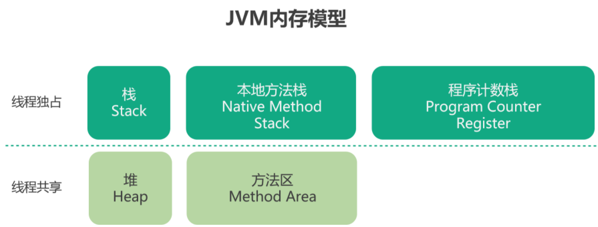
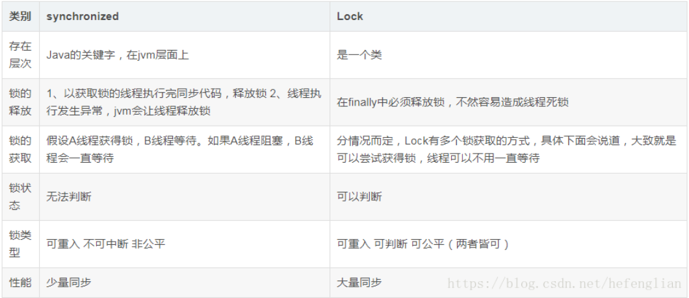

###### 1.讲实习项目，遇到哪些难点，怎么解决的，有什么收获？

慢查询sql

###### 2.数据结构学过吗？

数组(Array)
数组是一种聚合数据类型，它是将具有相同类型的若干变量有序地组织在一起的集合。数组可以说是最基本的数据结构，在各种编程语言中都有对应。一个数组可以分解为多个数组元素，按照数据元素的类型，数组可以分为整型数组、字符型数组、浮点型数组、指针数组和结构数组等。数组还可以有一维、二维以及多维等表现形式。 
栈( Stack)
栈是一种特殊的线性表，它只能在一个表的一个固定端进行数据结点的插入和删除操作。栈按照后进先出的原则来存储数据，也就是说，先插入的数据将被压入栈底，最后插入的数据在栈顶，读出数据时，从栈顶开始逐个读出。栈在汇编语言程序中，经常用于重要数据的现场保护。栈中没有数据时，称为空栈。 
队列(Queue)
队列和栈类似，也是一种特殊的线性表。和栈不同的是，队列只允许在表的一端进行插入操作，而在另一端进行删除操作。一般来说，进行插入操作的一端称为队尾，进行删除操作的一端称为队头。队列中没有元素时，称为空队列。 
链表( Linked List)
链表是一种数据元素按照链式存储结构进行存储的数据结构，这种存储结构具有在物理上存在非连续的特点。链表由一系列数据结点构成，每个数据结点包括数据域和指针域两部分。其中，指针域保存了数据结构中下一个元素存放的地址。链表结构中数据元素的逻辑顺序是通过链表中的指针链接次序来实现的。 
树( Tree)
树是典型的非线性结构，它是包括，2个结点的有穷集合K。在树结构中，有且仅有一个根结点，该结点没有前驱结点。在树结构中的其他结点都有且仅有一个前驱结点，而且可以有两个后继结点，m≥0。 
图(Graph)
图是另一种非线性数据结构。在图结构中，数据结点一般称为顶点，而边是顶点的有序偶对。如果两个顶点之间存在一条边，那么就表示这两个顶点具有相邻关系。 
堆(Heap)
堆是一种特殊的树形数据结构，一般讨论的堆都是二叉堆。堆的特点是根结点的值是所有结点中最小的或者最大的，并且根结点的两个子树也是一个堆结构。 
散列表(Hash)
散列表源自于散列函数(Hash function)，其思想是如果在结构中存在关键字和T相等的记录，那么必定在F(T)的存储位置可以找到该记录，这样就可以不用进行比较操作而直接取得所查记录。 

###### 3.数组和链表区别，使用场景

(1)  如果应用程序对各个索引位置的元素进行大量的存取或删除操作，ArrayList对象要远优于LinkedList对象；
( 2 ) 如果应用程序主要是对列表进行循环，并且循环时候进行插入或者删除操作，LinkedList对象要远优于ArrayList对象；

###### 4.口述，两个有序数组合并成一个数组,如何确定合并后的数组长度，我答两个数组长度之和

```java
public static int[] MergeList(int a[],int b[])
        {
            int result[];  
//                定义一个新数组，长度为两个数组长度之和
                result = new int[a.length+b.length];
              //i:a数组下标    j：b数组下标  k：新数组下标
                int i=0,j=0,k=0;
//                按位循环比较两个数组，较小元素的放入新数组，下标加一（注意，较大元素对应的下标不加一），直到某一个下标等于数组长度时退出循环
                while(i<a.length && j<b.length)
                    if(a[i] <= b[j]) {
                        result[k++] = a[i++];
                        print(result);
                        System.out.println();
                    }else{
                        result[k++] = b[j++];
                    }
                /* 后面连个while循环是用来保证两个数组比较完之后剩下的一个数组里的元素能顺利传入 *
                 * 此时较短数组已经全部放入新数组，较长数组还有部分剩余，最后将剩下的部分元素放入新数组，大功告成*/
                while(i < a.length) 
                    result[k++] = a[i++];
                while(j < b.length)
                    result[k++] = b[j++];
                return result;
           }
```


###### 5.哪些区会抛OOM异常

内存溢出通俗的讲就是内存不够用了，并且 GC 通过垃圾回收也无法提供更多的内存。实际上除了程序计数器，其他区域都有可能发生 OOM, 简单总结如下：

堆内存不足是最常见的 OOM 原因之一，抛出错误信息 java.lang.OutOfMemoryError:Java heap space，原因也不尽相同，可能是内存泄漏，也有可能是堆的大小设置不合理。

对于虚拟机栈和本地方法栈，导致 OOM 一般为对方法自身不断的递归调用，且没有结束点，导致不断的压栈操作。类似这种情况，JVM 实际会抛出 StackOverFlowError , 但是如果 JVM 试图去拓展栈空间的时候，就会抛出 OOM.

对于老版的 JDK, 因为永久代大小是有限的，并且 JVM 对老年代的内存回收非常不积极，所以当我们添加新的对象，老年代发生 OOM 的情况也非常常见。

随着元数据区的引入，方法区内存已经不再那么窘迫，所以相应的 OOM 有所改观，出现 OOM，异常信息则变成了：“java.lang.OutOfMemoryError: Metaspace”。

###### 6.链表反转。

```java
public class ListNode{
    int val;
    ListNode next = null;
    
    ListNode(int val){
        this.val = val;
    }
}
public ListNode reverseList(ListNode head) {
        ListNode prev = null;
        ListNode curr = head;
        while (curr != null) {
            ListNode next = curr.next;
            curr.next = prev;//改变指针的指向
            prev = curr; //把curr的值赋给prev
            curr = next;
        }
        return prev;
    }
```


###### 7.JVM内存模型，哪些是线程共享的。



栈、本地方法栈、程序计数器这三个部分都是线程独占的。 

栈也叫方法栈，是线程私有的，线程在执行每个方法时都会同时创建一个栈帧，用来存储局部变量表、操作栈、动态链接、方法出口等信息。调用方法时执行入栈，方法返回时执行出栈。

 本地方法栈与栈类似，也是用来保存线程执行方法时的信息，不同的是，执行 Java 方法使用栈，而执行 native 方法使用本地方法栈。 

程序计数器保存着当前线程所执行的字节码位置，每个线程工作时都有一个独立的计数器。程序计数器为执行 Java 方法服务，执行 native 方法时，程序计数器为空。 


线程共享

堆是JVM管理的内存中最大的一块，堆被所有线程共享，目的是为了存放对象实例，几乎所有的对象实例都在这里分配。当堆内存没有可用的空间时，会抛出OOM异常。根据对象存活的周期不同，JVM把堆内存...

方法区也是各个线程共享的内存区域，又叫非堆区。用于存储已被虚拟机加载的类信息、常量、静态变量、即时编译器编译后的代码等数据，JDK1.7中的永久代和JDK1.8中的Metaspace都是。


###### 8.volatile 怎么实现的可见性，为什么不能保证原子操作。

volatile通过添加内存屏障禁止指令重排序

**volatile如何实现内存可见性：**

​     深入来说：通过加入内存屏障和禁止重排序优化来实现的。

- 对volatile变量执行写操作时，会在写操作后加入一条store屏障指令
- 对volatile变量执行读操作时，会在读操作前加入一条load屏障指令

​     通俗地讲：volatile变量在每次被线程访问时，都强迫从主内存中重读该变量的值，而当该变量发生变化时，又会强迫线程将最新的值刷新到主内存。这样任何时刻，不同的线程总能看到该变量的最新值。

**不能保证原子性**

​       一个变量i被volatile修饰，两个线程想对这个变量修改，都对其进行自增操作也就是i++，i++的过程可以分为三步，首先获取i的值，其次对i的值进行加1，最后将得到的新值写会到缓存中。 线程A首先得到了i的初始值100，但是还没来得及修改，就阻塞了，这时线程B开始了，它也得到了i的值，由于i的值未被修改，即使是被volatile修饰，主存的变量还没变化，那么线程B得到的值也是100，之后对其进行加1操作，得到101后，将新值写入到缓存中，再刷入主存中。根据可见性的原则，这个主存的值可以被其他线程可见。 问题来了，线程A已经读取到了i的值为100，也就是说读取的这个原子操作已经结束了，所以这个可见性来的有点晚，线程A阻塞结束后，继续将100这个值加1，得到101，再将值写到缓存，最后刷入主存，所以即便是volatile具有可见性，也不能保证对它修饰的变量具有原子性。


###### 9.synchronized 与 lock区别。



###### 10.基本数据类型，与包装类区别？Integer 直接赋值和new对象赋值比较。


###### 11.对象锁。

JVM
在JVM中，根据锁的优化分为三种锁，偏向锁、轻量级锁、重量级锁，线程竞争越激烈，使用的锁等级越高，锁的转换过程不可逆，无法降级。

1.偏向锁
乐观锁。对象头有一个标志 MarkWord 负责记录哪个线程获得了锁，如果已经记录了线程A，线程A可以直接进入，但是线程B进入时，会检测线程A是否活动。
不活动：把标志MarkWord指向自己B。然后进入同步代码块。
活动：等待线程A执行到安全点，挂起线程A。执行线程B。最后膨胀为轻量级锁。
2.轻量级锁
乐观锁。升级轻量级锁后，线程A获得锁时，会在线程A的栈帧中创建“lock record”来记录(复制)对象头的MarkWord,并将对象头的MarkWord 更新为指向“lock record”的指针。如果更新失败了就会自旋有限次数，仍然失败就会膨胀为重量级锁。
3.重量级锁
悲观锁。如果线程A获取了对象的锁，其它线程会自旋有限次数，失败后线程B被阻塞挂起。线程A释放锁后唤醒所有阻塞的线程，一起竞争对象锁。阻塞线程之间不会排队等待，没有”先到先得“的原则。

###### 13.垃圾回收算法。


###### 14.冒泡排序讲一下，这个算法有什么优化空间吗？


###### 15.concurrentHashMap分段锁


###### 16.servlet的生命周期

对每一个客户端的请求，Servlet引擎载入Servlet，调用它的init()方法，完成Servlet的初始化。

然后，Servlet对象通过为每一个请求单独调用service()方法来处理所有随后来自客户端的请求

最后，调用Servlet(注意：这里应该是Servlet而不是server)的destroy()方法把Servlet删除掉。

###### 17.bean的生命周期

1. 实例化 Instantiation

2. 属性赋值 Populate

3. 初始化 Initialization

4. 销毁 Destruction

   细分

   1. Spring启动，查找并加载需要被Spring管理的bean，进行Bean的实例化
   2. Bean实例化后对将Bean的引入和值注入到Bean的属性中
   3. 如果Bean实现了BeanNameAware接口的话，Spring将Bean的Id传递给setBeanName()方法
   4. 如果Bean实现了BeanFactoryAware接口的话，Spring将调用setBeanFactory()方法，将BeanFactory容器实例传入
   5. 如果Bean实现了ApplicationContextAware接口的话，Spring将调用Bean的setApplicationContext()方法，将bean所在应用上下文引用传入进来。
   6. 如果Bean实现了BeanPostProcessor接口，Spring就将调用他们的postProcessBeforeInitialization()方法。
   7. 如果Bean 实现了InitializingBean接口，Spring将调用他们的afterPropertiesSet()方法。类似的，如果bean使用init-method声明了初始化方法，该方法也会被调用
   8. 如果Bean 实现了BeanPostProcessor接口，Spring就将调用他们的postProcessAfterInitialization()方法。
   9. 此时，Bean已经准备就绪，可以被应用程序使用了。他们将一直驻留在应用上下文中，直到应用上下文被销毁。
   10. 如果bean实现了DisposableBean接口，Spring将调用它的destory()接口方法，同样，如果bean使用了destory-method 声明销毁方法，该方法也会被调用。

###### 18.MyBatis插入数据返回插入对象的主键

useGeneratedKeys=“true” keyProperty=“userId” //userId为返回的主键对应的java对象的属性

```java
<insert id="insert" useGeneratedKeys="true" keyProperty="userId" parameterType="com.yhr.pojo.User">  
    insert into user(userName,password,comment)  
    values(#{userName}
</insert>  
```

