###### SpringIOC与设计模式？

工厂模式
单例模式
策略模式
装饰者模式

###### 说说工厂模式和单例模式吧


###### 讲讲OSI七层？

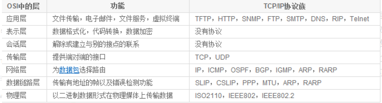

###### HTTP报文格式？

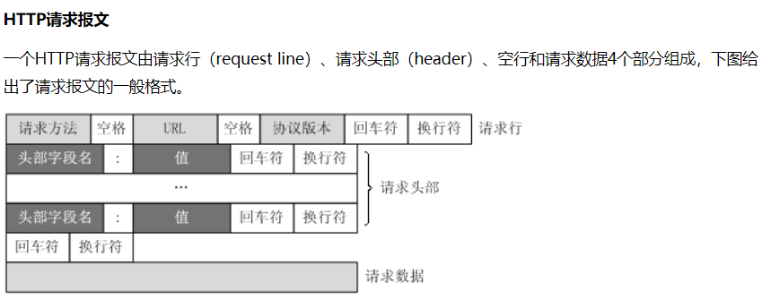


###### GET与POST？

get是获取数据的，而post是提交数据的。

GET 用于获取信息，是无副作用的，是幂等的，且可缓存， 而POST 用于修改服务器上的数据，有副作用，非幂等，不可缓存。


###### 遍历集合的方式？

for foreach iterator

###### for foreach iterator三者区别讲讲？

条件差别
for需要知道集合或数组的大小，而且需要是有序的，不然无法遍历；
foreach和iterator都不需要知道集合或数组的大小，他们都是得到集合内的每个元素然后进行处理；

多态差别
for和foreach都需要先知道集合的类型，甚至是集合内元素的类型，即需要访问内部的成员。
iterator是一个接口类型，他不关心集合或者数组的类型，而且他还能随时修改和删除集合的元素

用法差别
for循环一般用来处理比较简单的有序的，可预知大小的集合或数组
foreach可用于遍历任何集合或数组，而且操作简单易懂，他唯一的不好就是需要了解集合内部类型
iterator是最强大的，他可以随时修改或者删除集合内部的元素，并且是在不需要知道元素和集合的类型的情况下进行的（原因可参考第三点：多态差别），当你需要对不同的容器实现同样的遍历方式时，迭代器是最好的选择！

###### foreach 遍历 ArrayList和LinkedList的效率差异？

foreach则比较简洁又不易出错（因为foreach遍历不会有越界）

LinkedList遍历一定要用foreach或者迭代器，除非你能确定容量小到可以忽略这点性能差距。

如果需要在遍历的时候进行remove或者add操作，那么务必使用Iterator迭代器来操作。


###### count++线程安全问题？

​      多线程环境采用 java.util.concurrent.atomic 下的AtomicLong类，该类的介绍可看API文档。可以用原子方式更新的 long 值。有关原子变量属性的描述，请参java.util.concurrent.atomic 包规范。AtomicLong 可用在应用程序中（如以原子方式增加的序列号），并且不能用于替换 Long。但是，此类确实扩展了 Number，允许那些处理基于数字类的工具和实用工具进行统一访问。每天都要把统计的次数置为0，可以使用定时器，每天零点零分将次数重置为0，该方法不易拓展；另一种方法是使用全局变量时间戳，判断当前日期是不是与时间戳相等，如果是就说明今天的次数累加；如果不是就要把时间戳重置为当天的日期，并把次数重置为0。多线程情况下采用锁加double check方法确保解决并发问题！

​       还有很关键的一个问题不要忽略，就是该类是单例的，这样确保所有线程共享同一个count，dataSize只有一个对象!或者将count，dataSize设置成static！！

###### AtomicInteger和synchronized说说吧？

synchronized ：重量级操作，基于悲观锁，可重入锁。

AtomicInteger：乐观 ，用CAS实现


低并发情况下：使用AtomicInteger，因为其是基于乐观锁，并发低，基本都能成功。

高并发情况下：使用synchronized，如果此时使用AtomicInteger，失败的概率很大，incrementAndGet（）就需要一直不断重复的尝试，直到成功。既然很大情况会失败，就直接synchronized锁住
————————————————

###### 什么时候用乐观锁，什么时候用悲观锁？

乐观锁是在应用层加锁，而悲观锁是在数据库层加锁(for update)

乐观锁顾名思义就是在操作时很乐观，这数据只有我在用，我先尽管用，最后发现不行时就回滚。

悲观锁在操作时很悲观，生怕数据被其他人更新掉，我就先将其先锁住，让别人用不了，我操作完成后再释放掉。

悲观锁需要数据库级别上的的实现，程序中是做不到的，如果在长事务环境中，数据会一直被锁住，导致并发性能大大地降低。

一般来说如果并发量很高的话，建议使用悲观锁，否则的话就使用乐观锁。

如果并发量很高时使用乐观锁的话，会导致很多的并发事务回滚、操作失败。

总之，冲突几率大用悲观，小就用乐观。


###### 线程池配置线程数量？CPU密集？

IO密集型任务线程并不是一直在执行任务，则应配置尽可能多的线程，如CPU核数*2

CPU 使用率较高（也就是经常计算一些复杂的运算，逻辑处理等情况）非常多的情况下，线程数一般只需要设置为CPU核心数的线程个数就可以了。 这一类型多出现在开发中的一些业务复杂计算和逻辑处理过程中。

###### 如果现在有个类Student，把它存进HashMap，我再改变他的一些属性，例如姓名年龄，会不会有什么问题？手撕以下这个Student的HashCode算法？

https://blog.csdn.net/weixin_48101575/article/details/111690220


==============================================================================

-----Java有关------

###### 反射机制，怎么通过反射获取属性

```java
field.setAccessible(true);
clazz.getDeclaredField(propertyName)

getDeclaredFields()【获取所有修饰符字段】或者getFields()
```

###### Resource和Autowired的区别？

https://www.cnblogs.com/think-in-java/p/5474740.html

###### I/O模型

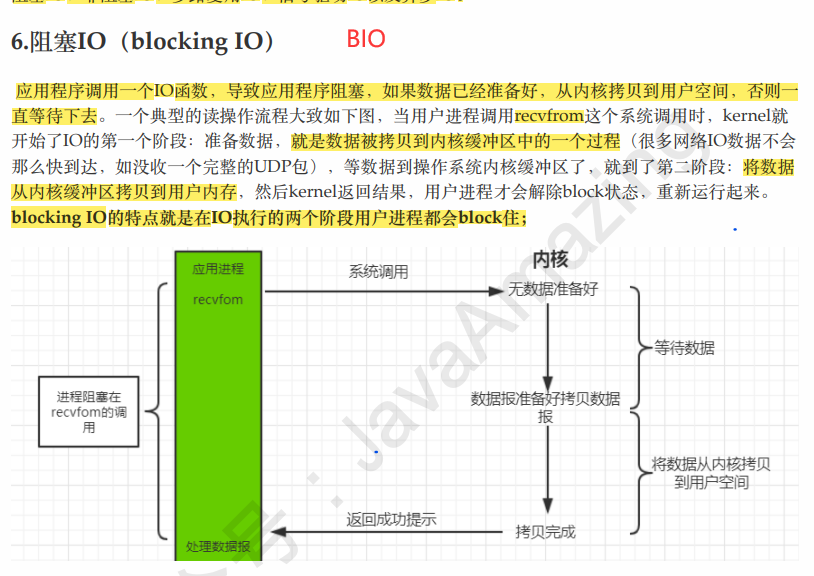

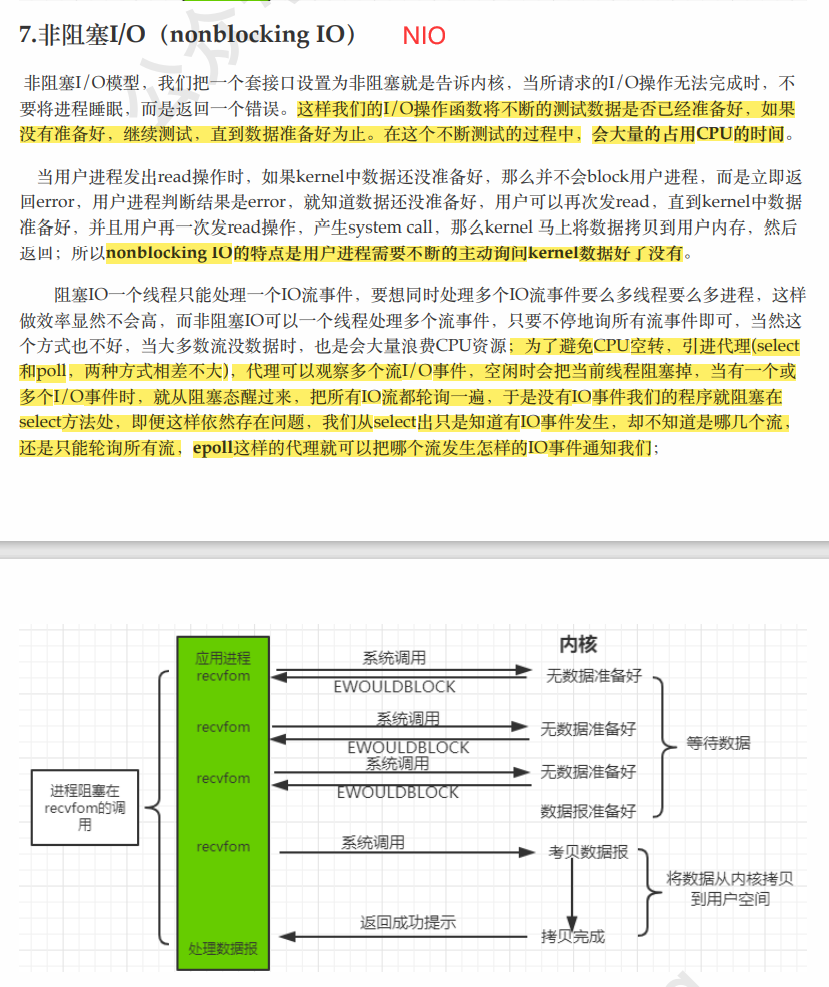

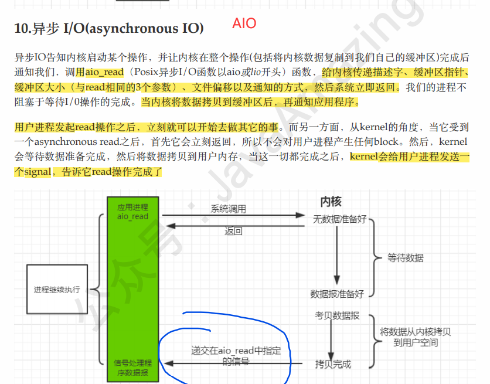


###### 可重入锁和非可重入锁

​        可重入锁又名递归锁，是指在同一个线程在外层方法获取锁的时候，再进入该线程的内层方法会自动获取锁（前提锁对象得是同一个对象或者class），不会因为之前已经获取过还没释放而阻塞。Java中ReentrantLock和synchronized都是可重入锁，可重入锁的一个优点是可一定程度避免死锁。

如果是一个不可重入锁，那么当前线程在调用doOthers()之前需要将执行doSomething()时获取当前对象的锁释放掉，实际上该对象锁已被当前线程所持有，且无法释放。所以此时会出现死锁。

https://www.cnblogs.com/jyroy/p/11365935.html

###### 公平锁和非公平锁

https://www.cnblogs.com/jyroy/p/11365935.html

公平锁是指多个线程按照申请锁的顺序来获取锁，线程直接进入队列中排队，队列中的第一个线程才能获得锁。公平锁的优点是等待锁的线程不会饿死。缺点是整体吞吐效率相对非公平锁要低，等待队列中除第一个线程以外的所有线程都会阻塞，CPU唤醒阻塞线程的开销比非公平锁大。

非公平锁是多个线程加锁时直接尝试获取锁，获取不到才会到等待队列的队尾等待。但如果此时锁刚好可用，那么这个线程可以无需阻塞直接获取到锁，所以非公平锁有可能出现  后申请锁的线程先获取锁   的场景。非公平锁的优点是可以减少唤起线程的开销，整体的吞吐效率高，因为线程有几率不阻塞直接获得锁，CPU不必唤醒所有线程。缺点是处于等待队列中的线程可能会饿死，或者等很久才会获得锁。

###### 双亲委派机制，怎么打破

当一个类收到了类的加载请求，他首先不会尝试自己去加载这个类，而是把这个请求委派给父类去完成，每一层的类加载器都是如此，因此所有的加载请求都应该传送到启动类加载其中，只有当父类加载器反馈自己无法完成这个请求的时候（在它的加载路径下没有找到所需加载的Class），子类加载器才会尝试自己去加载。

采用双亲委派机制的一个好处是比如加载位于 rt.jar 包中的类 java.lang.Object，不管是哪个加载器加载这个类，最终都是委托顶层的启动类加载器进行加载，这样保证了使用不同的类加载器最终得到的都是同一个Object对象。


###### JMM

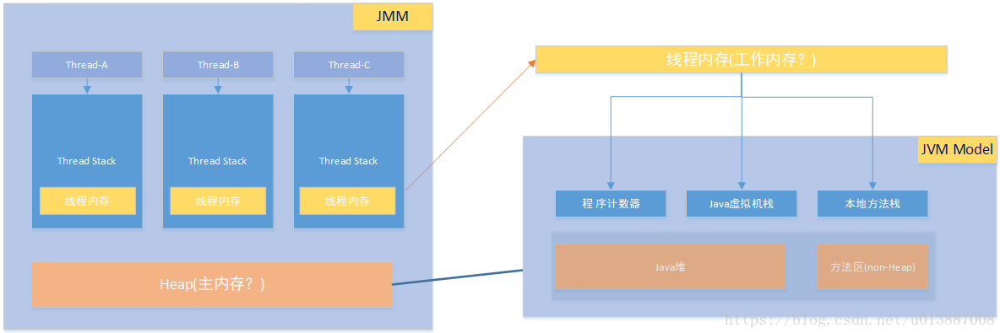

内存可见性问题

- 使用`volatile`关键字
- 使用`synchronized`同步机制

###### JUC下的automic包（原子性）CountDownLatch、CyclicBarrier

CountDownLatch类可以设置一个计数器，然后通过countDown方法来进行减1的操作，使用await方法等待计数器不大于0，然后继续执行await方法之后的语句。

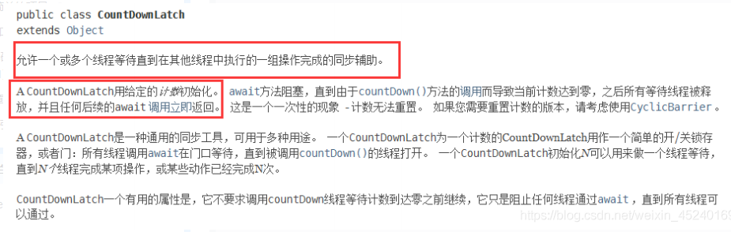

CyclicBarrier看英文单词可以看出大概就是循环阻塞的意思，在使用中CyclicBarrier的构造方法第一个参数是目标障碍数，每次执行CyclicBarrier一次障碍数会加一，如果达到了目标障碍数，才会执行cyclicBarrier.await()之后的语句。和CountDownLatch相反，可以将CyclicBarrier理解为加1操作
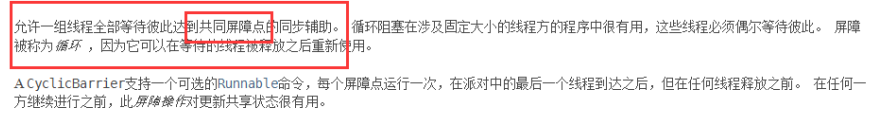

###### AQS

AbstractQueuedSynchronizer（简称为AQS）实现的。AQS是一种提供了原子式管理同步状态、阻塞和唤醒线程功能以及队列模型的简单框架。

J.U.C是基于AQS实现的，AQS是一个同步器，设计模式是模板模式。
核心数据结构：双向链表 + state(锁状态)
底层操作：CAS

AQS定义两种资源共享方式：Exclusive（独占，只有一个线程能执行，如ReentrantLock）和Share（共享，多个线程可同时执行，如Semaphore/CountDownLatch）。

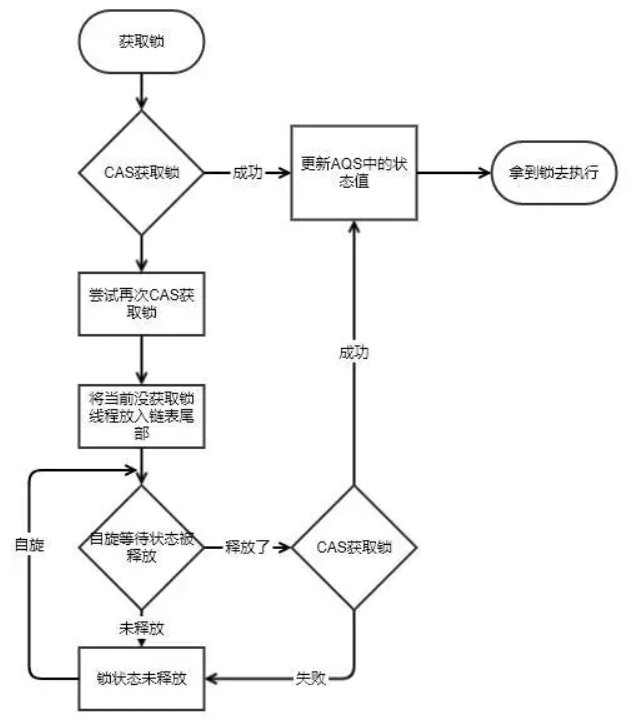

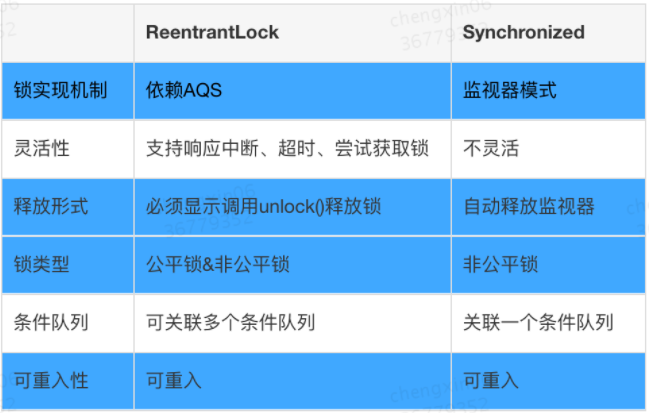

###### springmvc执行流程

一个请求匹配前端控制器 DispatcherServlet 的请求映射路径(在 web.xml中指定), WEB 容器将该请求转交给 DispatcherServlet 处理
DispatcherServlet 接收到请求后, 将根据 请求信息 交给 处理器映射器 （HandlerMapping）
HandlerMapping 根据用户的url请求 查找匹配该url的 Handler，并返回一个执行链
DispatcherServlet 再请求 处理器适配器(HandlerAdapter) 调用相应的 Handler 进行处理并返回 ModelAndView 给 DispatcherServlet
DispatcherServlet 将 ModelAndView 请求 ViewReslover（视图解析器）解析，返回具体 View
DispatcherServlet 对 View 进行渲染视图（即将模型数据填充至视图中）
DispatcherServlet 将页面响应给用户

二叉平衡树、红黑树
集合类源码

-----计算机网络-----

###### 七层模型

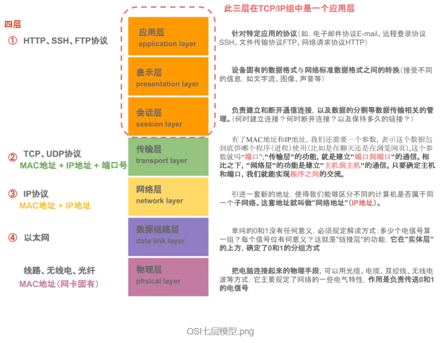

###### 三次握手、四次挥手

https://www.cnblogs.com/bj-mr-li/p/11106390.html


###### tcp拥塞控制

TCP的四种拥塞控制算法
1.慢开始
2.拥塞控制
3.快重传
4.快恢复

------mysql------

###### 索引类型

普通索引
唯一索引
主键索引
组合索引
全文索引

-----其他------
对linux的了解
熟悉的rpc框架
对netty的了解

==============================================================================

###### JVM的类加载规则 ：

1.	static类型的属性和方法，在类加载的时候就会存在于内存中。
2.	要想使用某个类的static属性和方法，那么这个类必须要加载到JAVA虚拟机中。
3.	非静态内部类并不随外部类一起加载，只有在实例化外部类之后才会加载。
	现在考虑这个情况：在外部类并没有实例化，内部类还没有加载，这时候如果										  				
	调用内部类的静态成员或方法，内部类还没有加载，却试图在内存中创建该内
	部类的静态成员，这明显是矛盾的。所以非静态内部类不能有静态成员变量或
	静态方法。
	假设 ：在外部类并没有实例化，内部类还没有加载，这时候如果JVM加载静	
	态成员或方法，内部类还没有加载，因为非静态内部类的加载依赖于实化，
	而此时却试图在内存中创建该内部类的静态成员，这明显是矛盾的。所以非
	静态内部类不能有静态成员变量或静态方法。


