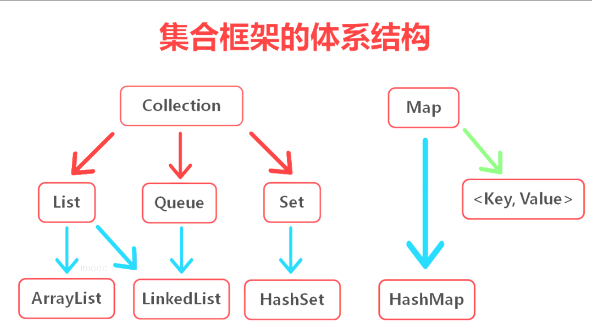

###### 1、会问到你做的项目的技术点、架构等，怎么用的？

###### 2、还会问道集合和多线程，框架问的很少，主要问底层的原理，偏重javaSE；

HashSet：无序不重复（能存入null）

###### 3、多线程如何实现资源共享？

答：这是考察多线程的，当时我就说出一种办法，即实现同一个Runnable接口。现在把标准答案总结如下：

（1）如果访问的类的方法相同：实现同一个Runnable对象，只需创建一个Runnable,这个Runnable里有那个共享数据

（2）如果访问类的方法不同：把共享数据单独放在一个类中，然后再作为成员变量放到每个Runnable中，并把操作数据的方法也一块放这个类里；

或者把每个Runnable对象都放到一个类中，作为内部类，共享数据放到外部类中；

###### 4、Java中interrupted 和 isInterruptedd方法的区别？

**interrupt**

interrupt 方法用于中断线程。调用该方法的线程的状态为将被置为”中断”状态。

注意：线程中断仅仅是置线程的中断状态位，不会停止线程。需要用户自己去监

视线程的状态为并做处理。支持线程中断的方法（也就是线程中断后会抛出

interruptedException 的方法）就是在监视线程的中断状态，一旦线程的中断状

态被置为“中断状态”，就会抛出中断异常。

**interrupted**

查询当前线程的中断状态，并且清除原状态。如果一个线程被中断了，第一次调

用 interrupted 则返回 true，第二次和后面的就返回 false 了。

**isInterrupted**

仅仅是查询当前线程的中断状态

###### 5.如何比较两个double类型的数据

1. 转换成字符串之后用equals方法比较
2. 转换成Long之后用==方法比较

​    BigDecimal

###### 6.泛型为什么要用类

​        泛型解决了类型转换的根本问题，第一它用不着类型的强制转换。第二泛型集合一旦声明了是何种数据类型的集合，就不再允许其他类型加进去List。最后一旦出现类型转换的错误时，无需运行，编译就通不过。

​         泛型要求是对象类型，而基本数据类型在Java中不属于对象。但是基本数据类型有其封装类，且为对象类型。

###### 7.并行与并发

​        如果某个系统支持两个或者多个动作（Action）**同时存在**，那么这个系统就是一个**并发系统**。如果某个系统支持两个或者多个动作**同时执行**，那么这个系统就是一个**并行系统**。并发系统与并行系统这两个定义之间的关键差异在于**“存在”**这个词。

###### 8.进程与线程的关系

**进程是资源分配的最小单位，线程是CPU调度的最小单位**

进程：指在系统中正在运行的一个应用程序；程序一旦运行就是进程；进程——资源分配的最小单位。

线程：系统分配处理器时间资源的基本单元，或者说进程之内独立执行的一个单元执行流。线程——程序执行的最小单位。

做个简单的比喻：进程=火车，线程=车厢

- 线程在进程下行进（单纯的车厢无法运行）
- 一个进程可以包含多个线程（一辆火车可以有多个车厢）
- 不同进程间数据很难共享（一辆火车上的乘客很难换到另外一辆火车，比如站点换乘）
- 同一进程下不同线程间数据很易共享（A车厢换到B车厢很容易）
- 进程要比线程消耗更多的计算机资源（采用多列火车相比多个车厢更耗资源）
- 进程间不会相互影响，一个线程挂掉将导致整个进程挂掉（一列火车不会影响到另外一列火车，但是如果一列火车上中间的一节车厢着火了，将影响到所有车厢）
- 进程可以拓展到多机，进程最多适合多核（不同火车可以开在多个轨道上，同一火车的车厢不能在行进的不同的轨道上）
- 进程使用的内存地址可以上锁，即一个线程使用某些共享内存时，其他线程必须等它结束，才能使用这一块内存。（比如火车上的洗手间）－"互斥锁"
- 进程使用的内存地址可以限定使用量（比如火车上的餐厅，最多只允许多少人进入，如果满了需要在门口等，等有人出来了才能进去）－“信号量”

###### 9.说说基本类型和包装类型的区别吧

包装类型可以为 null，而基本类型不可以
别小看这一点区别，它使得包装类型可以应用于 POJO 中，而基本类型则不行。

POJO 是什么呢？这里稍微说明一下。

POJO 的英文全称是 Plain Ordinary Java Object，翻译一下就是，简单无规则的 Java 对象，只有属性字段以及 setter 和 getter 方法

###### hashmap  hashtable treemap treeset

HashSet是线程不安全的，TreeSet也是线程不安全的

HashMap是非synchronized，而Hashtable是synchronized，

这意味着Hashtable是线程安全的，多个线程可以共享一个Hashtable；而如果没有正确的同步的话，多个线程不能共享HashMap。 即是说，在多线程应用程序中，不用专门的操作就安全地可以使用Hashtable了；而对于HashMap，则需要额外的同步机制。但HashMap的同步问题可通过Collections的一个静态方法得到解决： Map Collections.synchronizedMap(Map m)
 HashSet&HashMap

###### *HashMap*    *HashSet*

HashMap实现了Map接口 HashSet实现了Set接口

HashMap储存键值对   HashSet仅仅存储对象（且无重复对象）

使用put()方法将元素放入map中 ，使用add()方法将元素放入set中

HashMap中使用键对象来计算hashcode值，HashSet使用成员对象来计算hashcode值，对于两个对象来说hashcode可能相同，所以equals()方法用来判断对象的相等性，如果两个对象不同的话，那么返回false

HashMap比较快，因为是使用唯一的键来获取对象 ，HashSet较HashMap来说比较慢

HashMap允许将null作为一个entry的key或者value，而Hashtable不允许。
HashMap把Hashtable的contains方法去掉了，改成containsvalue和containsKey。因为contains方法容易让人引起误解。

###### TreeSet和TreeMap的关系

与HashSet完全类似，TreeSet里面绝大部分方法都市直接调用TreeMap方法来实现的。

相同点：

TreeMap和TreeSet都是有序的集合，也就是说他们存储的值都是排好序的。

TreeMap和TreeSet都是非同步集合，因此他们不能在多线程之间共享，不过可以使用方法Collections.synchroinzedMap()来实现同步

运行速度都要比Hash集合慢，他们内部对元素的操作时间复杂度为O(logN)，而HashMap/HashSet则为O(1)。

不同点：

最主要的区别就是TreeSet和TreeMap非别实现Set和Map接口

TreeSet只存储一个对象，而TreeMap存储两个对象Key和Value（仅仅key对象有序）

TreeSet中不能有重复对象，而TreeMap中可以存在

