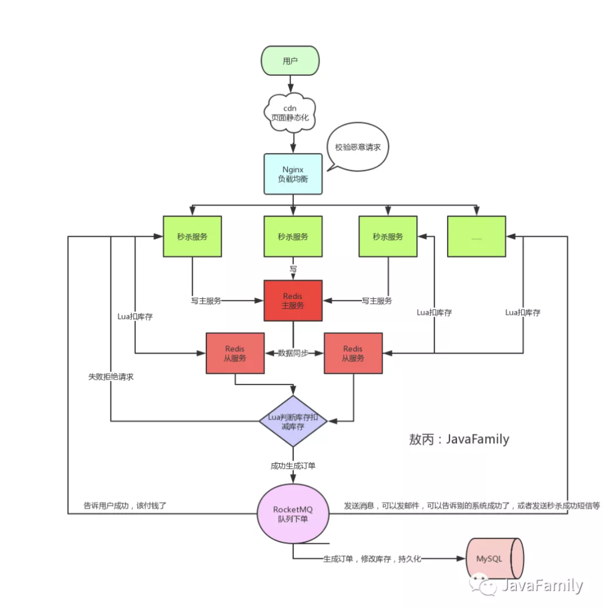
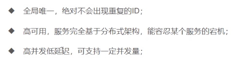
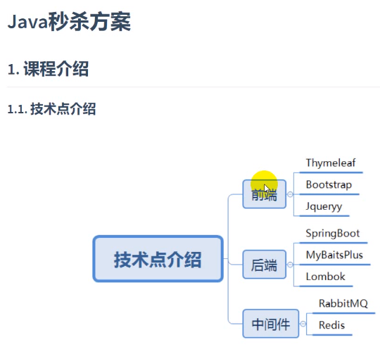
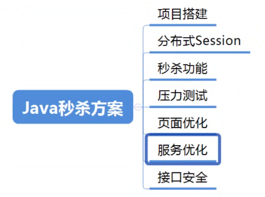
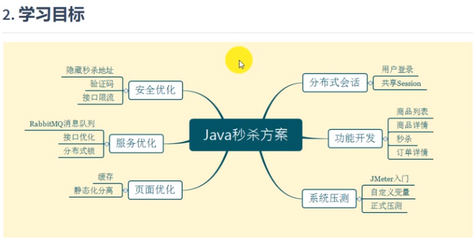

###### 1.秒杀架构

https://mp.weixin.qq.com/s/z2S1EjWQDwKm5Ud36IenNw

###### 2.分布式锁

https://blog.csdn.net/xiaoxiaole0313/article/details/107011095/

###### 3.分布式事务

https://zhuanlan.zhihu.com/p/183753774

---

---

本质是解决并发读与并发写

---

减库存  拍下 与 购买 减库存

---

---

分布式session

session信息存到redis中去

---

